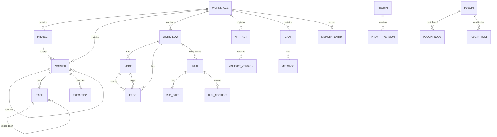
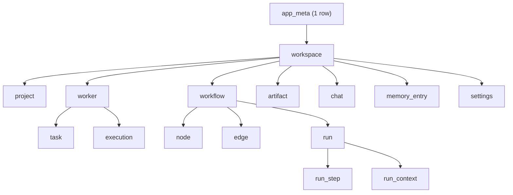

# SQLiteSchema Diagrams





# ASCII Overview

```text
workspace  (root, CASCADE parent)
  |
  +-- project
  +-- worker  --(self FK)--> worker
  |     +-- task  --(self FK)--> task
  |     +-- execution
  +-- workflow
  |     +-- node
  |     +-- edge
  |     +-- run
  |           +-- run_step
  |           +-- run_context
  +-- artifact  --versioned--> artifact_version
  +-- prompt    --versioned--> prompt_version
  +-- chat --has--> message
  +-- memory_entry  (scoped: global/workspace/project/worker/task/session)
  +-- settings (key/value, sensitive encrypted)
  +-- log_entry
  +-- plugin --contributes--> plugin_node / plugin_tool
```
