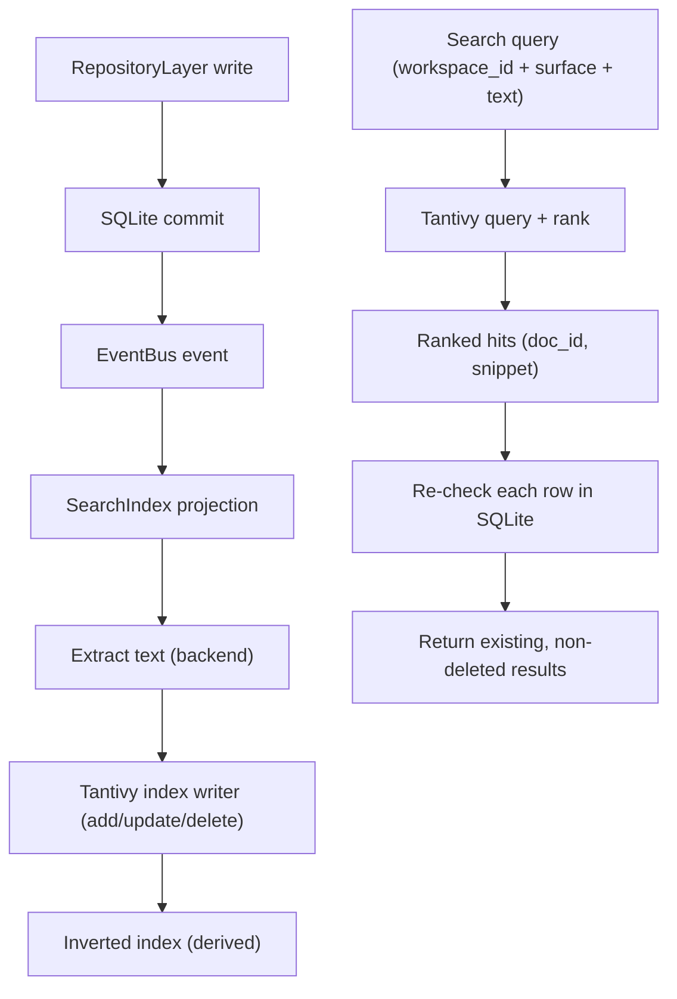
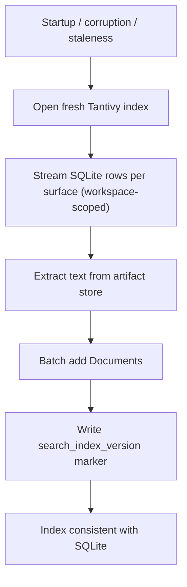

# SearchIndex Diagrams





# ASCII Overview

```text
Write:  SQLite commit -> EventBus -> projection -> Tantivy (async, never blocks)
Read:   query (+workspace_id) -> Tantivy rank -> re-check SQLite -> results
Recover: rebuild from SQLite in batches (index is derived, always rebuildable)
```
