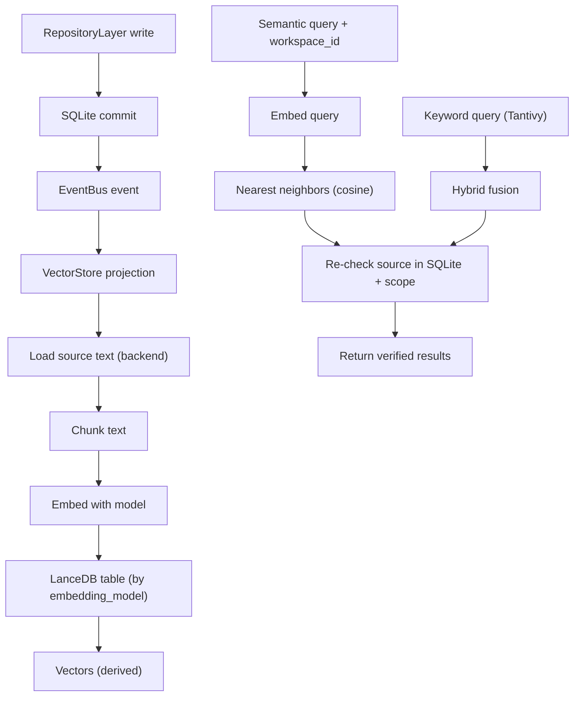
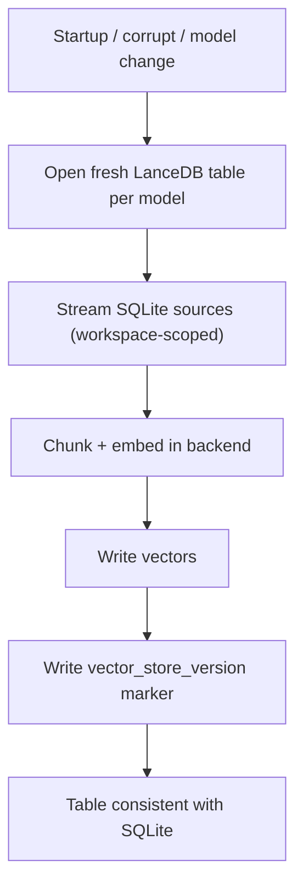

# VectorStore Diagrams





# ASCII Overview

```text
Write:  SQLite commit -> EventBus -> embed (backend) -> LanceDB (async)
Read:   embed query -> nearest neighbors -> re-check SQLite + scope -> results
Hybrid: Tantivy (keyword) fused with LanceDB (semantic), then SQLite re-check
Recover: rebuild per embedding_model from source text (always rebuildable)
```
