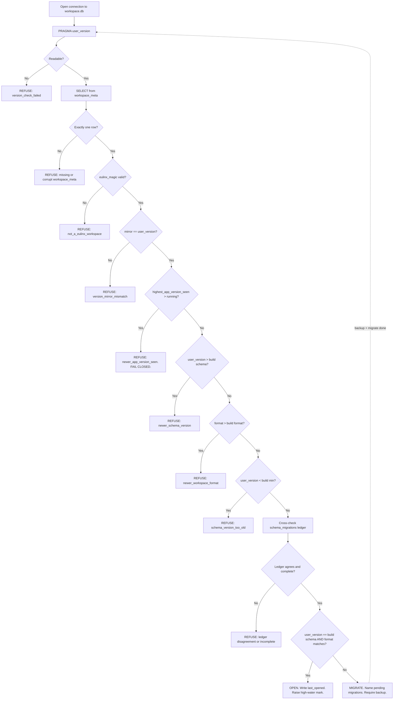
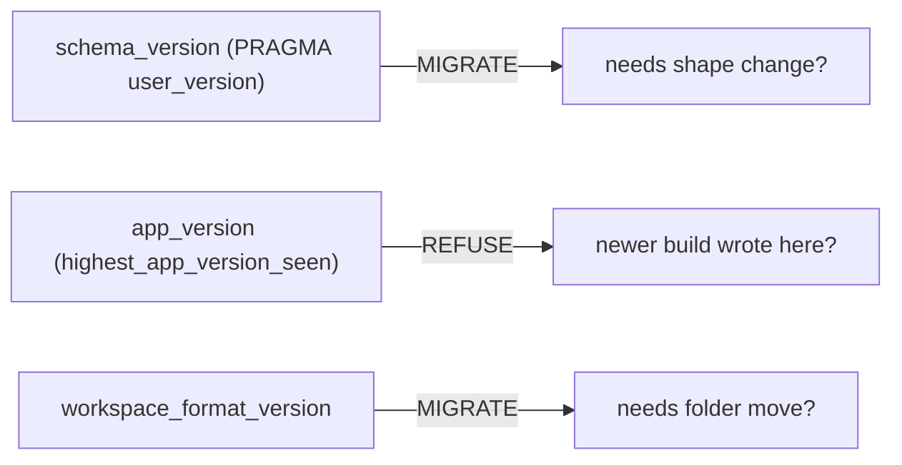

---
title: Versioning Diagrams
status: draft
version: 1.0
tags:
  - database
  - diagrams
related:
  - "[[Versioning-Part01]]"
---

# Versioning Diagrams





# ASCII Overview

```text
Three numbers, three questions, never compared to each other:

schema_version           -> "do I need to change the shape?"    -> MIGRATE
app_version              -> "did something I cannot understand already write here?" -> REFUSE
workspace_format_version -> "do I need to move folders?"         -> MIGRATE

Verdicts: OPEN | MIGRATE | REFUSE  (fail closed on any doubt)
```
