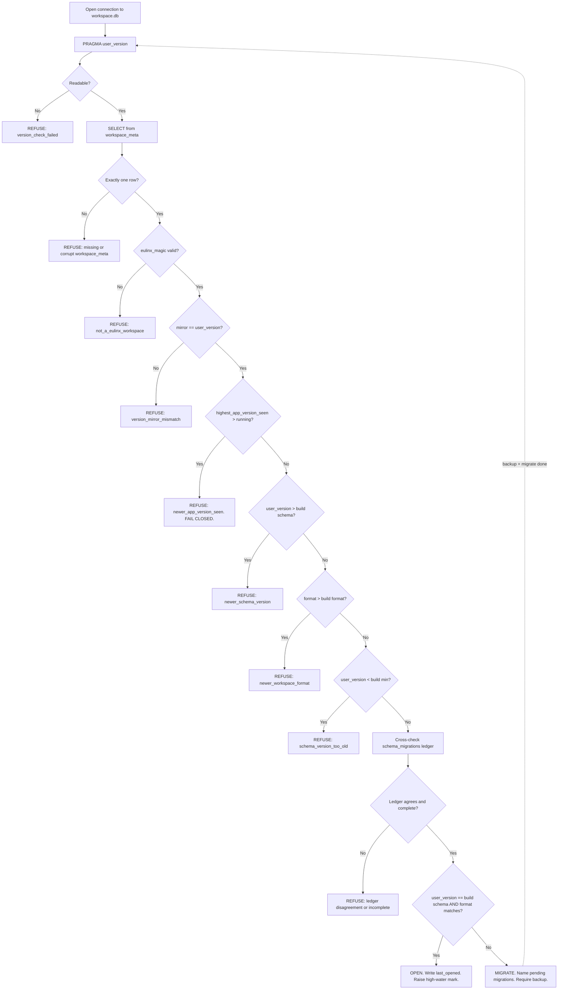

---
title: Versioning Specification - Part 01
status: draft
version: 1.0
tags:
  - database
  - versioning
  - compatibility
  - architecture
related:
  - "[[08-database/README]]"
  - "[[SQLiteSchema-Part01]]"
  - "[[BackupRestore-Part01]]"
---

# Versioning Specification (Part 01)

## Document Index

Part 01 - Purpose, Philosophy, the Three Numbers, Object Model, Invariants
Diagrams - Versioning-Diagrams.md

# Purpose

Versioning defines how Eulinx decides whether it is allowed to open a Workspace database at all.

This is a gate, not a feature. Every other database document assumes the gate has already run and returned a verdict. [[SQLiteSchema-Part01]] describes the tables as they exist at one known schema version. Migrations describes how to move from one schema version to the next. Neither of them asks the question this document asks:

```text
Is this file something this build of Eulinx is allowed to touch?
```

Versioning answers that question and only that question. It runs before the first ordinary query, before the RuntimeManager starts, before any Worker exists. It returns one of three verdicts: OPEN, MIGRATE, or REFUSE.

Versioning does not perform migrations. It decides that a migration is required and names which ones. Migrations performs them.

Versioning does not take backups. It decides that a backup is required before a migration may proceed. [[BackupRestore-Part01]] takes them.

# Core Philosophy

A Workspace database is a user's work. It is the record of every Worker, every Artifact, every merge, every permission grant. It is the substrate Replay reads. Losing it is not a bug report, it is a person's project gone.

Therefore the gate **fails closed**. This is the same rule the PermissionManager follows, applied to bytes on disk instead of actions on a machine. When the gate cannot prove that opening a Workspace is safe, it refuses. It does not guess, it does not open read-only-and-hope, it does not "try the query and see what happens".

```text
An unopened Workspace is an inconvenience.
A silently corrupted Workspace is a catastrophe.
Refusing is always the cheaper mistake.
```

The single hardest rule in this document follows from that, and it is stated fully in Part 03: **Eulinx MUST refuse to open a Workspace that was last written by a newer app version than the running build.** Not warn. Not open read-only. Refuse.

The reason is not politeness about version numbers. A newer build may have added a column this build does not select, and every `INSERT` this build performs would leave that column at its default, silently. A newer build may have changed the meaning of an existing column without changing its type - a status enum that gained a variant, a duration that moved from milliseconds to microseconds. This build cannot detect either case, because the damage is invisible at the SQL layer. It looks like ordinary successful writes. The user finds out three weeks later when the numbers are wrong and there is no backup old enough to help.

A schema number tells you the shape changed. It does not tell you the semantics changed. Only the app version tells you that, and only by being higher than yours. So a higher app version is treated as an unbounded unknown, and the only safe response to an unbounded unknown is to stop.

Versioning is also **deterministic**. The same three numbers and the same running build MUST always produce the same verdict. No timestamps, no heuristics, no "usually fine". The verdict is a pure function, specified as a numbered algorithm in Part 03, and it is testable as a table.

# Definition

Versioning is the Workspace-open gate. It owns:

- the definitions of the three distinct version numbers and who bumps each
- the `PRAGMA user_version` read and write path in Rust
- the `workspace_meta` table, which is the only table this document owns
- the compatibility matrix between a running build and a Workspace on disk
- the OPEN / MIGRATE / REFUSE decision algorithm
- the fail-closed refusal of newer-app-written Workspaces
- the user-facing upgrade flow and every choice offered in it
- the `VersionInfo`, `CompatibilityVerdict`, and `VersionError` types
- every error case reachable during the gate

Versioning does NOT own:

- the base schema. That is [[SQLiteSchema-Part01]]. This document MUST NOT restate it.
- the `schema_migrations` ledger table. That is Migrations.
- migration execution, ordering, or rollback. That is Migrations.
- backup and restore mechanics. That is [[BackupRestore-Part01]].
- history table shape. That is [[HistoryTables-Part01]].

# The Three Numbers

There are exactly three version numbers in Eulinx. They are independent. They are never compared to each other. Conflating any two of them is the most common implementation failure in this document and is called out again in AI Notes.

```text
                      what it describes        stored where                 form

schema_version        the SQL shape of the     PRAGMA user_version          monotonic
                      database: tables,        (mirrored in                 integer
                      columns, indexes,        workspace_meta)
                      triggers

app_version           the Eulinx build that       workspace_meta               semver
                      wrote the file           .last_opened_by_app_version  MAJOR.MINOR.PATCH
                                               .highest_app_version_seen

workspace_format_     the on-disk layout of    workspace_meta               monotonic
version               the Workspace folder     .workspace_format_version    integer
                      around the .db file
```

## schema_version

`schema_version` is a monotonic integer describing the SQL shape of the database: which tables exist, which columns they have, which indexes and triggers are defined.

It starts at 1. It increases by exactly 1 per migration. It never decreases. It never skips.

**Who bumps it:** the author of a migration, in Migrations. Adding a migration file is the only act that bumps `schema_version`.

**When:** any change to the SQL shape. A new table, a dropped column, a renamed index, a changed `CHECK` constraint. All of these are shape changes and all of them require a migration and a bump.

**Not when:** a release. Shipping Eulinx 0.9.4 with no schema changes leaves `schema_version` exactly where it was. Most releases do not bump it.

The running build declares the schema version it understands as a compile-time constant:

```rust
/// The schema version this build was written against.
/// Bumped by whoever adds the migration that reaches it.
pub const EULINX_SCHEMA_VERSION: i64 = 7;

/// The oldest schema version this build has migration code for.
/// Anything below this must be upgraded by an older Eulinx first.
pub const EULINX_MIN_SCHEMA_VERSION: i64 = 3;
```

`EULINX_MIN_SCHEMA_VERSION` exists so migration code can eventually be deleted. A build that has dropped the 1-to-2 and 2-to-3 migrations cannot open a version-2 Workspace, and must say so clearly rather than fail halfway through a migration chain that has holes in it.

## app_version

`app_version` is the semantic version of the running Eulinx build. It is the value in `Cargo.toml` and in the Tauri bundle manifest, and it is the same string the About dialog shows.

Form: `MAJOR.MINOR.PATCH`, optionally followed by `-` and a prerelease tag. Only the numeric triple participates in comparison. The prerelease tag is recorded and displayed but MUST NOT affect the verdict, because `0.9.4-beta.1` and `0.9.4` may both write the same bytes and treating them as different would refuse Workspaces for no reason.

**Who bumps it:** the release process, in Migrations's sibling document set and ultimately `12-development/ReleaseProcess`. Never a migration author, never at runtime.

**When:** every release, whether or not the schema changed.

```rust
/// Compile-time app version. Sourced from Cargo.toml at build time.
pub const EULINX_APP_VERSION: &str = env!("CARGO_PKG_VERSION");
```

`app_version` is the only number that can detect a semantic change that left no trace in the schema. That is why it is the number the fail-closed rule is built on.

## workspace_format_version

`workspace_format_version` is a monotonic integer describing the on-disk layout of the Workspace directory that surrounds the database file: which subfolders exist, where artifacts are staged, where sandbox roots live, where the backup directory sits.

It starts at 1. It increases by exactly 1 per layout change.

**Who bumps it:** whoever changes the Workspace directory layout in WorkspaceManager. See [[WorkspaceManager-Part01]].

**When:** the folder tree changes shape. Moving `artifacts/` under `state/artifacts/` is a format bump. Adding a file inside an existing folder is not.

```rust
/// The Workspace folder layout this build expects.
pub const EULINX_WORKSPACE_FORMAT_VERSION: i64 = 2;

/// The oldest Workspace folder layout this build can migrate forward.
pub const EULINX_MIN_WORKSPACE_FORMAT_VERSION: i64 = 1;
```

A database can be perfectly current while the folder around it is stale, and the reverse. They are checked independently and both must pass.

## Why Three and Not One

The obvious simplification is to use `app_version` for everything and refuse anything that does not match. That is rejected for a concrete reason: it would refuse to open a Workspace written by yesterday's patch release. Users would be unable to move a Workspace between two machines with slightly different builds, which is the normal case, not the exotic one.

The opposite simplification is to use `schema_version` for everything. That is rejected because it cannot see semantic changes, which is the whole argument in Core Philosophy.

Three numbers, three questions:

```text
schema_version           -> "do I need to change the shape before I can query?"    -> MIGRATE
app_version              -> "did something I cannot understand already write here?" -> REFUSE
workspace_format_version -> "do I need to move folders before I can find things?"   -> MIGRATE
```

# Responsibilities

Versioning MUST:

- run the gate before any other database access on the connection, other than the pragmas the gate itself needs
- read `PRAGMA user_version` and `workspace_meta` inside a single read transaction
- treat `PRAGMA user_version` as the authoritative schema version
- verify that `workspace_meta.schema_version_mirror` agrees with `PRAGMA user_version` and refuse if it does not
- produce exactly one `CompatibilityVerdict` per gate run
- refuse when `workspace_meta.highest_app_version_seen` is greater than `EULINX_APP_VERSION`
- refuse when `PRAGMA user_version` is greater than `EULINX_SCHEMA_VERSION`
- refuse when `workspace_meta.workspace_format_version` is greater than `EULINX_WORKSPACE_FORMAT_VERSION`
- refuse when `PRAGMA user_version` is below `EULINX_MIN_SCHEMA_VERSION`
- name every pending migration by id in a MIGRATE verdict
- require a backup before any MIGRATE verdict is acted upon
- write `last_opened_by_app_version` and `last_opened_at` on every successful open
- raise `highest_app_version_seen` only when the running build is strictly higher, and never lower it
- emit a `database.version_checked` event on every verdict, including refusals
- be a pure function of the three on-disk numbers plus the three compile-time constants

Versioning SHOULD:

- complete the entire gate in under 20 ms on a cold open
- report the full `VersionInfo` in the refusal so the UI can show real numbers rather than "incompatible"
- offer the user a read-only inspection path on a newer-app refusal, per Part 04

Versioning MUST NOT:

- open a Workspace read-write when any refusal condition holds
- downgrade, rewrite, or "fix up" a newer schema to match this build
- lower `highest_app_version_seen` under any circumstance, including a user override
- compare `schema_version` to `app_version`, or either to `workspace_format_version`
- infer a schema version by inspecting `sqlite_master` when `user_version` is 0 and the database is non-empty
- perform a migration itself
- take a backup itself
- treat a prerelease tag as part of the comparison
- proceed on `VersionError`. Every error is a refusal.

# Versioning Object Model

```ts
/** A monotonic integer schema version. Starts at 1. Never skips, never decreases. */
type SchemaVersion = number;

/** A monotonic integer workspace folder layout version. Starts at 1. */
type WorkspaceFormatVersion = number;

/** Parsed semver. Only major/minor/patch participate in comparison. */
type AppVersion = {
  major: number;
  minor: number;
  patch: number;
  /** e.g. "beta.1" for 0.9.4-beta.1. Recorded and displayed. Never compared. */
  prerelease?: string;
  /** The original string exactly as written, for display and for round-tripping. */
  raw: string;
};

/** Everything the gate read off disk, plus everything the running build declares. */
type VersionInfo = {
  /** --- read from the database --- */
  /** PRAGMA user_version. Authoritative. */
  onDiskSchemaVersion: SchemaVersion;
  /** workspace_meta.schema_version_mirror. Must equal onDiskSchemaVersion. */
  onDiskSchemaVersionMirror: SchemaVersion;
  /** workspace_meta.workspace_format_version. */
  onDiskWorkspaceFormatVersion: WorkspaceFormatVersion;
  /** workspace_meta.created_by_app_version. Informational only. Never gates. */
  createdByAppVersion: AppVersion;
  /** workspace_meta.last_opened_by_app_version. Informational only. Never gates. */
  lastOpenedByAppVersion: AppVersion;
  /** workspace_meta.highest_app_version_seen. THIS is what the fail-closed rule reads. */
  highestAppVersionSeen: AppVersion;
  /** workspace_meta.workspace_id. Cross-checked against the folder's identity. */
  workspaceId: string;
  /** workspace_meta.created_at, ISO-8601 UTC. */
  createdAt: string;
  /** workspace_meta.last_opened_at, ISO-8601 UTC. */
  lastOpenedAt: string;

  /** --- declared by the running build --- */
  runningAppVersion: AppVersion;
  buildSchemaVersion: SchemaVersion;
  buildMinSchemaVersion: SchemaVersion;
  buildWorkspaceFormatVersion: WorkspaceFormatVersion;
  buildMinWorkspaceFormatVersion: WorkspaceFormatVersion;

  /** --- derived, for display --- */
  /** Absolute path of the .db file the gate inspected. */
  databasePath: string;
  /** Byte size of the .db file at gate time. Shown in the upgrade dialog. */
  databaseSizeBytes: number;
};

/** The gate's only output. Exactly one of three shapes. */
type CompatibilityVerdict =
  | OpenVerdict
  | MigrateVerdict
  | RefuseVerdict;

type OpenVerdict = {
  kind: "open";
  info: VersionInfo;
  /** True when the running build is strictly newer than highestAppVersionSeen.
   *  The open still proceeds; the gate raises the stored high-water mark. */
  raisesHighWaterMark: boolean;
};

type MigrateVerdict = {
  kind: "migrate";
  info: VersionInfo;
  fromSchemaVersion: SchemaVersion;
  toSchemaVersion: SchemaVersion;
  /** Migration ids in the exact order MigrationStrategy must apply them.
   *  Named, not counted. The UI shows these. */
  pendingSchemaMigrations: string[];
  fromWorkspaceFormatVersion: WorkspaceFormatVersion;
  toWorkspaceFormatVersion: WorkspaceFormatVersion;
  pendingFormatMigrations: string[];
  /** Always true. There is no migration path in Eulinx that skips a backup. */
  backupRequired: true;
  /** Best-effort estimate for the progress dialog. Never gates anything. */
  estimatedDurationMs: number;
  /** True when any pending migration is flagged irreversible by
   *  MigrationStrategy. Changes the wording of the confirm dialog. */
  irreversible: boolean;
};

type RefuseVerdict = {
  kind: "refuse";
  info: VersionInfo | null; // null only when the gate could not read enough to build it
  reason: RefuseReason;
  /** One sentence, user-facing, already localized. Shown as the dialog title. */
  userMessage: string;
  /** Full technical detail. Shown under "Details", and logged. */
  detail: string;
  /** What the user can actually do about it. Drives the dialog buttons. Part 04. */
  remedy: RefuseRemedy;
};

type RefuseReason =
  /** PRAGMA user_version > EULINX_SCHEMA_VERSION. Written by a newer schema. */
  | "newer_schema_version"
  /** highest_app_version_seen > EULINX_APP_VERSION. THE fail-closed case. */
  | "newer_app_version_seen"
  /** workspace_format_version > EULINX_WORKSPACE_FORMAT_VERSION. */
  | "newer_workspace_format"
  /** PRAGMA user_version < EULINX_MIN_SCHEMA_VERSION. Migration code was deleted. */
  | "schema_version_too_old"
  /** workspace_format_version < EULINX_MIN_WORKSPACE_FORMAT_VERSION. */
  | "workspace_format_too_old"
  /** workspace_meta does not exist, or has zero rows. */
  | "missing_workspace_meta"
  /** workspace_meta has more than one row, or a NULL in a NOT NULL-intended field,
   *  or an unparseable semver. */
  | "corrupt_workspace_meta"
  /** eulinx_magic is absent or wrong. This .db is not a Eulinx Workspace. */
  | "not_a_eulinx_workspace"
  /** user_version != schema_version_mirror. The two sources disagree. */
  | "version_mirror_mismatch"
  /** user_version disagrees with the max applied id in schema_migrations. */
  | "migration_ledger_disagreement"
  /** schema_migrations has a row marked started but not completed. */
  | "migration_ledger_incomplete"
  /** Any VersionError. The gate could not complete. */
  | "version_check_failed";

type RefuseRemedy = {
  /** Can the user open this read-only to look at it? Part 04. */
  readOnlyInspectionOffered: boolean;
  /** Can the user restore from a backup? True when BackupRestore finds one. */
  restoreFromBackupOffered: boolean;
  /** The minimum app version that could open this, when computable. */
  requiredAppVersion?: AppVersion;
  /** A stable doc anchor the "Learn more" link targets. */
  helpAnchor: string;
};
```

# States

The gate is a short-lived state machine. It has no persistent state of its own; the states below describe one gate run.

```text
unchecked   the connection is open, no pragma has been read yet
probing     reading user_version, workspace_meta, schema_migrations
decided     a CompatibilityVerdict exists
sealed      the verdict was OPEN, last_opened_* has been written, DB is usable
migrating   the verdict was MIGRATE, control has passed to MigrationStrategy
refused     the verdict was REFUSE, the connection MUST be closed
```

Legal transitions, and only these:

```text
unchecked -> probing    always, exactly once per connection
probing   -> decided    always. A VersionError produces a REFUSE, not a stall.
decided   -> sealed     verdict.kind == "open"
decided   -> migrating  verdict.kind == "migrate" AND a backup completed
decided   -> refused    verdict.kind == "refuse"
migrating -> unchecked  after MigrationStrategy completes: RE-RUN THE GATE
migrating -> refused    MigrationStrategy failed and BackupRestore rolled back
refused   -> [*]        connection closed
```

The `migrating -> unchecked` edge is not a decoration. After a migration the gate MUST run again from scratch against the new numbers. A migration that claimed to reach version 7 but left `user_version` at 6 is a bug, and re-running the gate is what catches it. Part 03 step 14 states this again.

There is no `refused -> probing` edge. A refusal is terminal for that connection. Retrying requires a new connection and a new gate run, which is what happens after the user restores a backup.

# Invariants

```text
The gate runs before any other statement on the connection.
Exactly one CompatibilityVerdict is produced per gate run.
PRAGMA user_version is the authoritative schema version.
workspace_meta.schema_version_mirror always equals PRAGMA user_version.
workspace_meta has exactly one row, whose id is 1.
schema_version increases by exactly 1 per migration, and never decreases.
workspace_format_version never decreases.
highest_app_version_seen never decreases, for any reason, ever.
A REFUSE verdict never opens a read-write connection.
A MIGRATE verdict never proceeds without a completed backup.
Every VersionError produces a REFUSE verdict, never a proceed.
The verdict is a pure function of the on-disk numbers and the build constants.
The three version numbers are never compared to each other.
A prerelease tag never changes a verdict.
After a migration, the gate runs again from scratch.
```

The `highest_app_version_seen never decreases` invariant is worth restating because it is the one an implementer will be tempted to break. When Eulinx 0.9.4 opens a Workspace whose high-water mark is 0.9.4, it writes nothing. When Eulinx 0.9.5 opens it, it raises the mark to 0.9.5. When Eulinx 0.9.4 is then pointed at that Workspace again, it reads 0.9.5, sees a number higher than itself, and refuses - and it MUST NOT "helpfully" set the mark back to 0.9.4 to make the problem go away. Lowering the mark destroys the only evidence that a newer build ever touched the file.

# Mermaid Diagram



# AI Notes

Do not collapse the three numbers into one. This is the failure mode this document exists to prevent. An implementer who stores only `app_version` and compares it on open will refuse every Workspace touched by a patch release. An implementer who stores only `schema_version` will happily let an old build write garbage into columns a newer build added meaning to. You need all three, and they are never compared to each other.

Do not open read-write on a newer-app refusal because "it will probably work". It probably will work, for a while, and that is exactly the danger. Silent semantic drift produces no error, no log line, and no symptom until the data is unrecoverable. Read Part 03's justification before you weaken this.

Do not lower `highest_app_version_seen`. Not on a user override, not on a "repair" command, not to make a test pass. It is a high-water mark. Marks that go down are not marks.

Do not infer the schema version by looking at `sqlite_master` when `user_version` is 0. A `user_version` of 0 on a non-empty database means something wrote this file without going through Eulinx's gate, and guessing which of seven schemas it resembles is how you end up running migration 4 against a version-6 database. Refuse.

Do not skip the `schema_migrations` cross-check because `user_version` "already told you". `user_version` is one integer and it can be set by any process with write access, including a half-finished migration that crashed after the pragma and before the commit. The ledger is the second witness. Two witnesses that agree is the bar. See Part 02.

Do not run the gate lazily, on first query. It must run on connection open, before anything else, or some other code path will race it and query a database nobody has cleared for use.

Do not treat `VersionError` as recoverable. Every variant listed in Part 03 maps to a REFUSE. There is no error in this document whose correct handling is "log it and continue".

Do not put the base schema in this document or in this folder. The tables live in [[SQLiteSchema-Part01]]. The only DDL this document owns is `workspace_meta`, given in Part 02.

# Related Documents

- [[08-database/README]]
- [[Versioning-Diagrams]]
- [[SQLiteSchema-Part01]]
- [[BackupRestore-Part01]]
- [[HistoryTables-Part01]]
- [[WorkspaceManager-Part01]]
- [[Workspace-Part01]]
</content>
