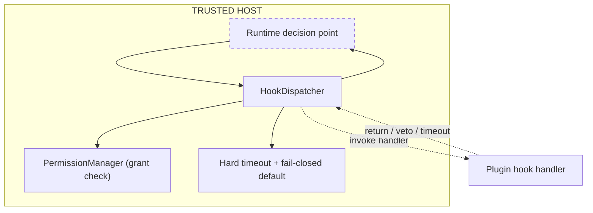
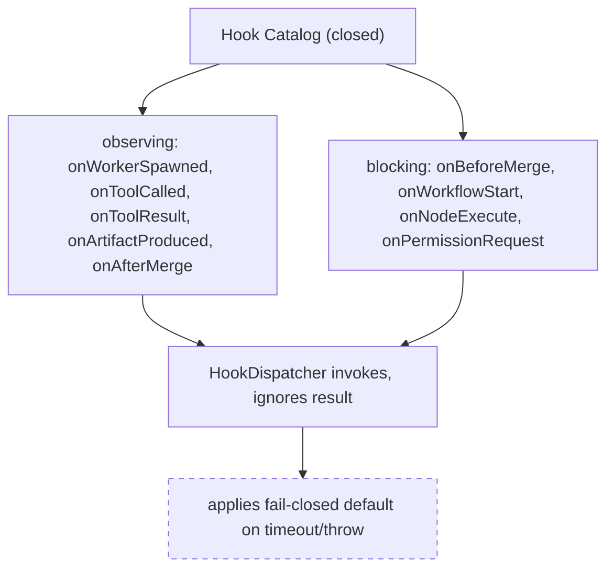
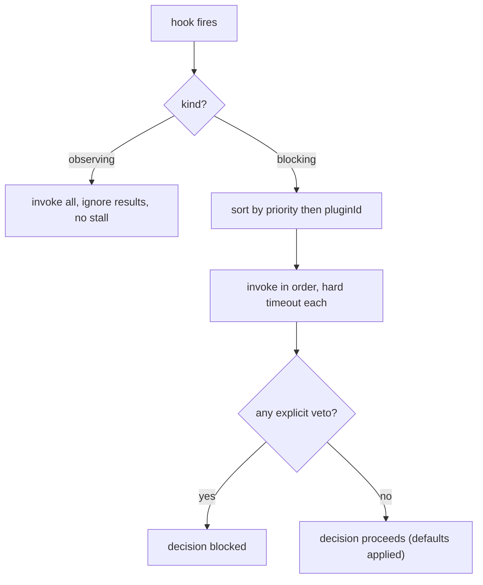
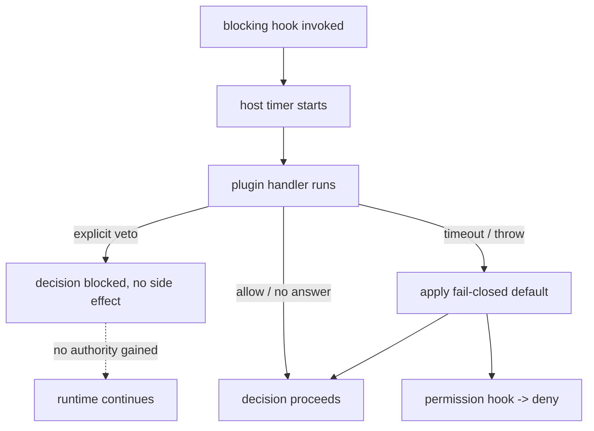
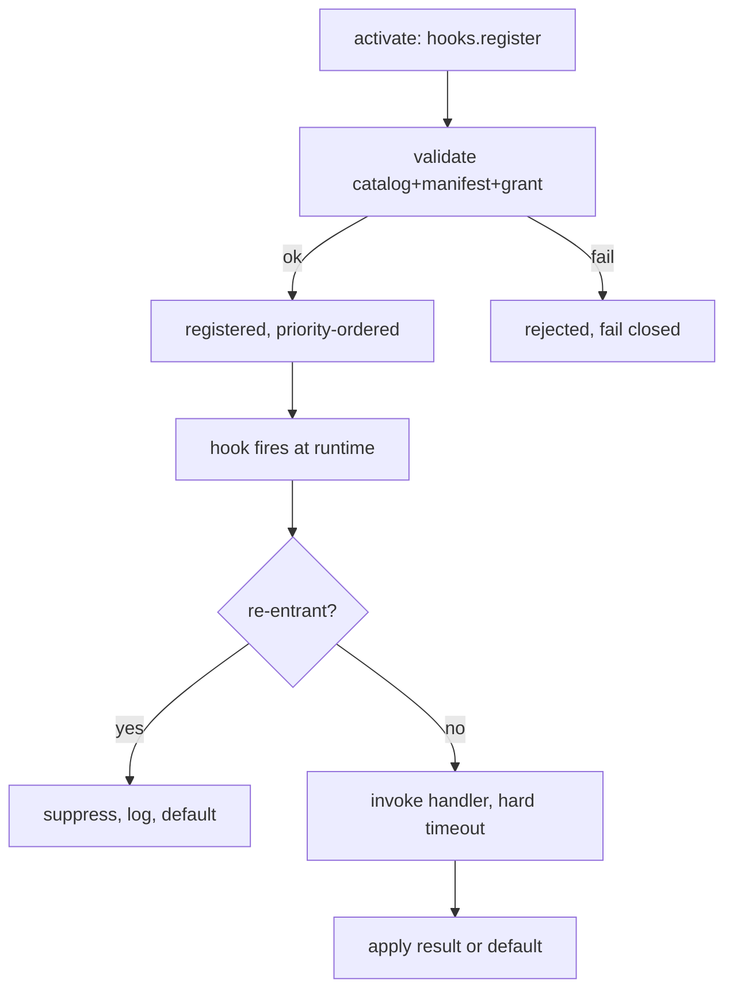

# HookSystem Diagrams

## Observe Versus Participate

## Catalog: Observing And Blocking

## Ordering And Veto Aggregation

## Hard Timeout And Fail-Closed Default

## Re-Entrancy Guard

## Related Documents

- [[09-plugin-system/README]]
- [[HookSystem-Part01]]
- [[HookSystem-Part02]]
- [[HookSystem-Part03]]
- [[HookSystem-Part04]]
- [[HookSystem-Part05]]
- [[PluginArchitecture-Part05]]
- [[MergeManager-Part01]]
- [[EventBus-Part01]]
