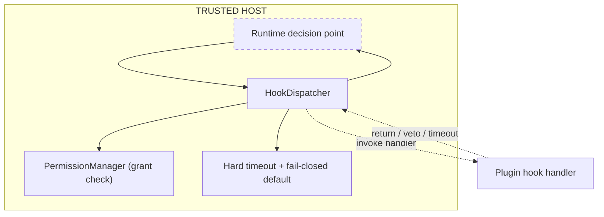

---
title: HookSystem Specification - Part 01
status: draft
version: 1.0
tags:
  - plugin-system
  - hook-system
  - security
related:
  - "[[09-plugin-system/README]]"
  - [[HookSystem-Part02]]
  - [[PluginArchitecture-Part05]]
  - [[EventBus-Part01]]
---

# HookSystem Specification (Part 01)

## Document Index

Part 01 - Purpose, philosophy, the observe/block split, the threat model
Part 02 - The hook catalog with a full signature for each hook
Part 03 - Blocking versus observing hooks, ordering, priority determinism
Part 04 - Hard timeouts, fail-closed defaults, veto model, error isolation
Part 05 - Re-entrancy guards, registration lifecycle, worked examples

# Purpose

HookSystem defines how a plugin participates in runtime decisions rather than merely observing them. A hook is the sharpest tool in this folder, because a blocking hook puts untrusted code on the runtime's critical path. Every rule here exists to bound that.

# Philosophy: Observe Versus Participate

Eulinx distinguishes two kinds of plugin participation:

```text
OBSERVE    the core made a decision and tells the plugin about it.
           The plugin cannot change the outcome. It logs, metrics,
           or reacts. This is safe; it is notification.

PARTICIPATE the core is about to make a decision and asks the plugin.
           The plugin may influence or veto the outcome. This is sharp;
           untrusted code is on the critical path.
```

Hooks are the participate surface. The observing surface is the [[EventBus-Part01]], which carries notification only and which a plugin cannot use to change a decision. Hooks and events are deliberately separate subsystems so that "I want to watch" never implies "I want to decide".

# Why Hooks Are The Sharpest Tool

A blocking hook runs while the runtime is waiting for its answer. If the hook hangs, the runtime hangs. If the hook lies, the runtime makes a wrong decision. If the hook throws, the decision pipeline must still produce a safe outcome. That is why hooks have the tightest timeouts, the most explicit fail-closed defaults, and the strictest veto rules in the entire plugin system.

```text
EventBus event   -> the runtime already decided. Plugin reacts. Safe.
Observing hook   -> same as an event, delivered via HookDispatcher.
Blocking hook    -> the runtime is waiting. Plugin decides or vetoes.
                   This is the one to bound hard.
```

# The HookDispatcher

Hooks are invoked by the HookDispatcher, a host component that owns timeout enforcement, ordering, and the fail-closed default for every hook. A plugin never calls a hook; the dispatcher calls the plugin's registered handler at the right moment. The dispatcher is the only thing that decides what happens when a hook times out, throws, or vetoes. The plugin's handler is a guest in that decision.

# Participation Is Capability-Gated

A plugin may only register a hook it declared (`hook.register`) and the user granted, for the specific hook name. A plugin cannot subscribe to a hook it did not declare, cannot subscribe to core-internal hooks, and cannot subscribe to another plugin's hooks. The grant lists the exact hook names; the dispatcher checks the grant on every registration and every invocation.

# HookSystem Invariants

```text
A blocking hook runs on the runtime's critical path and is hard-timeout
bounded with a fail-closed default.
An observing hook cannot change the outcome; it is notification only.
A hook handler is invoked by the dispatcher, never by the plugin.
A plugin may only register hooks it declared and was granted by name.
A hook veto MUST NOT grant the plugin any authority it did not already
hold.
A hook failure is isolated: it resolves to the fail-closed default and
the runtime continues.
```

# Mermaid Diagram



# AI Notes

Do not blur hooks and events. If a plugin "just wants to watch", it uses the EventBus, not a hook. Conflating them lets a watching plugin accidentally gain a blocking seat on the critical path.

Do not let a hook run without a host-owned timeout. Untrusted code on the critical path with no deadline is a permanently frozen pipeline. The dispatcher owns the timer; the plugin cannot extend it.

Do not let a veto grant authority. A hook that vetoes a merge because "I say so" must not, as a side effect, gain `fs.write` it was not granted. Veto is a negative; it confers nothing.

# Related Documents

- [[09-plugin-system/README]]
- [[HookSystem-Part02]]
- [[HookSystem-Part03]]
- [[HookSystem-Part04]]
- [[HookSystem-Part05]]
- [[HookSystem-Diagrams]]
- [[PluginArchitecture-Part05]]
- [[PluginLifecycle-Part03]]
- [[EventBus-Part01]]
- [[MergeManager-Part01]]
- [[PermissionManager-Part01]]
