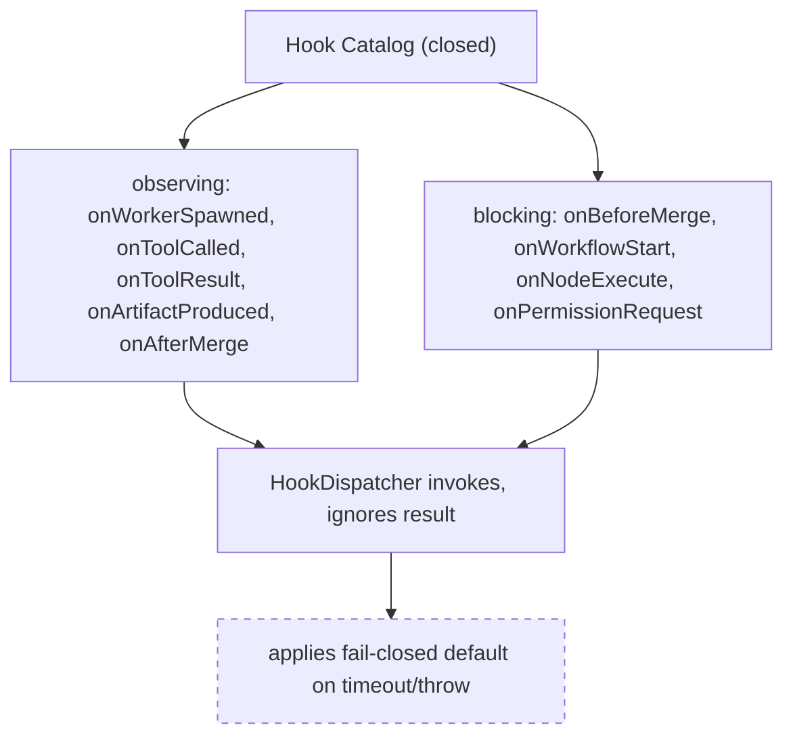

---
title: HookSystem Specification - Part 02
status: draft
version: 1.0
tags:
  - plugin-system
  - hook-system
  - catalog
  - signatures
related:
  - "[[09-plugin-system/README]]"
  - [[HookSystem-Part01]]
  - [[HookSystem-Part03]]
  - [[HookSystem-Part04]]
---

# HookSystem Specification (Part 02)

## Document Index

Part 01 - Purpose, philosophy, the observe/block split, the threat model
Part 02 - The hook catalog with a full signature for each hook
Part 03 - Blocking versus observing hooks, ordering, priority determinism
Part 04 - Hard timeouts, fail-closed defaults, veto model, error isolation
Part 05 - Re-entrancy guards, registration lifecycle, worked examples

# Purpose

This part enumerates the closed catalog of hooks Eulinx exposes, with the full signature (when it fires, what payload it receives, what it may return, and whether it is blocking or observing) for each. The catalog is closed. A plugin cannot invent a hook; it can only register for a name in this catalog that it declared and was granted.

# Catalog Shape

Each catalog entry has: a `hookName`, a `kind` (observing or blocking), a `payload` shape the dispatcher delivers, a `result` shape the handler returns, and the `default` the dispatcher applies when the handler times out, throws, or is absent. The payload and result are JSON only; no handle crosses the boundary.

# The Hook Catalog

```text
onWorkerSpawned (observing)
  payload:  { workerId, kind, model, createdAt }
  result:   ignored
  default:  n/a (observation only)
  fires:    after a Worker is spawned.

onToolCalled (observing)
  payload:  { toolId, pluginId, argsHash, startedAt }
  result:   ignored
  default:  n/a
  fires:    when any tool (core or plugin) is invoked.

onToolResult (observing)
  payload:  { toolId, outcome, durationMs }
  result:   ignored
  default:  n/a
  fires:    after a tool resolves or fails.

onArtifactProduced (observing)
  payload:  { artifactId, type, producerId, sizeBytes }
  result:   ignored
  default:  n/a
  fires:    when an Artifact is created.

onBeforeMerge (blocking)
  payload:  { artifactId, targetPath, proposedPatch }
  result:   { veto: boolean, reason?: string }
  default:  allow (proceed with merge)
  fires:    before the MergeManager applies an Artifact.
  note:     a veto blocks the merge; it grants no authority.

onAfterMerge (observing)
  payload:  { artifactId, targetPath, appliedAt, status }
  result:   ignored
  default:  n/a
  fires:    after the MergeManager applies (or rejects) an Artifact.

onWorkflowStart (blocking)
  payload:  { workflowId, graphHash, nodeTypeIds }
  result:   { veto: boolean, reason?: string }
  default:  allow
  fires:    before a Workflow graph begins execution.

onNodeExecute (blocking)
  payload:  { workflowId, nodeId, nodeTypeId, inputs }
  result:   { veto: boolean, reason?: string }
  default:  allow
  fires:    before a node (core or plugin) executes.

onPermissionRequest (blocking)
  payload:  { capability, scope, requesterId }
  result:   { allow: boolean, reason?: string }
  default:  deny (fail closed)
  fires:    when a capability-gated RPC needs a just-in-time policy
           decision beyond the stored grant (rare; see Part 04).
  note:     default is deny, never allow. This hook never widens a grant.
```

# Signature Rules

```text
An observing hook's result is always ignored by the dispatcher.
A blocking hook's result MUST include its decision field (veto/allow).
A blocking hook that returns an unexpected shape is treated as its
default (fail closed).
A hook payload never contains a host handle, only JSON data.
A hook result never contains a handle; only a decision and optional text.
```

# Catalog Closure

No hook exists outside this catalog. If a future need appears (for example, a new lifecycle event), it is added to the catalog in a MINOR SDK bump with a defined default, reviewed for the critical-path impact. A plugin cannot define `onFooBar` and have the dispatcher call it; unknown hook names are rejected at registration.

# Mermaid Diagram



# AI Notes

Do not add an `onPermissionRequest` hook that can grant new capability. Its default is deny and its only safe effect is to deny or, at most, apply a pre-existing policy. A hook that widens a grant is the escalation primitive this whole folder forbids.

Do not let an observing hook's return value do anything. If you are tempted to "let the plugin tweak the event", that is a blocking hook, and it belongs on the critical path with a timeout. Observation is fire-and-forget.

Do not let a plugin register a hook name not in this catalog. Unknown names are rejected; a plugin that could invent `onCoreShutdown` would have a seat at a very bad moment.

# Related Documents

- [[09-plugin-system/README]]
- [[HookSystem-Part01]]
- [[HookSystem-Part03]]
- [[HookSystem-Part04]]
- [[HookSystem-Part05]]
- [[PluginArchitecture-Part03]]
- [[PluginSDK-Part03]]
- [[EventBus-Part01]]
- [[MergeManager-Part01]]
- [[ToolPlugins-Part05]]
- [[NodePlugins-Part04]]
