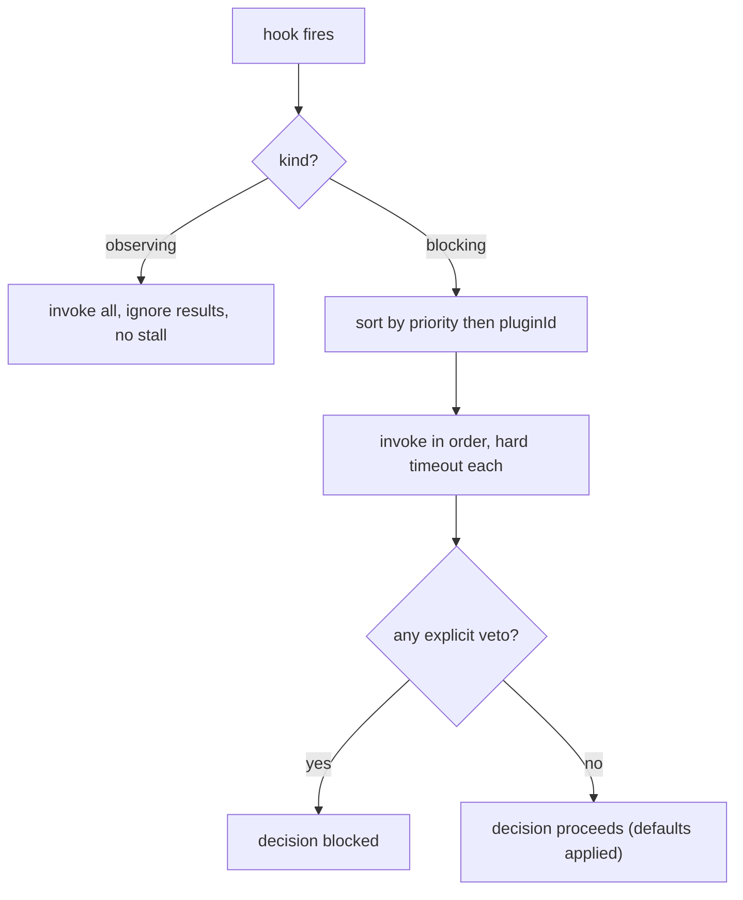

# HookSystem Specification (Part 03)

## Document Index

Part 01 - Purpose, philosophy, the observe/block split, the threat model
Part 02 - The hook catalog with a full signature for each hook
Part 03 - Blocking versus observing hooks, ordering, priority determinism
Part 04 - Hard timeouts, fail-closed defaults, veto model, error isolation
Part 05 - Re-entrancy guards, registration lifecycle, worked examples

# Purpose

This part defines the difference between blocking and observing hooks in operational terms, and the deterministic ordering and priority rules the HookDispatcher uses when more than one plugin registers for the same hook. Determinism is a security property here: a plugin must never be able to stealthily reorder the decision pipeline by racing another plugin.

# Blocking Versus Observing

```text
OBSERVING
  The dispatcher invokes the handler and discards its result.
  The runtime's decision is already made. The hook is notification.
  No timeout can stall the runtime because the outcome does not depend
  on the hook. (The dispatcher still bounds it for resource hygiene.)

BLOCKING
  The dispatcher invokes the handler and USES its result to decide.
  The runtime waits. The hook is on the critical path.
  A hard timeout and a fail-closed default apply (Part 04).
  A veto from the hook changes the outcome (negatively only).
```

The classification is fixed per hook name in the catalog (Part 02). A plugin cannot upgrade an observing hook to blocking or downgrade a blocking one; the kind is part of the contract.

# Ordering And Priority

When multiple plugins register the same hook, the dispatcher invokes them in a deterministic order so that behavior is reproducible and no plugin can gain advantage by "running first" or "running last" in a way that depends on install timing.

```text
ordering key:
  1. hook kind (blocking hooks run before any observing of the same event)
  2. declared priority (an integer from the contribution; lower runs first)
  3. plugin id (lexicographic, as a stable tiebreaker)
```

Priority is declared in the manifest `contributes.hooks` entry, not chosen at runtime. A plugin cannot raise its priority to jump the queue. Ties are broken by `pluginId` so the order is total and reproducible.

# Veto Aggregation For Blocking Hooks

For a blocking hook whose result is a veto, the dispatcher aggregates across plugins with a simple, fail-closed rule:

```text
any single veto  -> the decision is blocked, regardless of other allows
no veto, all allow (or timed out / threw) -> the decision proceeds
per-plugin timeout or throw -> treated as that plugin's default
   (for onBeforeMerge / onWorkflowStart / onNodeExecute: default = allow,
    so a failed plugin does NOT block; the runtime continues)
   (for onPermissionRequest: default = deny)
```

This means a malicious or broken plugin can at worst decline to block (for merge/workflow/node hooks) or deny a permission (for the permission hook). It can never convert an allow into a forced allow, because the default for the decision-critical hooks is allow and a plugin that fails simply yields the default. The dangerous direction (blocking the core) requires an explicit, successful veto from a granted plugin.

# Determinism Invariants

```text
Hook invocation order is a pure function of (kind, priority, pluginId).
A plugin cannot change its priority or order at runtime.
A blocking hook's default is applied on timeout, throw, or absence.
For merge/workflow/node hooks, a failed plugin yields allow (not block).
For the permission hook, a failed plugin yields deny (not allow).
The order is identical across runs given the same installed set.
```

# Mermaid Diagram



# AI Notes

Do not make hook order depend on install time or registration time. Non-deterministic order is how a plugin "wins the race" against a security hook. Order is a pure function of declared priority and id.

Do not let a failed plugin block the core by default. For merge/workflow/node hooks the default is allow, so a crashed or timed-out plugin yields the default and the runtime continues. Only an explicit successful veto blocks. The dangerous failure mode (freezing the core) is excluded by construction.

Do not let a plugin set priority at runtime to jump ahead of a security hook. Priority is manifest-declared and host-validated; runtime priority changes are ignored.

# Related Documents

- [[09-plugin-system/README]]
- [[HookSystem-Part01]]
- [[HookSystem-Part02]]
- [[HookSystem-Part04]]
- [[HookSystem-Part05]]
- [[PluginArchitecture-Part03]]
- [[PluginSDK-Part03]]
- [[MergeManager-Part01]]
