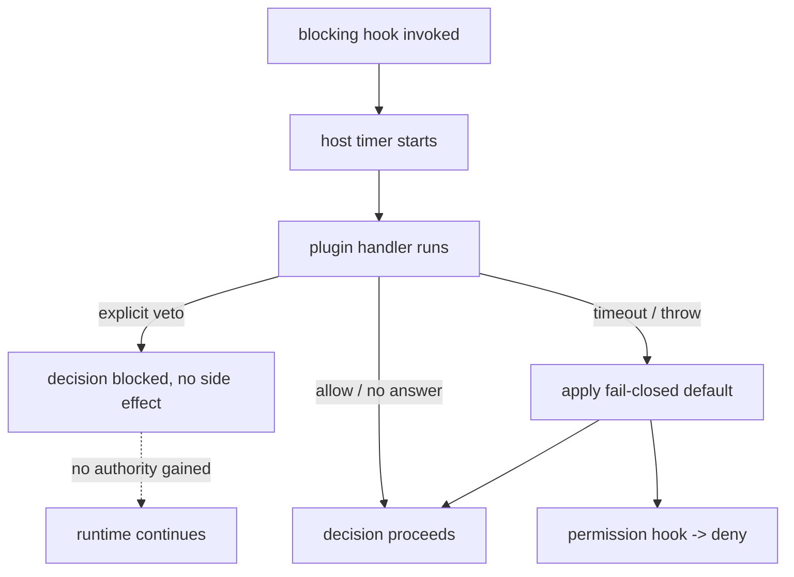

# HookSystem Specification (Part 04)

## Document Index

Part 01 - Purpose, philosophy, the observe/block split, the threat model
Part 02 - The hook catalog with a full signature for each hook
Part 03 - Blocking versus observing hooks, ordering, priority determinism
Part 04 - Hard timeouts, fail-closed defaults, veto model, error isolation
Part 05 - Re-entrancy guards, registration lifecycle, worked examples

# Purpose

This part defines the safety envelope around blocking hooks: the mandatory hard timeout, the fail-closed default applied on timeout/error/crash, the veto model and its non-escalation rule, and error isolation. These are the mechanisms that keep untrusted code on the critical path from becoming a core failure.

# The Mandatory Hard Timeout

Every blocking hook invocation is bounded by a hard timeout owned by the HookDispatcher, not the plugin. The timeout is short: a hook is a participant in a decision, not a long task. The dispatcher starts a timer before invoking the handler and abandons the call when the timer fires. The plugin cannot extend the timer, cannot "request more time", and cannot detect the timer except by its own cooperative abort signal.

```text
timeout sources, in priority:
  1. the hook-specific ceiling defined per hook name in the catalog
  2. the plugin's engineApiVersion policy (never above the ceiling)
  3. there is no plugin-supplied or runtime-escalated value
```

# The Fail-Closed Default

When a blocking hook times out, throws, returns a malformed result, or is simply not registered by any enabled plugin, the dispatcher applies that hook's defined default. The default is part of the catalog contract (Part 02) and is chosen so the safe outcome wins.

```text
onBeforeMerge      default = allow    (a failed plugin does not freeze merges)
onWorkflowStart    default = allow
onNodeExecute      default = allow
onPermissionRequest default = deny    (a failed plugin never grants authority)
```

The asymmetry is deliberate. For decision-critical runtime hooks, failure yields the status quo (proceed), because freezing the runtime is the worse failure. For the permission hook, failure yields deny, because granting by default would be an escalation.

# The Veto Model And Non-Escalation

A veto is a negative decision: "do not do this". It confers no authority. The cardinal rule:

```text
A plugin veto MUST NOT grant the plugin any authority it did not
already hold. A veto is a subtraction, never an addition.
```

Concretely, an `onBeforeMerge` veto that blocks an Artifact must not, as a side effect, let the plugin write the file itself, read a secret, or register a tool. The dispatcher applies the veto and nothing else. The plugin's only observable effect of a veto is the blocked decision. If the plugin wants a different action, it must request it through a normal capability-gated RPC like any other call, and that request is checked against the frozen grant like any other.

# Error Isolation

A hook handler's error is contained. The dispatcher catches it, attributes it to the plugin id, records it against the circuit breaker (see [[PluginLifecycle-Part06]]), applies the fail-closed default, and continues. The error MUST NOT propagate as a runtime exception, MUST NOT stall the decision pipeline, and MUST NOT affect sibling plugins' hook handlers. Each registered handler is isolated: one throwing does not prevent the others from being invoked (except that a veto from any already-decided handler short-circuits the decision).

# The Permission Hook Is Not Escalation

`onPermissionRequest` is the most sensitive hook and the most constrained. It exists only to apply a fine-grained, pre-existing policy beyond the stored grant (for example, "allow `fs.read` for this path but not that one"). It can only DENY or apply a policy the grant already permits. It cannot invent a capability the grant did not include. Its default is deny. A plugin that uses it to try to widen authority is rejected at registration (the grant is the ceiling) and its hook calls are answered with deny.

# Safety Invariants

```text
Every blocking hook has a host-owned hard timeout. No extension.
On timeout/throw/malformed/absent, the catalog default applies.
Decision-critical hooks default to allow; the permission hook defaults
to deny.
A veto confers no authority and produces no side effect.
A hook error is isolated, attributed, and breaker-counted.
A failed plugin never stalls or crashes the runtime.
```

# Mermaid Diagram



# AI Notes

Do not make the permission hook's default allow "so plugins work". Its default is deny precisely because a failed permission check must never grant. The stored grant is the ceiling; the hook only refines it downward.

Do not let a veto have a side effect. A veto is "no". If the plugin also needs to read a file to justify the veto, that is a separate RPC checked against the grant. Bundling authority into a veto is the escalation this folder forbids.

Do not let one plugin's hook error abort the others. Isolate per handler; catch, attribute, breaker-count, default, continue. The pipeline must finish with a decision no matter what the plugins do.

# Related Documents

- [[09-plugin-system/README]]
- [[HookSystem-Part01]]
- [[HookSystem-Part02]]
- [[HookSystem-Part03]]
- [[HookSystem-Part05]]
- [[PluginLifecycle-Part06]]
- [[PluginArchitecture-Part04]]
- [[MergeManager-Part01]]
- [[PermissionManager-Part01]]
