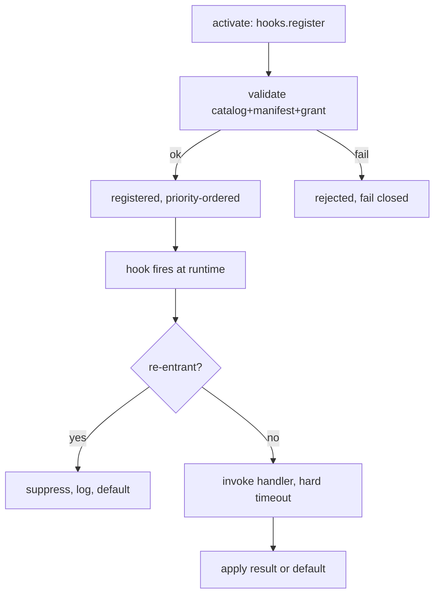

# HookSystem Specification (Part 05)

## Document Index

Part 01 - Purpose, philosophy, the observe/block split, the threat model
Part 02 - The hook catalog with a full signature for each hook
Part 03 - Blocking versus observing hooks, ordering, priority determinism
Part 04 - Hard timeouts, fail-closed defaults, veto model, error isolation
Part 05 - Re-entrancy guards, registration lifecycle, worked examples

# Purpose

This part closes the HookSystem with the rules that prevent a hook from becoming a re-entrancy or recursion hazard, the registration lifecycle a plugin follows, and a worked example showing a correct blocking and observing hook. Re-entrancy is a real danger: a hook that triggers the event it hooks can loop forever and stall the core.

# Re-Entrancy Guards

A hook handler MUST NOT be able to re-enter the same decision synchronously. The dispatcher enforces this with a per-hook, per-dispatch re-entrancy guard.

```text
A blocking hook invocation runs inside a "dispatch context" tagged with
the hook name and the decision id. While that context is active, the
plugin's attempts to trigger the same hook (directly or by causing the
event) are suppressed: the dispatcher ignores the re-entrant fire and
logs a hook.reentrancy_suppressed observation event.

A hook handler that calls a tool or RPC which itself would fire a hook
does NOT see its own fire. The decision in flight is already committed
to using the handler's current result.
```

This prevents the classic trap: an `onBeforeMerge` veto handler that, to decide, calls a tool which produces an Artifact which fires `onBeforeMerge` again, infinitely. The guard breaks the loop at the second fire.

# Cross-Hook Re-Entrancy

Even cross-hook re-entrancy is bounded. A handler for `onNodeExecute` that causes a `tool.invoke` which causes `onToolCalled` is allowed (observation), but a handler for a blocking hook that causes another blocking hook to fire and wait on the same plugin's answer is guarded: the second fire is detached and resolved with its default, because the plugin is already on the stack for the first and cannot answer both. The runtime never blocks on a plugin answering two nested critical-path hooks simultaneously.

# Registration Lifecycle

A plugin registers hooks inside `activate` via `context.hooks.register(name, handler)` (see [[PluginSDK-Part03]]). The dispatcher validates each registration:

```text
1. name is in the catalog (Part 02)
2. name was declared in contributes.hooks
3. name was granted in the frozen grant (hook.register scope)
4. priority is an integer within the allowed range
5. handler is a function
```

Any failed check rejects that registration (fail closed); other valid registrations still stand. On `deactivate`, all of the plugin's hook registrations are dropped by the host before the process is killed, so a dead plugin cannot keep receiving hook fires.

# Worked Example: An Observing Hook

A plugin that logs every tool call registers `onToolCalled`. The handler receives the payload, emits a namespaced event via `context.events`, and returns. Its return value is ignored. It cannot change the tool call. It runs after the fact. It is safe by construction.

# Worked Example: A Blocking Hook

A plugin that guards merges registers `onBeforeMerge`. The handler inspects `proposedPatch` and `targetPath`. If the path is under a protected directory the plugin was granted to read, it returns `{ veto: true, reason: "protected path" }`. Otherwise it returns `{ veto: false }`. If the handler times out or throws, the dispatcher applies the default (allow) and the merge proceeds; the plugin's failure does not freeze merges. The veto grants the plugin nothing; it only blocks this one Artifact.

# HookSystem Final Invariants

```text
Re-entrant hook fires are suppressed by a per-dispatch guard.
A blocking hook cannot wait on a nested blocking hook from the same
plugin; the nested fire resolves with its default.
Hook registration is validated against catalog, manifest, and grant.
All of a plugin's hooks are dropped on deactivate before process kill.
A hook handler's only critical-path effect is its decision; no side
effect, no authority gain.
```

# Mermaid Diagram



# AI Notes

Do not let a hook handler trigger the event it hooks without a guard. The re-entrancy loop is the fastest way to turn a "helpful" plugin into a core freeze. The guard is host-enforced, not a convention the plugin is expected to follow.

Do not let a blocking hook wait on a nested blocking hook from the same plugin. The plugin is on the stack; it cannot answer both. The nested fire must resolve with its default so the outer decision can complete.

Do not keep a dead plugin's hook registrations alive after deactivate. Dropping them before the kill is what ensures a crashed plugin stops receiving fires immediately, not "after the next GC".

# Related Documents

- [[09-plugin-system/README]]
- [[HookSystem-Part01]]
- [[HookSystem-Part02]]
- [[HookSystem-Part03]]
- [[HookSystem-Part04]]
- [[HookSystem-Diagrams]]
- [[PluginSDK-Part02]]
- [[PluginSDK-Part03]]
- [[PluginLifecycle-Part06]]
- [[MergeManager-Part01]]
