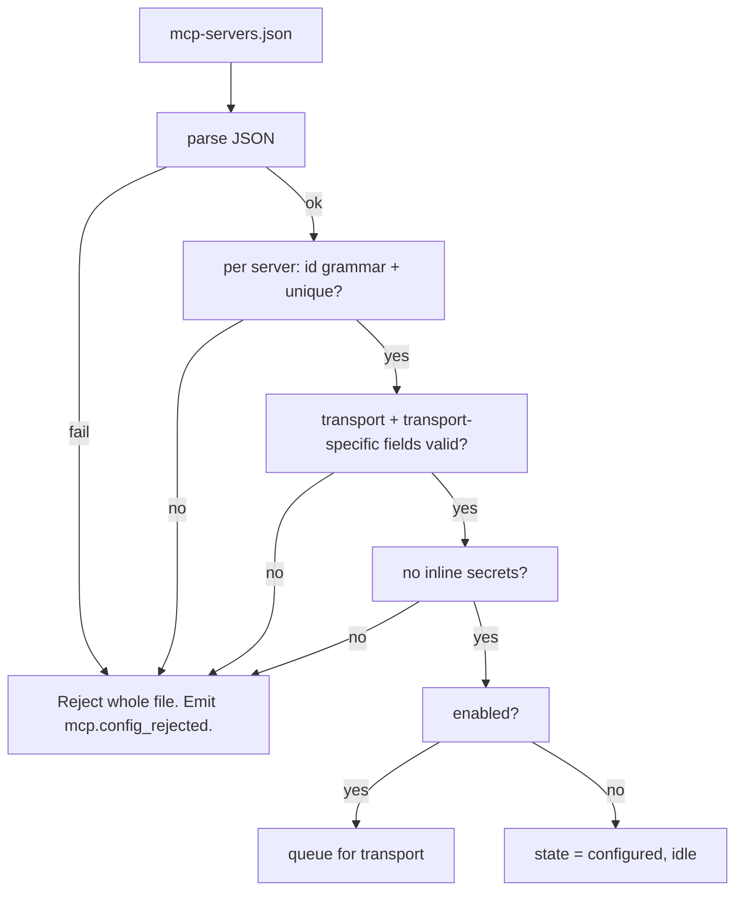
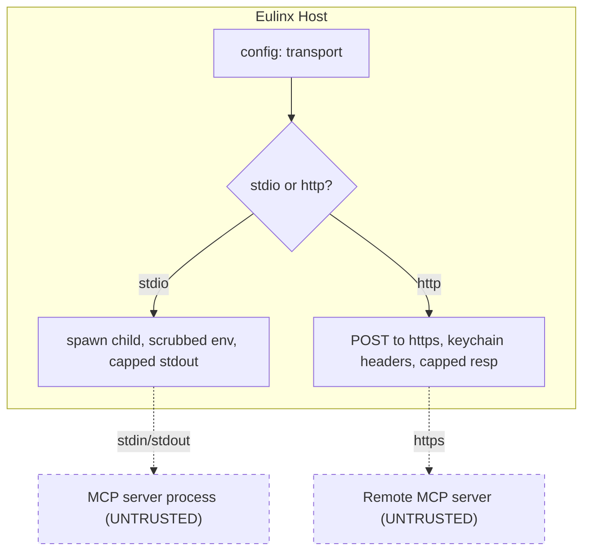
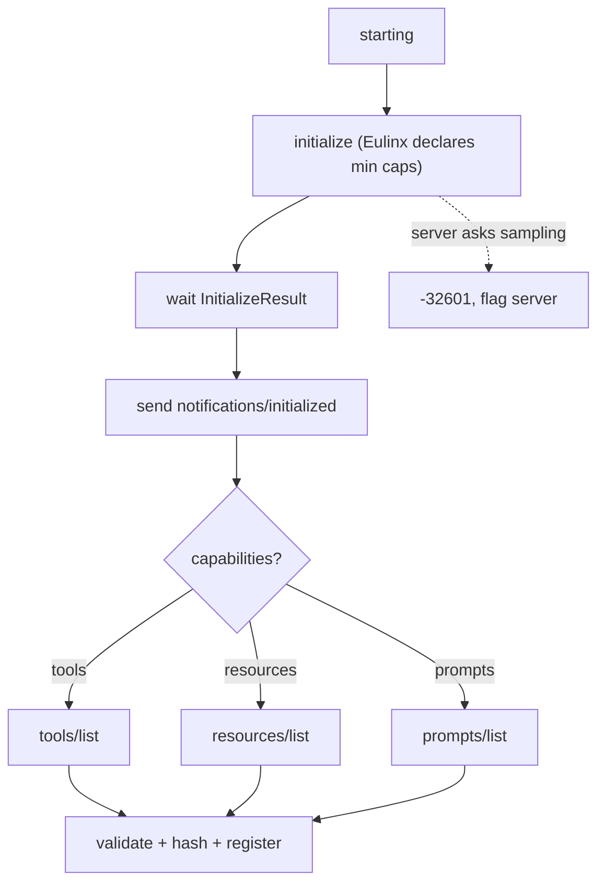
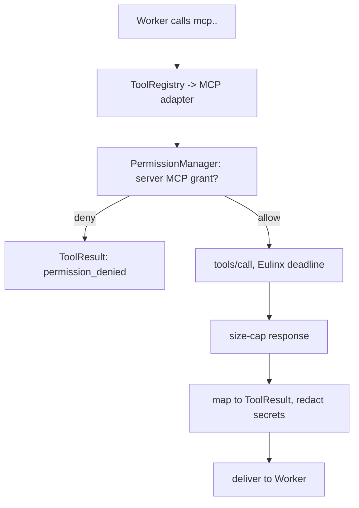
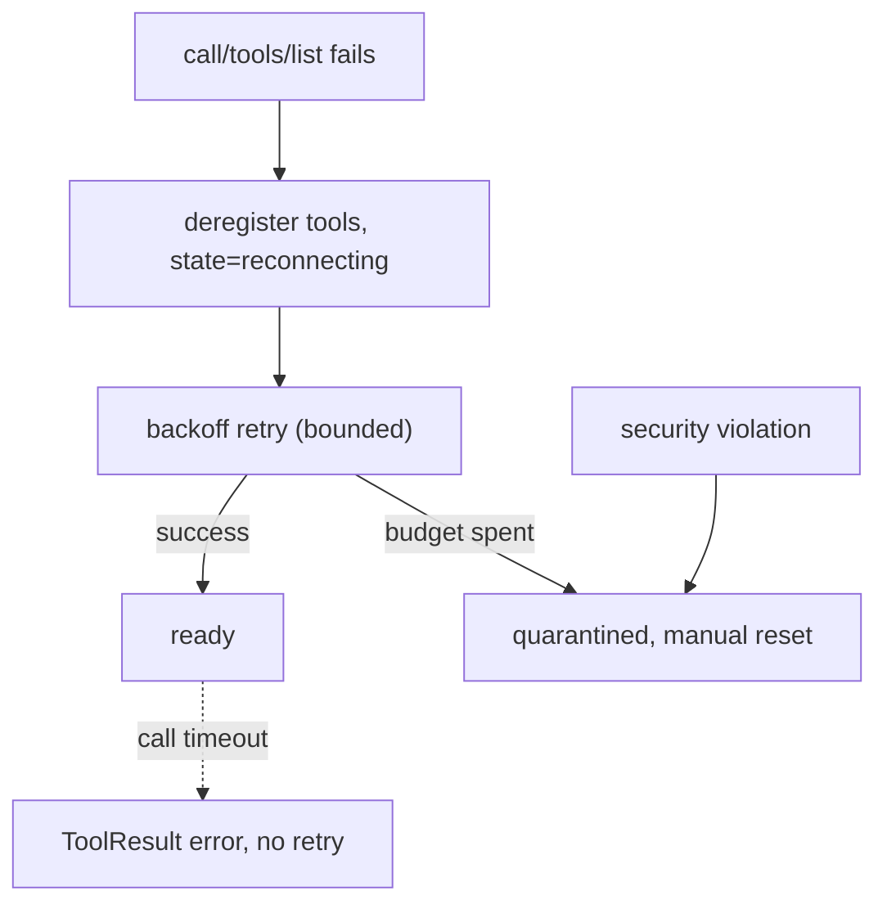

---
title: MCPIntegration Diagrams
status: draft
version: 1.0
tags:
  - plugin-system
  - mcp-integration
  - diagrams
related:
  - "[[09-plugin-system/README]]"
  - [[MCPIntegration-Part01]]
  - [[MCPIntegration-Part04]]
  - [[MCPIntegration-Part05]]
---

# MCPIntegration Diagrams

## Eulinx Is An MCP Client

```text
                      Eulinx process
   +--------------------------------------------------+
   |                                                  |
   |   Worker  -->  ToolRegistry  -->  MCPAdapter     |
   |                                        |         |
   |                                   MCPClient      |
   |                                        |         |
   |                              MCPConnectionPool   |
   |                                   |    |    |    |
   +-----------------------------------|----|----|----+
                                       |    |    |
                       stdio child ----+    |    +---- HTTPS
                                            |
                                       stdio child

   Eulinx INITIATES. Eulinx sends initialize. Eulinx sends tools/call.
   The server RESPONDS.
   A server MUST NOT be able to call INTO Eulinx's tools.
   Eulinx declares NO sampling, NO roots, NO elicitation.
```

## Config Validation



## Transports



## Handshake And Capability Negotiation



## Tool Mapping And Invocation



## Failure And Quarantine



## Related Documents

- [[09-plugin-system/README]]
- [[MCPIntegration-Part01]]
- [[MCPIntegration-Part02]]
- [[MCPIntegration-Part03]]
- [[MCPIntegration-Part04]]
- [[MCPIntegration-Part05]]
- [[MCPIntegration-Part06]]
- [[ToolRegistry-Part01]]
- [[PermissionManager-Part01]]
