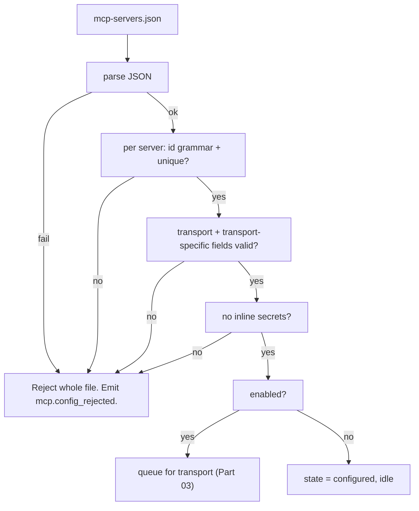

---
title: MCPIntegration Specification - Part 02
status: draft
version: 1.0
tags:
  - plugin-system
  - mcp-integration
  - config
  - schema
related:
  - "[[09-plugin-system/README]]"
  - [[MCPIntegration-Part01]]
  - [[MCPIntegration-Part03]]
  - [[MCPIntegration-Part04]]
---

# MCPIntegration Specification (Part 02)

## Document Index

Part 01 - Purpose, Philosophy, Definition, Client Architecture, Object Model, States
Part 02 - Server Configuration File Schema and Validation
Part 03 - Transports: stdio and HTTP, with Concrete Tradeoffs
Part 04 - Connection Lifecycle, Initialize Handshake, Capability Negotiation, Discovery
Part 05 - Tool Mapping into ToolRegistry, Invocation Path, Result Mapping, Auth and Secrets
Part 06 - Failure, Retry, Health, Checklist, Worked Examples
Diagrams - MCPIntegration-Diagrams.md

# Purpose

This part defines the MCP server configuration file: its schema, every field, and the validation that runs before any server is started. The config file is the only thing Eulinx reads to decide what to connect to. It is untrusted input from Eulinx's point of view (a user may point it at any server), and validation is fail closed.

# The Config File

The config is a JSON document, conventionally `mcp-servers.json`, holding an array or map of server entries. Eulinx reads it at startup and on a reload signal. It never executes anything from it; it validates, then (for enabled entries) connects via the transport in Part 03.

```text
mcp-servers.json
  version        required   config schema version pin
  servers        required   map of serverId -> ServerConfig
```

Each `ServerConfig` entry declares how to reach the server, what transport to use, and where to get its secret.

```text
ServerConfig:
  id             required   the server id used in namespacing (mcp.<id>.*)
  transport      required   "stdio" or "http"
  enabled        required   boolean; disabled entries are parsed, not started
  command        stdio-only required   the executable to spawn
  args           stdio-only optional   argv passed to the executable
  env            stdio-only optional   extra env KEYS only; values come from
                                       the OS keychain, never inline (Part 05)
  url            http-only  required   the Streamable HTTP endpoint
  headers        http-only  optional   header NAMES only; values from keychain
  scope          optional   human label for the server's purpose (metadata)
  capabilities   optional   expected capability hints; not trusted, re-checked
  trust          optional   "untrusted" (default) | "internal"; never relaxes
                          the sandbox, only affects UI labeling
```

# id Grammar And Namespacing

The `id` is the local key used to namespace the server's tools as `mcp.<id>.<toolName>` (Part 05). It is subject to a closed grammar so it is always safe as a registry key and a settings path segment.

```text
id    := [a-z][a-z0-9_-]*     must start with a lowercase letter
max length                    48 characters
reserved "Eulinx"                forbidden (core namespace)
reserved "internal"           forbidden
```

Two enabled servers with the same `id` is a config error; the second is rejected. The `id` is local and assigned by the user, not by a remote authority.

# Validation Order

```text
1. config parses as JSON and matches the pinned version
2. servers is a non-empty map (or empty = no servers, valid)
3. each server: id grammar + not reserved + unique
4. each server: transport is "stdio" or "http"
5. stdio server: command present, args is an array of strings
6. http server: url present, is https (http rejected unless explicit
   dev override), headers is an array of names
7. env / headers keys are strings; VALUES are never present inline
8. enabled is boolean
9. any server failing validation is rejected; a rejected server
   emits mcp.config_rejected and is never started
```

# Secrets Are Never Inline

The config may name an `env` key or a `headers` name, but it MUST NOT contain the value. The value is resolved from the OS keychain at connect time (Part 05) using the key name. A config that contains an inline secret-looking value (a long base64 or a Bearer token) is rejected, because secrets in config files is the canonical leak. The redaction algorithm in Part 05 applies to any value the host resolves.

# Config Invariants

```text
Validation is fail closed; a bad server entry is never started.
A server id is local, grammar-checked, unique, and not reserved.
Secrets are referenced by key name, resolved from the keychain, never
inline in the config.
A rejected server emits mcp.config_rejected and contributes zero tools.
The config is data; it never executes code.
A config hash change forces a full teardown and rebuild (Part 01).
```

# Mermaid Diagram



# AI Notes

Do not put the API token in the config file "for now". There is no "for now". The keychain reference format in Part 05 is the only supported way; inline secrets are rejected.

Do not accept `http://` for the HTTP transport in normal use. MCP over plain HTTP is unauthenticated, unencrypted, and trivially tampered with. Require `https` unless an explicit, logged dev override is set.

Do not start a server whose config entry failed validation "because the others are fine". A bad entry is rejected individually and emits `mcp.config_rejected`; the rest proceed. But never let a partial parse silently drop servers. Fail closed on the file; reject per-entry on structure.

# Related Documents

- [[09-plugin-system/README]]
- [[MCPIntegration-Part01]]
- [[MCPIntegration-Part03]]
- [[MCPIntegration-Part04]]
- [[MCPIntegration-Part05]]
- [[MCPIntegration-Part06]]
- [[MCPIntegration-Diagrams]]
- [[ToolRegistry-Part01]]
- [[PermissionManager-Part01]]
- [[PluginArchitecture-Part04]]
