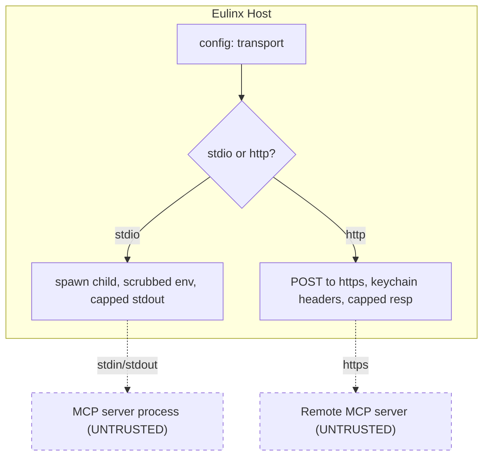

---
title: MCPIntegration Specification - Part 03
status: draft
version: 1.0
tags:
  - plugin-system
  - mcp-integration
  - transport
  - stdio
  - http
related:
  - "[[09-plugin-system/README]]"
  - [[MCPIntegration-Part01]]
  - [[MCPIntegration-Part02]]
  - [[MCPIntegration-Part04]]
  - [[ProcessLifecycle-Part01]]
---

# MCPIntegration Specification (Part 03)

## Document Index

Part 01 - Purpose, Philosophy, Definition, Client Architecture, Object Model, States
Part 02 - Server Configuration File Schema and Validation
Part 03 - Transports: stdio and HTTP, with Concrete Tradeoffs
Part 04 - Connection Lifecycle, Initialize Handshake, Capability Negotiation, Discovery
Part 05 - Tool Mapping into ToolRegistry, Invocation Path, Result Mapping, Auth and Secrets
Part 06 - Failure, Retry, Health, Checklist, Worked Examples
Diagrams - MCPIntegration-Diagrams.md

# Purpose

This part defines the two transports Eulinx supports for MCP servers, stdio and Streamable HTTP, and the concrete tradeoffs of each. Both are treated as untrusted third-party connections; the differences are about process ownership and network exposure, not about trust.

# stdio Transport

A stdio server is a child process Eulinx spawns. Eulinx writes JSON-RPC requests to the process's stdin and reads responses from its stdout. The process is created by [[ProcessLifecycle-Part01]] with the same hardening as any plugin process: a scrubbed environment, a dedicated working directory, no inherited handles, and a resource budget.

```text
stdio connection:
  spawn the command with args from config (Part 02)
  env is scrubbed; only keychain-resolved secrets are added (Part 05)
  working directory is the server's own dir, never the workspace root
  stdin/stdout carry length-framed JSON-RPC
  stderr is captured, capped, and redacted; never fed to a model
  the process is killable by Eulinx at any time
```

Tradeoffs: stdio gives Eulinx full process control (it can kill the server), no network listener, and natural isolation. The downside is the server runs on the user's machine as a child of Eulinx, so a server that exhausts CPU or memory is the host's problem; the resource budget mitigates this. A stdio server MUST NOT be assumed safe because "it's local"; local code is exactly what exfiltrates local files.

# Streamable HTTP Transport

An HTTP server is a remote endpoint Eulinx connects to over Streamable HTTP (POST requests carrying JSON-RPC, with optional server-push over SSE). Eulinx is the client; it never listens. The connection is host-executed and capability-gated like any network call (the `net.http` capability model applies conceptually, though MCP servers are configured explicitly).

```text
http connection:
  POST JSON-RPC to the configured https url
  headers are names from config; values from the keychain (Part 05)
  responses are size-capped before parsing
  server-push (SSE) is treated as untrusted input, capped, and redacted
  the connection is timeout-bounded on every request
```

Tradeoffs: HTTP lets a server run elsewhere (another machine, a SaaS), which is convenient but means the server is on someone else's machine and its responses are fully attacker-controlled. The trust posture is stricter, not looser. A remote server gets no more authority than a local one; it gets less visibility into the workspace, which is fine because it should not have any.

# Framing For stdio

Because stdio is a byte stream, Eulinx frames each JSON-RPC message. The exact framing follows the MCP spec's newline-delimited or length-prefixed form; the key safety rule is that Eulinx MUST NOT read an unbounded stream from the child's stdout. A server that emits an infinite stream would consume all host memory. Eulinx reads frame-by-frame with a maximum frame size; a frame over the cap is discarded and the server is flagged.

# Transport Selection Rules

```text
stdio is preferred for local servers Eulinx should be able to kill.
http is required for remote servers; must be https in normal use.
A server's transport is fixed in config and never negotiated by the
server.
Neither transport grants the server any inbound access to Eulinx.
Neither transport relaxes the sandbox, permission, or redaction rules.
```

# Transport Invariants

```text
A stdio server is a hardened child process with a scrubbed env.
A stdio server's stdout is read frame-by-frame with a size cap.
An HTTP server is https-only in normal use and client-only.
Eulinx never listens for inbound MCP connections on either transport.
Every request on either transport is timeout-bounded and size-capped.
A server cannot upgrade its transport or gain inbound access.
```

# Mermaid Diagram



# AI Notes

Do not read a stdio child's stdout with an unbounded read loop. A server that streams forever exhausts host memory. Frame and cap; discard over-cap frames and flag the server.

Do not accept `http://` for the HTTP transport. Plain HTTP MCP is tamperable and unauthenticated; require https unless an explicit dev override is set and logged.

Do not assume a local stdio server is safer than a remote one. Local code exfiltrates local files. Both transports get identical sandbox and permission treatment.

# Related Documents

- [[09-plugin-system/README]]
- [[MCPIntegration-Part01]]
- [[MCPIntegration-Part02]]
- [[MCPIntegration-Part04]]
- [[MCPIntegration-Part05]]
- [[MCPIntegration-Diagrams]]
- [[ProcessLifecycle-Part01]]
- [[PermissionManager-Part01]]
- [[PluginArchitecture-Part05]]
