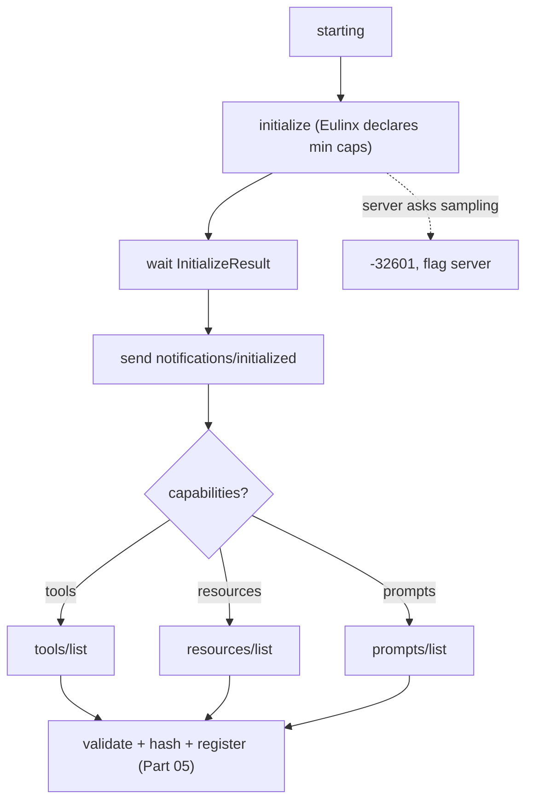

---
title: MCPIntegration Specification - Part 04
status: draft
version: 1.0
tags:
  - plugin-system
  - mcp-integration
  - handshake
  - discovery
related:
  - "[[09-plugin-system/README]]"
  - [[MCPIntegration-Part01]]
  - [[MCPIntegration-Part03]]
  - [[MCPIntegration-Part05]]
---

# MCPIntegration Specification (Part 04)

## Document Index

Part 01 - Purpose, Philosophy, Definition, Client Architecture, Object Model, States
Part 02 - Server Configuration File Schema and Validation
Part 03 - Transports: stdio and HTTP, with Concrete Tradeoffs
Part 04 - Connection Lifecycle, Initialize Handshake, Capability Negotiation, Discovery
Part 05 - Tool Mapping into ToolRegistry, Invocation Path, Result Mapping, Auth and Secrets
Part 06 - Failure, Retry, Health, Checklist, Worked Examples
Diagrams - MCPIntegration-Diagrams.md

# Purpose

This part defines the connection lifecycle: the `initialize` handshake, capability negotiation, and discovery (`tools/list`, `resources/list`, `prompts/list`). The ordering is fixed by the protocol and load-bearing: no method other than `initialize` is sent before `InitializeResult`, and no method is called whose capability the server did not declare.

# The Connection Lifecycle

A connection moves through states (defined in Part 01): `configured` -> `starting` -> `handshaking` -> `discovering` -> `registering` -> `ready`, with `degraded`, `reconnecting`, `stopping`, `stopped`, and `quarantined` as the exceptional states. The transitions are host-driven.

# The initialize Handshake

The first JSON-RPC message on a connection is always `initialize`. Eulinx sends its client info and an explicit, minimal client capability set. The minimal set is a security decision, not an oversight.

```text
Eulinx's initialize request declares:
  client capabilities:
    roots:        NOT declared   (Eulinx will not expose filesystem roots)
    sampling:     NOT declared   (Eulinx will not let the server spend tokens)
    elicitation:  NOT declared   (Eulinx will not let the server prompt the user)
  protocol version: the highest version Eulinx supports from the allowed set
```

Eulinx waits for `InitializeResult`. Only after that, and only after sending `notifications/initialized`, does Eulinx send any other request.

# Capability Negotiation

The `InitializeResult` carries the server's declared capabilities (`tools`, `resources`, `prompts`, `logging`, `completions`). Eulinx records them. From that point, Eulinx calls a method only if the server declared the corresponding capability. Calling an undeclared method is how you get `-32601` responses that look like transport failures, so the rule is enforced strictly.

```text
call tools/list       only if capabilities.tools present
call resources/list   only if capabilities.resources present
call prompts/list     only if capabilities.prompts present
never call sampling/createMessage   (Eulinx did not declare sampling)
never call roots/list            (Eulinx did not declare roots)
```

If a server sends a `sampling/createMessage` or `roots/list` request to Eulinx despite Eulinx not declaring those capabilities, Eulinx answers with JSON-RPC error `-32601 Method not found` and flags the server. Honoring `sampling/createMessage` would let an untrusted server spend the user's tokens on its chosen prompt; honoring `roots/list` would let it enumerate the user's files. Both are refused.

# Discovery

After handshake, Eulinx runs discovery for each declared capability:

```text
tools/list       -> list of tool descriptors (name, description, schema)
resources/list   -> list of resource descriptors (uri, name, mimeType)
prompts/list     -> list of prompt descriptors (name, arguments)
```

Each result is validated (Part 05) and, for tools, namespaced and registered. A `notifications/tools/list_changed` from the server triggers a re-list, but only after comparing the `toolsListHash` (Part 01) to detect an actual change; Eulinx does not blindly re-register on every notification.

# Protocol Version Handling

Eulinx supports a fixed set of MCP protocol versions. If the server's negotiated version is not in that set, Eulinx rejects the connection (state `stopped`) rather than speaking an unknown protocol. A version mismatch is a configuration error, not a reason to "try anyway".

# Handshake Invariants

```text
initialize is the first and only first request.
No method other than initialize is sent before InitializeResult.
A method is called only if its capability was declared by the server.
Eulinx declares no sampling, no roots, no elicitation.
A server requesting sampling/roots gets -32601 and is flagged.
Discovery runs only for declared capabilities.
tools/list_changed re-lists only after a hash change is confirmed.
A protocol version outside Eulinx's set rejects the connection.
```

# Mermaid Diagram



# AI Notes

Do not skip `initialize` because "the server works without it". A client that calls `tools/list` before `initialize` is broken per the protocol and fails against strict servers. The handshake is the contract.

Do not declare `sampling` or `roots` to "be compatible". Compatibility is not worth letting a server spend your tokens or read your file tree. Eulinx's minimal capability set is deliberate; keep it minimal.

Do not re-register tools on every `tools/list_changed` notification without checking the hash. A chatty server would cause constant re-registration churn; the hash makes re-list a no-op when nothing changed.

# Related Documents

- [[09-plugin-system/README]]
- [[MCPIntegration-Part01]]
- [[MCPIntegration-Part02]]
- [[MCPIntegration-Part03]]
- [[MCPIntegration-Part05]]
- [[MCPIntegration-Part06]]
- [[MCPIntegration-Diagrams]]
- [[ToolRegistry-Part01]]
- [[PermissionManager-Part01]]
