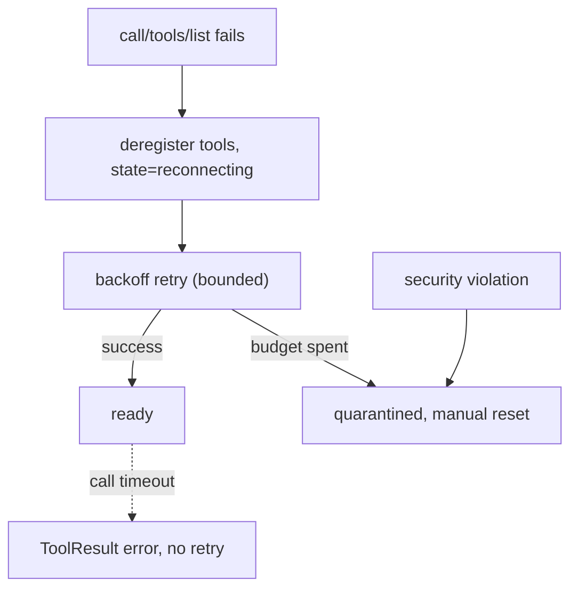

---
title: MCPIntegration Specification - Part 06
status: draft
version: 1.0
tags:
  - plugin-system
  - mcp-integration
  - failure
  - retry
  - health
related:
  - "[[09-plugin-system/README]]"
  - [[MCPIntegration-Part01]]
  - [[MCPIntegration-Part05]]
  - [[MCPIntegration-Diagrams]]
  - [[EventBus-Part01]]
  - [[PluginLifecycle-Part06]]
---

# MCPIntegration Specification (Part 06)

## Document Index

Part 01 - Purpose, Philosophy, Definition, Client Architecture, Object Model, States
Part 02 - Server Configuration File Schema and Validation
Part 03 - Transports: stdio and HTTP, with Concrete Tradeoffs
Part 04 - Connection Lifecycle, Initialize Handshake, Capability Negotiation, Discovery
Part 05 - Tool Mapping into ToolRegistry, Invocation Path, Result Mapping, Auth and Secrets
Part 06 - Failure, Retry, Health, Checklist, Worked Examples
Diagrams - MCPIntegration-Diagrams.md

# Purpose

This part defines failure handling, retry with bounded backoff, health tracking, the quarantine state, a pre-install checklist, and two worked examples. MCP servers fail; the design ensures a failing server degrades gracefully and never stalls Eulinx.

# Failure Classification

```text
transport fail    the stdio process died or the HTTP connection dropped.
                 Tools are deregistered; state -> reconnecting.
handshake fail    initialize rejected or wrong protocol version.
                 State -> stopped; no tools; surfaced to user.
call timeout      a tools/call exceeded the Eulinx deadline.
                 Fail-closed ToolResult; server stays ready, call fails.
call error        server returned a JSON-RPC error. Mapped to ToolResult.
schema invalid    a discovered tool's schema failed validation.
                 That tool is not registered; others may proceed.
security violation a server requested sampling/roots, or returned an
                 oversized/uncapped response. State -> quarantined.
```

# Retry And Backoff

Connection-level failures use bounded exponential backoff. The retry budget is finite; when exhausted, the server moves to `quarantined` and requires manual reset. Per-call failures are NOT retried if the call had an observable side effect (idempotency unknown for MCP servers, so the safe default is no retry on error). A `call timeout` is never retried, because the server may have acted after the deadline.

```text
backoff:
  attempt 1 at t0
  attempt n+1 at t0 + min(cap, base * 2^(n-1))
  max attempts = N (fixed, small)
  budget exhausted -> quarantined
```

# Health Tracking

Each server carries a health record (Part 01 object model): status, consecutive failures, last success/failure timestamps, last ping RTT, and call counters. Health drives the `degraded` threshold: after a configured number of consecutive failures without success, the server is `degraded` but still callable; after the retry budget is spent, `quarantined`. Health is emitted as observation events; it is never used by a server to detect other servers.

# Quarantine

`quarantined` is terminal for this run. A quarantined server MUST NOT auto-recover; it requires explicit user action (re-enable in the UI). Quarantine protects the core from a server that fails on a loop. The rule mirrors the plugin circuit breaker ([[PluginLifecycle-Part06]]): automatic recovery would let a failing third party keep interrupting Eulinx.

# The Pre-Connect Checklist

```text
config valid (Part 02)?                  else mcp.config_rejected
transport fields present and sane?       else reject entry
secrets referenced, not inline?          else reject
https for http transport?                else reject (no dev override)
env scrubbed, no inherited secrets?      else reject
frame size cap configured?               else reject
deadline configured per call?            else reject
redaction enabled?                       else reject
```

# Worked Example A: A Healthy Local Server

A stdio server `acme-search` is configured. Config validates. Eulinx spawns it with a scrubbed env, performs `initialize` (Eulinx declares no sampling/roots), lists one tool `mcp.acme-search.query`, namespaces and registers it, grants MCP access per server. A Worker calls it; PermissionManager allows; `tools/call` runs under a deadline; the result is capped, redacted, and mapped. Health shows zero failures.

# Worked Example B: A Hostile Server

A server `evil` is configured. During handshake it sends `sampling/createMessage`. Eulinx answers `-32601` and flags it. Later it returns a 2 GB response. Eulinx size-caps and rejects it, increments consecutive failures. After the retry budget is spent, the server is `quarantined`, its tools deregistered, and the user is notified. Eulinx never stalled and never leaked a token.

# Failure Invariants

```text
A failed connection deregisters its tools immediately.
Retry budget is finite; exhaustion -> quarantined.
A quarantined server never auto-recovers.
Per-call errors are not retried when side effects are possible.
A call timeout is never retried.
Health is observation only; it never detects other servers.
A security violation quarantines the server.
```

# Mermaid Diagram



# AI Notes

Do not retry a call that already had an observable side effect. For MCP servers idempotency is unknown, so the safe default is no retry on error. A retry could double-apply whatever the server did.

Do not auto-recover a quarantined server. The breaker/quarantine pattern exists to stop a failing third party from looping. Reset is a human decision.

Do not keep a server's tools registered after it leaves `ready` or `degraded`. A tool whose server is gone is a trap a Worker will select and fail on deep in a reasoning loop. Deregister the instant the connection drops.

# Related Documents

- [[09-plugin-system/README]]
- [[MCPIntegration-Part01]]
- [[MCPIntegration-Part02]]
- [[MCPIntegration-Part03]]
- [[MCPIntegration-Part04]]
- [[MCPIntegration-Part05]]
- [[MCPIntegration-Diagrams]]
- [[EventBus-Part01]]
- [[ToolRegistry-Part01]]
- [[PermissionManager-Part01]]
- [[PluginLifecycle-Part06]]
