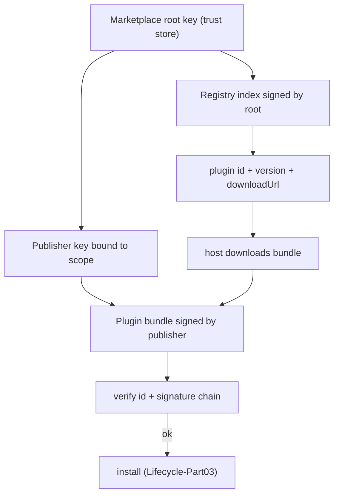
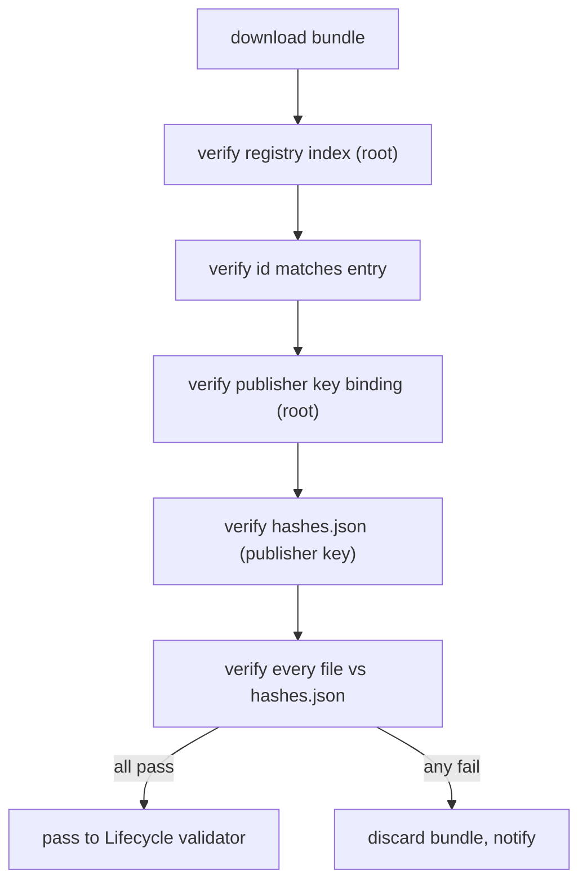
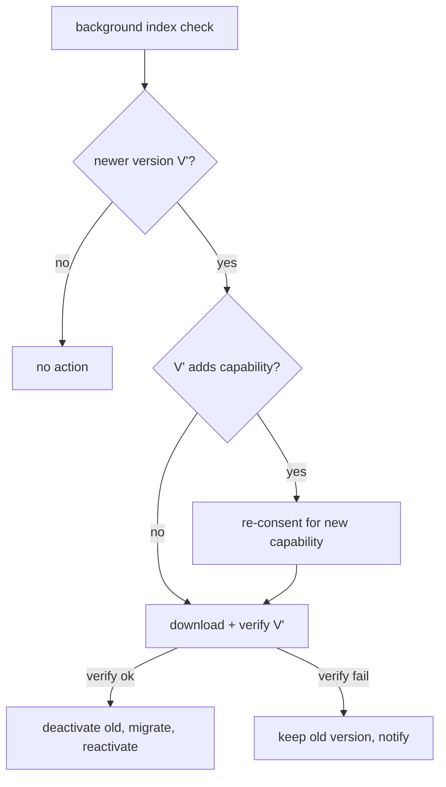
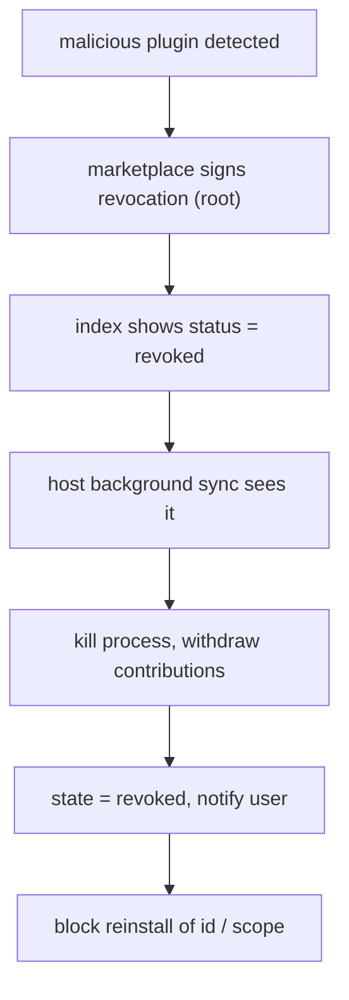
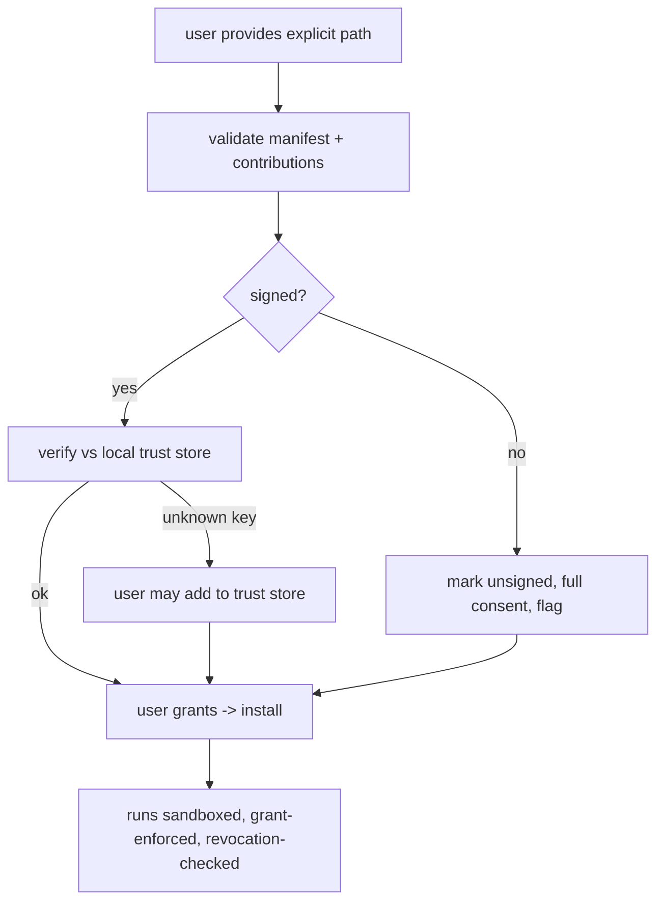

# MarketplaceIntegration Diagrams

## Trust Chain: Root -> Publisher -> Plugin

## Verification At Download

## Version Resolution And Update

## Revocation Propagation

## Local Install And Trust Store

## Related Documents

- [[09-plugin-system/README]]
- [[MarketplaceIntegration-Part01]]
- [[MarketplaceIntegration-Part02]]
- [[MarketplaceIntegration-Part03]]
- [[MarketplaceIntegration-Part04]]
- [[MarketplaceIntegration-Part05]]
- [[PluginArchitecture-Part02]]
- [[PluginLifecycle-Part03]]
