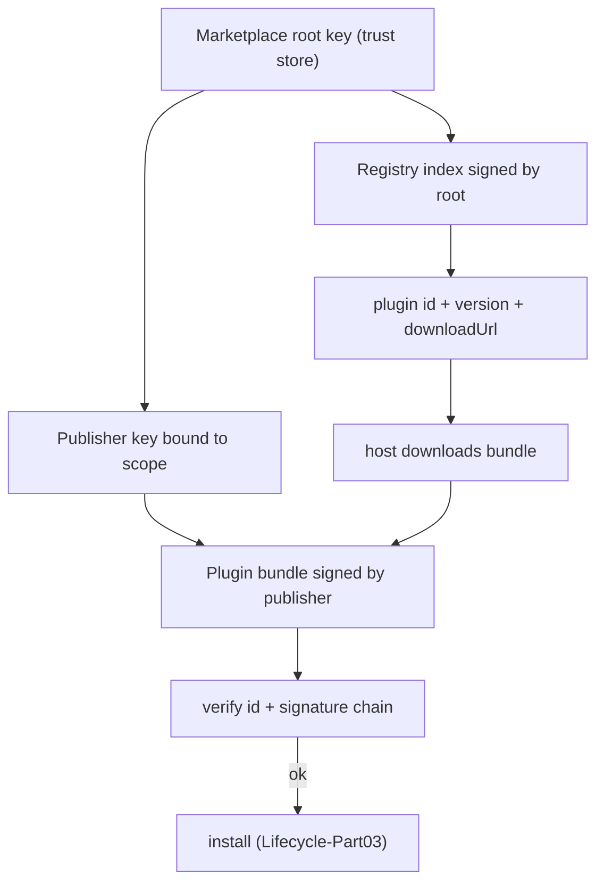

---
title: MarketplaceIntegration Specification - Part 01
status: draft
version: 1.0
tags:
  - plugin-system
  - marketplace
  - distribution
  - identity
related:
  - "[[09-plugin-system/README]]"
  - [[MarketplaceIntegration-Part02]]
  - [[PluginLifecycle-Part03]]
  - [[PluginArchitecture-Part02]]
---

# MarketplaceIntegration Specification (Part 01)

## Document Index

Part 01 - Purpose, the registry index, publisher identity, trust model
Part 02 - Signing keys, signature formats, and verification at download
Part 03 - Version resolution, update notification, and channels
Part 04 - The review and revocation path for a malicious plugin
Part 05 - Local install, offline use, and the trust store

# Purpose

MarketplaceIntegration defines plugin distribution: the registry index, publisher identity, signing keys, version resolution, update notification, and the review and revocation path for a plugin found to be malicious. The marketplace is the id authority and the trust anchor for plugins that did not come from a local path.

# The Marketplace Is The Id Authority

The marketplace assigns and owns plugin `id`s. A plugin's `id` (see [[PluginArchitecture-Part02]]) is minted by the marketplace when a publisher first publishes, in the form `scope/name` where `scope` is the publisher's verified namespace. This is why a plugin cannot impersonate another's id: the marketplace enforces global uniqueness of `scope/name`, and the install-time identity check ([[PluginLifecycle-Part03]]) rejects a bundle whose asserted id differs from the registry's.

# The Registry Index

The registry index is the marketplace's catalog. It is a list of published plugins, each entry carrying:

```text
id                the marketplace-assigned plugin id
publisher          the verified publisher identity (Part 02)
latestVersion      the newest published version
versions           the set of published versions and their metadata
capabilitiesSummary the union of capabilities any version requests
signatureKeyRef    reference to the publisher's current signing key
reviewStatus       reviewed / pending / flagged / revoked
downloadUrl        the bundle location for each version
```

The index is fetched over a capability-gated, host-executed request (the host, not the plugin, performs network). The index is integrity-protected: its own signature is verified against the marketplace's root key before any entry is trusted.

# Publisher Identity

A publisher is identified by a public key pair. The marketplace binds the publisher's `scope` to its public key in a publisher record. The binding is what makes "this plugin really came from Acme" verifiable: the bundle is signed by Acme's key, and Acme's key is bound to the `acme` scope in the registry.

```text
publisher record:
  scope            the publisher's namespace (e.g. "acme")
  publicKey        the publisher's current signing public key
  keyHistory       previous keys, for verifying older bundles
  status           active / suspended / revoked
```

# Trust Model

```text
ROOT      the marketplace root key, shipped with Eulinx, in the trust store
PUBLISHER a key signed by (or registered with) the root, bound to a scope
PLUGIN    a bundle signed by the publisher's key
```

Trust flows root -> publisher -> plugin. The host verifies the chain: the bundle signature against the publisher key, the publisher key binding against the root, and the id against the registry. Any break rejects the plugin. Signing proves origin; it does not prove safety, so the sandbox and grant still apply (see [[PluginLifecycle-Part03]]).

# Marketplace Invariants

```text
The marketplace is the authoritative id and scope allocator.
A plugin's id must match the registry entry it was downloaded from.
The registry index is integrity-protected by the root key.
Publisher scope is bound to a public key verified by the root.
Trust flows root -> publisher -> plugin and is checked end to end.
A signed plugin still runs sandboxed under its frozen grant.
```

# Mermaid Diagram



# AI Notes

Do not let a plugin assert an id the registry does not back. The registry is the authority. An id mismatch is impersonation and is rejected at install.

Do not ship the marketplace root key in a way a plugin can replace. The root key is in the host trust store, not in any plugin-accessible location. A plugin that could swap the root key could vouch for anything.

Do not treat a signed plugin as safe. The signature answers "who published this", not "is this benign". The sandbox and grant are unchanged by signing.

# Related Documents

- [[09-plugin-system/README]]
- [[MarketplaceIntegration-Part02]]
- [[MarketplaceIntegration-Part03]]
- [[MarketplaceIntegration-Part04]]
- [[MarketplaceIntegration-Part05]]
- [[PluginArchitecture-Part02]]
- [[PluginLifecycle-Part02]]
- [[PluginLifecycle-Part03]]
- [[PluginArchitecture-Part04]]
