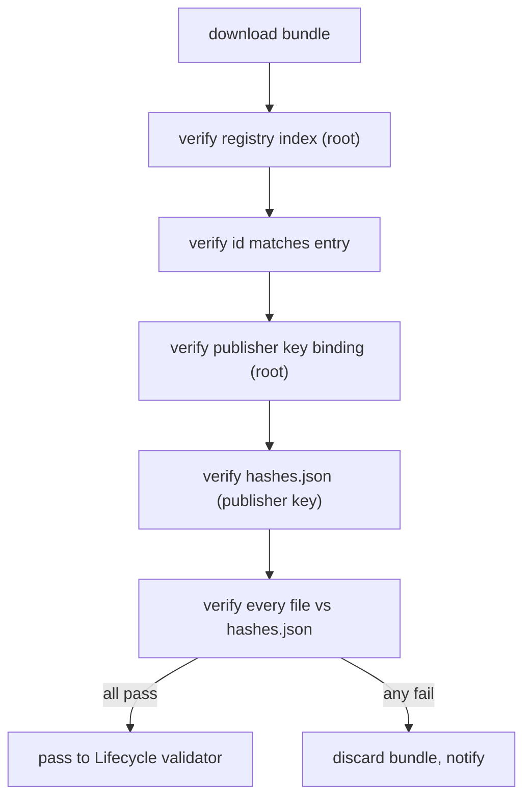

---
title: MarketplaceIntegration Specification - Part 02
status: draft
version: 1.0
tags:
  - plugin-system
  - marketplace
  - signing
  - verification
related:
  - "[[09-plugin-system/README]]"
  - [[MarketplaceIntegration-Part01]]
  - [[MarketplaceIntegration-Part03]]
  - [[PluginLifecycle-Part03]]
---

# MarketplaceIntegration Specification (Part 02)

## Document Index

Part 01 - Purpose, the registry index, publisher identity, trust model
Part 02 - Signing keys, signature formats, and verification at download
Part 03 - Version resolution, update notification, and channels
Part 04 - The review and revocation path for a malicious plugin
Part 05 - Local install, offline use, and the trust store

# Purpose

This part defines how plugin bundles are signed, what the signature covers, and how the host verifies a download before it is ever passed to the lifecycle validator ([[PluginLifecycle-Part03]]). Verification at download is the outer layer; the lifecycle signature check is the inner layer. Both must pass.

# Signing Key Hierarchy

The marketplace operates a key hierarchy with one root and many publisher keys.

```text
root key            offline, shipped in Eulinx's trust store. Signs the
                   registry index and publisher key bindings. Never leaves
                   the marketplace's control.

publisher key       an asymmetric keypair per publisher scope. The public
                   half is bound to the scope in a publisher record signed
                   by (or registered with) the root. The private half signs
                   plugin bundles. Rotated periodically; old keys kept in
                   keyHistory for verifying previously published bundles.

bundle signature    produced by the publisher's current private key over a
                   hash list of the bundle's files.
```

# What The Signature Covers

A bundle signature is computed over a canonical hash list of every file in the bundle, not over a single opaque blob. This lets the host verify individual files and detect any added, removed, or modified file after signing. The hash list itself is what is signed; the host recomputes the list from the downloaded bytes and compares.

```text
signed artifact (per bundle):
  hashes.json       canonical JSON: relative path -> sha256, sorted
  hashes.sig        signature over hashes.json by the publisher key
  pubkey.ref        reference to the publisher key in the registry
                   (or an embedded signed key bound to the scope)
```

# Verification At Download

Before the bundle reaches the lifecycle validator, the host verifies:

```text
1. registry index signature against the root key (Part 01)
2. the entry's id matches the bundle's asserted id
3. the publisher key binding against the root
4. hashes.json against the publisher key (bundle signature)
5. every file in the bundle against hashes.json
6. the bundle's engines/sdkVersion are sane (cheap pre-check)
```

Any failure rejects the download. A bundle that fails signature is never written to the install directory; it is discarded and the user is notified. This is the outer gate; the lifecycle validator's own signature step ([[PluginLifecycle-Part03]]) is a second, independent check on the installed copy.

# Key Rotation And Old Bundles

When a publisher rotates keys, the old key moves to `keyHistory`. Bundles signed by the old key remain verifiable because the host checks the signature against the key that was current when the bundle's version was published (recorded in the registry entry). A bundle signed by a key not in current-or-history for that scope is rejected. This prevents both forgery (old key can't sign new bundles accepted as current) and breakage (old bundles still verify).

# Transitive Trust Rules

```text
The marketplace root key is the only implicitly trusted key.
A publisher key is trusted only via the root-bound scope binding.
A bundle is trusted only via a publisher key in that scope's history.
A plugin's dependencies (if any) are separate bundles, each verified
the same way; a plugin cannot vouch for its own dependency.
```

# Signing Invariants

```text
The signature covers a hash list of every bundle file, not a blob.
Verification checks index, id, publisher binding, and per-file hashes.
A failed-signature download is discarded; never partially installed.
Old bundles verify against the key current at their publish time.
No plugin can vouch for another; each bundle verifies independently.
```

# Mermaid Diagram



# AI Notes

Do not sign a single blob and call it a bundle signature. A blob signature lets an attacker append a file after signing if the loader ever reads "extra" files. A per-file hash list detects additions and modifications.

Do not trust a publisher key presented inside the bundle without checking it against the root-bound scope. The bundle is attacker-controlled; only the root (in the trust store) can vouch for the key.

Do not install a bundle that failed signature "to let the user decide". A failed signature is a tamper signal. Discard it and tell the user; the consent gate is for granted capabilities, not for accepting forged bytes.

# Related Documents

- [[09-plugin-system/README]]
- [[MarketplaceIntegration-Part01]]
- [[MarketplaceIntegration-Part03]]
- [[MarketplaceIntegration-Part04]]
- [[PluginLifecycle-Part02]]
- [[PluginLifecycle-Part03]]
- [[PluginArchitecture-Part02]]
