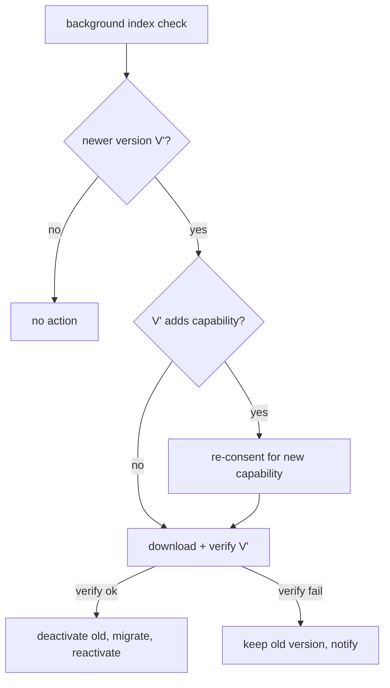

---
title: MarketplaceIntegration Specification - Part 03
status: draft
version: 1.0
tags:
  - plugin-system
  - marketplace
  - versioning
  - updates
related:
  - "[[09-plugin-system/README]]"
  - [[MarketplaceIntegration-Part01]]
  - [[MarketplaceIntegration-Part02]]
  - [[PluginLifecycle-Part04]]
  - [[PluginLifecycle-Part06]]
---

# MarketplaceIntegration Specification (Part 03)

## Document Index

Part 01 - Purpose, the registry index, publisher identity, trust model
Part 02 - Signing keys, signature formats, and verification at download
Part 03 - Version resolution, update notification, and channels
Part 04 - The review and revocation path for a malicious plugin
Part 05 - Local install, offline use, and the trust store

# Purpose

This part defines how the host decides which version of a plugin to install or update to, how update notifications are delivered without stalling the core, and the channel model (stable versus pre-release). Version resolution is conservative: an update never silently widens a grant or breaks compatibility.

# Version Resolution

A plugin's `version` is semver. The host resolves the install/update target against the registry entry's `versions` and the running Eulinx's compatibility constraints.

```text
install target:
  the highest version V such that:
    - V is in the requested channel (stable by default)
    - V.engines includes the running Eulinx version
    - V.sdkVersion is compatible with the host (PluginSDK-Part06)
  If no such V exists, install is refused (incompatible).

update target:
  the highest version V' > current that satisfies the same constraints
  AND does not require a capability not already in the current grant
  (a widening update requires re-consent; see below).
```

# No Silent Grant Widening

An update whose manifest requests a capability the user never granted to the current version is NOT applied silently. The host detects the new capability in the updated manifest and requires a fresh consent step ([[PluginLifecycle-Part05]]) for the added capability only. The plugin updates, but the new capability stays denied until the user grants it. This prevents a "benign v1, hostile v2" escalation where an update quietly adds `fs.read` on the workspace root.

# Channels

Plugins may publish to a `stable` channel and/or a `prerelease` channel. The host defaults to `stable`. A user may opt a plugin or the whole install into `prerelease`, but pre-release plugins are marked in the UI and their signatures are still verified. Pre-release does not relax any sandbox or grant rule.

# Update Notification Without Stalling

The host periodically checks the registry index for newer versions of installed plugins. The check is a host-executed, capability-gated, background request with its own timeout; it MUST NOT block startup, the UI, or any Worker. Notifications are surfaced in the UI as observations; the user decides whether to apply an update. There is no auto-update that runs plugin code without user action, because auto-running updated code is an escalation path (the update could be malicious or the account compromised).

# Update Application

When the user applies an update, the host runs the lifecycle update path ([[PluginLifecycle-Part06]]): deactivate and kill the old process, download and verify the new bundle, run migration on the namespaced prefix, and reactivate. If the new manifest adds capabilities, the consent step runs first. If verification fails, the old version is preserved and the user is notified; the plugin is not left half-updated.

# Version Invariants

```text
An install/update target satisfies engines and sdkVersion constraints.
An update that adds a capability requires fresh, explicit consent.
Pre-release never relaxes sandbox or grant rules.
Update checks are background, timeout-bounded, and non-blocking.
There is no auto-update that executes plugin code without user action.
A failed update preserves the prior version; no half-state.
```

# Mermaid Diagram



# AI Notes

Do not auto-apply updates that run plugin code. Auto-running updated plugin code is exactly the moment a compromised publisher account or a poisoned update executes on the user's machine without consent. Updates are user-approved.

Do not let an update silently widen a grant. The new capability stays denied until re-consent. The "benign v1, hostile v2" pattern is the canonical plugin supply-chain attack and the consent re-gate is the defense.

Do not block startup or the UI on the update check. The check is background and timeout-bounded. A slow or unreachable registry must never stall Eulinx.

# Related Documents

- [[09-plugin-system/README]]
- [[MarketplaceIntegration-Part01]]
- [[MarketplaceIntegration-Part02]]
- [[MarketplaceIntegration-Part04]]
- [[PluginLifecycle-Part04]]
- [[PluginLifecycle-Part05]]
- [[PluginLifecycle-Part06]]
- [[PluginSDK-Part06]]
- [[PluginArchitecture-Part06]]
