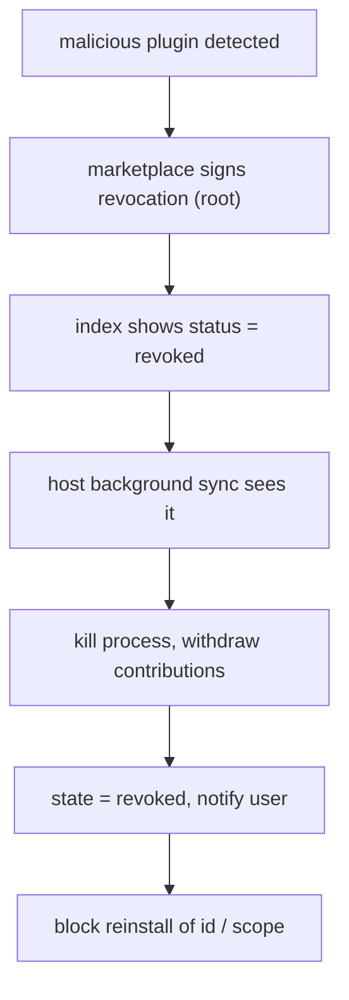

# MarketplaceIntegration Specification (Part 04)

## Document Index

Part 01 - Purpose, the registry index, publisher identity, trust model
Part 02 - Signing keys, signature formats, and verification at download
Part 03 - Version resolution, update notification, and channels
Part 04 - The review and revocation path for a malicious plugin
Part 05 - Local install, offline use, and the trust store

# Purpose

This part defines what happens when a plugin is found to be malicious: the revocation signal, how it propagates to installed instances, and the guarantee that a revoked plugin cannot re-enable or reinstall. Revocation is the backstop of the entire trust model. Detection is imperfect; revocation must be fast and final.

# Triggers For Revocation

A plugin or publisher may be revoked for:

```text
malicious behavior     exfiltration, sandbox escape attempt, hidden
                       capability use, prompt-injection via descriptions
review failure         a security review finds a violation post-publish
 compromised publisher the publisher key is believed leaked
legal / policy         takedown per marketplace policy
```

Revocation is recorded in the registry index as a `revoked` status on the plugin (or on the publisher, which revokes all their plugins). The revocation is signed by the root key, so it is tamper-evident and authoritative.

# Propagation To Installed Instances

When the host next checks the index (Part 03 background check), it sees the `revoked` status. It then:

```text
1. deactivates and kills the plugin's process immediately
2. moves the plugin to a terminal 'revoked' lifecycle state
3. withdraws all contributions (tools unregistered, nodes unavailable,
   hooks dropped) so nothing the plugin contributed remains callable
4. notifies the user with the revocation reason
5. blocks any future install or update of that id (or all ids under a
   revoked publisher scope)
```

A revoked plugin's registration record is retained for audit ([[PluginLifecycle-Part06]]), but its code is never executed again through this path.

# No Re-Enable, No Reinstall

Revocation is terminal and host-enforced. Unlike a user-initiated `disabled` (which can be re-enabled), a `revoked` plugin cannot be re-enabled by the user from the UI; the only way to clear it is for the marketplace to lift the revocation, which re-syncs via the index. Reinstalling the same bundle is blocked because the id is on the revocation list; the install path checks the list before validation.

```text
disabled   user or breaker; can be re-enabled by user.
revoked    marketplace; cannot be re-enabled or reinstalled until the
           marketplace lifts it via a signed index update.
```

# Publisher Revocation

When a publisher is revoked, every `scope/name` under that scope is treated as revoked. This is stronger than per-plugin revocation and is the response to a compromised publisher key: all their plugins are pulled at once, because any of them could be re-signed by the compromised key.

# Revocation Invariants

```text
Revocation is signed by the root key and authoritative.
A revoked plugin is deactivated, killed, and fully withdrawn.
A revoked plugin cannot be re-enabled or reinstalled by the user.
A revoked publisher revokes all plugins under its scope.
The audit record of a revoked plugin is retained.
Revocation is checked before install and during the background sync.
```

# Mermaid Diagram



# AI Notes

Do not let a user "re-enable" a revoked plugin from settings. Revocation is the marketplace pulling the plug; a local override would let a user re-run known-malicious code. The only lift is a new signed index from the marketplace.

Do not soft-withdraw a revoked plugin (leave its tools half-registered). Full withdrawal means nothing the plugin contributed is callable. A lingering tool from a revoked plugin is a trap a Worker will select.

Do not block revocation behind a user confirmation. Revocation is protective and automatic; the user is notified after the fact, not asked to approve the protection.

# Related Documents

- [[09-plugin-system/README]]
- [[MarketplaceIntegration-Part01]]
- [[MarketplaceIntegration-Part03]]
- [[MarketplaceIntegration-Part05]]
- [[PluginLifecycle-Part01]]
- [[PluginLifecycle-Part06]]
- [[PluginArchitecture-Part06]]
- [[ToolPlugins-Part01]]
- [[NodePlugins-Part01]]
- [[HookSystem-Part01]]
