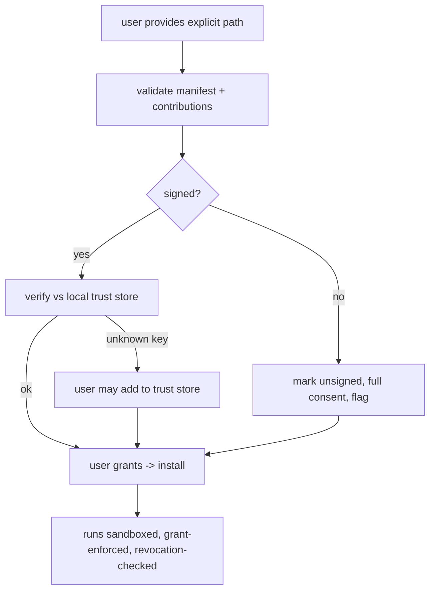

---
title: MarketplaceIntegration Specification - Part 05
status: draft
version: 1.0
tags:
  - plugin-system
  - marketplace
  - local-install
  - trust-store
related:
  - "[[09-plugin-system/README]]"
  - [[MarketplaceIntegration-Part01]]
  - [[MarketplaceIntegration-Part02]]
  - [[PluginLifecycle-Part02]]
  - [[PluginLifecycle-Part03]]
---

# MarketplaceIntegration Specification (Part 05)

## Document Index

Part 01 - Purpose, the registry index, publisher identity, trust model
Part 02 - Signing keys, signature formats, and verification at download
Part 03 - Version resolution, update notification, and channels
Part 04 - The review and revocation path for a malicious plugin
Part 05 - Local install, offline use, and the trust store

# Purpose

This part defines installation from a local path (not the marketplace) and the local trust store that lets a user vouch for a publisher or a specific bundle. Local install is for development and private plugins; it keeps every other rule (sandbox, grant, validation) intact, but the id authority and signature chain differ.

# Local Install Path

A user may add a plugin from an explicit local path or bundle file through the UI or CLI. The host does NOT auto-scan the filesystem for plugins (see [[PluginLifecycle-Part02]]); the path is always explicit and user-provided. Local install still runs the full lifecycle: validation ([[PluginLifecycle-Part03]]), consent ([[PluginLifecycle-Part05]]), and transactional install ([[PluginLifecycle-Part04]]).

```text
local install flow:
  user provides explicit path / bundle file
  host reads Eulinx.plugin.json (no code exec)
  host validates manifest + contributions (Part 03)
  host assigns or confirms the id (local id authority)
  if signed: verify against the local trust store (below)
  if unsigned: mark unsigned, require full consent, flag in UI
  user grants capabilities -> install
```

# Local Id Authority

For a local plugin, the `id` is either taken from the manifest (if the user trusts it) or generated by the host as `local/<name>` to avoid colliding with marketplace ids. A local plugin MUST NOT claim a marketplace `scope` it does not own; an id like `acme/linter` from a local path is rejected as `IdMismatch` unless the user has explicitly trusted the `acme` scope in the local trust store (a deliberate, rare act).

# The Local Trust Store

The local trust store is a host-managed key/identity store, separate from any plugin-accessible location, where a user can record:

```text
trusted publisher scopes   scope -> public key, added by the user
trusted bundle hashes       a specific bundle hash the user vouches for
revocation overrides        NONE; the marketplace revocation list still
                            applies and cannot be locally overridden
```

The local trust store lets a user vouch for a self-published or internal plugin's signature without going through the marketplace. Adding to it is an explicit, logged user action; it is not something a plugin can do for itself.

# Offline Use

The marketplace index and revocation list are cached. Eulinx must function offline: installed plugins run, and revocation is enforced against the last cached list (with a note that the list may be stale). When connectivity returns, the host refreshes the list. A stale list never permits a revoked plugin; it only means a revocation published while offline is applied late. The host surfaces "last verified at" so the user knows the freshness.

# Local Install Security Posture

```text
Local install is NOT a sandbox bypass. The plugin still runs sandboxed.
Local install is NOT a grant bypass. Consent still happens.
Local install is NOT a signature bypass. Unsigned is flagged and consented.
Local id must not impersonate a marketplace scope without explicit trust.
The marketplace revocation list still applies to locally installed plugins
matched by id (a marketplace-plugin installed locally is still revocable).
```

# Local Install Invariants

```text
Local install paths are explicit; the filesystem is never auto-scanned.
A local plugin claiming a marketplace scope is rejected unless trusted.
The local trust store is host-managed and plugin-inaccessible.
Offline use enforces the last cached revocation list.
Local install preserves sandbox, grant, validation, and consent.
```

# Mermaid Diagram



# AI Notes

Do not let a local install bypass the sandbox. "It's my own plugin, I trust it" is a reasonable feeling and a bad security default. The sandbox costs little and protects against a typo that reads the wrong file. Local still means sandboxed.

Do not let a plugin add itself to the local trust store. That would let any plugin vouch for any other, which is the trust store's purpose defeated. Adding a trusted scope/key is a host UI action, logged and user-confirmed.

Do not let a local plugin claim `acme/...` without explicit trust. Impersonating a marketplace scope locally is the same impersonation as over the network; it is rejected unless the user deliberately trusted that scope.

# Related Documents

- [[09-plugin-system/README]]
- [[MarketplaceIntegration-Part01]]
- [[MarketplaceIntegration-Part02]]
- [[MarketplaceIntegration-Part03]]
- [[MarketplaceIntegration-Part04]]
- [[PluginLifecycle-Part02]]
- [[PluginLifecycle-Part03]]
- [[PluginLifecycle-Part05]]
- [[PluginArchitecture-Part02]]
- [[PluginArchitecture-Part06]]
