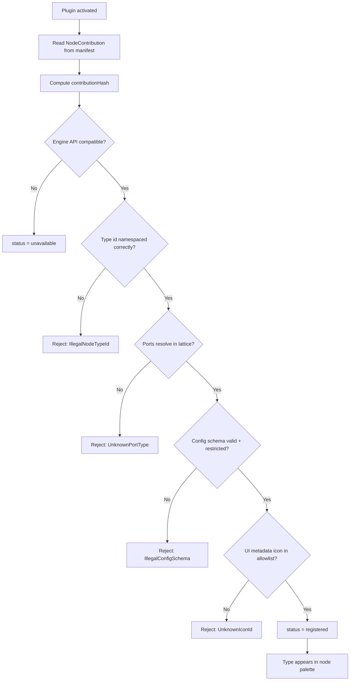
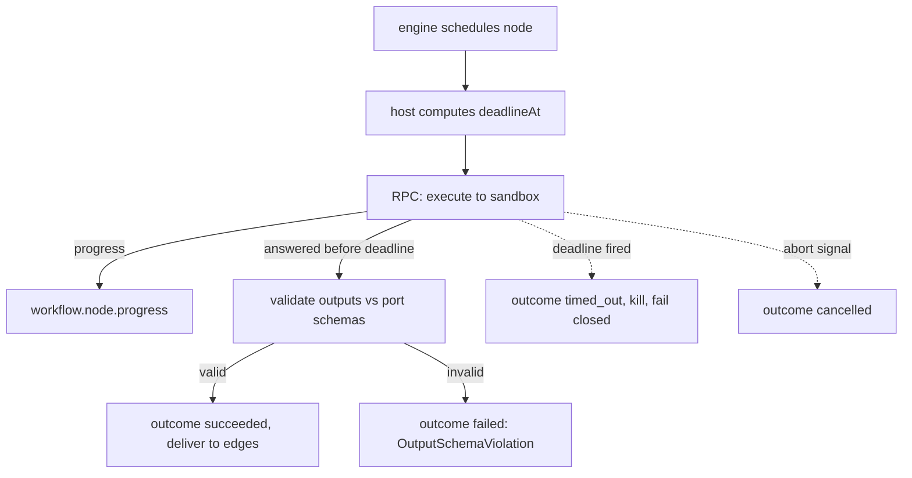
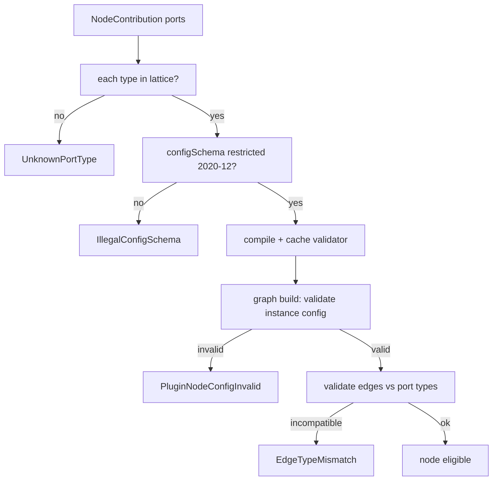
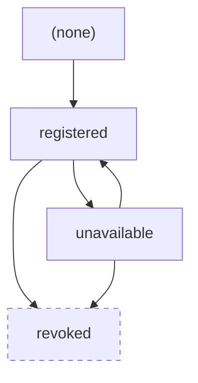

# NodePlugins Diagrams

## Registration And Validation



## Execution With Timeout



## Ports And Edges



## No-DOM / Artifact Rule

```text
Plugin node wants to change the project:
   MUST NOT write the working tree directly.
   MUST emit an Artifact (via fs.write capability RPC).
   Verification verifies it.
   MergeManager applies it.
Same answer Workers get, for the same reason.
```

## State Transitions



Note: `revoked -> registered` does not exist. A revoked node type is dead.

## Related Documents

- [[09-plugin-system/README]]
- [[NodePlugins-Part01]]
- [[NodePlugins-Part02]]
- [[NodePlugins-Part03]]
- [[NodePlugins-Part04]]
- [[NodePlugins-Part05]]
- [[PluginArchitecture-Part01]]
- [[EdgeTypes-Part01]]
- [[WorkflowEngine-Part01]]
- [[MergeManager-Part01]]
