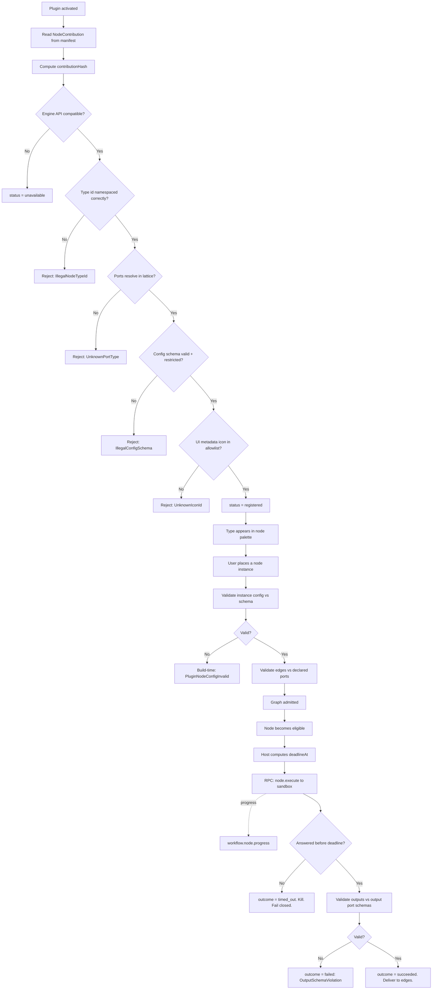

---
title: NodePlugins Specification - Part 01
status: draft
version: 1.0
tags:
  - plugin-system
  - node-plugins
  - workflow-engine
  - security
  - architecture
related:
  - "[[09-plugin-system/README]]"
  - "[[PluginArchitecture-Part01]]"
  - "[[NodeArchitecture-Part01]]"
  - "[[EdgeTypes-Part01]]"
  - "[[WorkflowEngine-Part01]]"
---

# NodePlugins Specification (Part 01)

## Document Index

Part 01 - Purpose, Philosophy, Definition, Responsibilities, Object Model, States, Invariants
Part 02 - The Node Contribution Manifest, Base Node Contract Conformance, UI Metadata and the No-DOM Rule
Part 03 - Typed Ports, the Config JSON Schema, Type Compatibility, and Edge Validation
Part 04 - The Execute Function, the Sandboxed Context, Progress Reporting, Failure, Retry, and Timeout
Part 05 - Implementation Checklist, the Complete Worked Example Node, Common Mistakes, Future Expansion
Diagrams - NodePlugins-Diagrams.md

# Purpose

NodePlugins defines how untrusted third-party code contributes a custom node type to a Eulinx Workflow graph.

This is the most dangerous extension point in Eulinx, and it is worth being precise about why. A Tool plugin (see [[ToolPlugins-Part01]]) is invoked by a Worker that already decided to call it, with a permission profile that already bounds it. A hook (see [[HookSystem-Part01]]) observes or vetoes a decision the core already made. A node plugin is different: it becomes a **vertex in the execution graph**. The WorkflowEngine will schedule it, wait on it, take its outputs, and feed those outputs into downstream nodes that may be Builder nodes, Verifier nodes, or the MergeManager itself.

```text
A Tool plugin answers a question the runtime asked.
A hook plugin votes on a decision the runtime made.
A node plugin IS A STEP OF THE RUNTIME'S OWN PLAN.
```

That is why every rule in this document is tighter than the equivalent rule elsewhere in `09-plugin-system`. A node plugin sits on the workflow's critical path. If it stalls, the graph stalls. If it lies about its output type, a downstream node receives a value it was statically proven never to receive. If it could render DOM, it would render that DOM inside the trusted Eulinx window, next to the user's repository.

NodePlugins owns the contribution, validation, scheduling, execution routing, and failure semantics of a plugin-contributed node type. It does not own what a node *is* in general; that is [[NodeArchitecture-Part01]], and this document is a conformance specification against it.

# Core Philosophy

**A plugin node is a pure function proposal, executed under supervision, whose result is data.**

Unpack each clause, because each is load-bearing.

*Pure function proposal.* The plugin declares a mapping from typed inputs plus a validated config to typed outputs. It does not declare side effects. Every side effect a plugin node appears to have is actually a capability-gated RPC back through the trusted host, checked by the PermissionManager on every call, and attributable to the plugin id in the audit log. The plugin's `execute` has no ambient authority whatsoever. If the plugin wants to read a file, it asks; it does not read.

*Executed under supervision.* The host, not the plugin, owns the clock, the retry counter, the cancellation token, and the kill switch. A plugin node cannot decide it needs more time. It cannot decide to retry itself. It cannot decide not to die. The host applies the timeout from the *installed manifest record*, not from anything the plugin says at run time.

*Whose result is data.* A plugin node's output is a JSON value that passed the declared output port schema, or it is an error. There is no third outcome. The plugin cannot return a callback, a handle, a function, a DOM node, a component, or a promise of future mutation. The RPC boundary is JSON, and that is a security property, not a serialization convenience: a value that cannot express a reference cannot express an escape.

The cardinal rule of Eulinx applies here without softening:

```text
AI output MUST NOT directly mutate trusted state.
Worker -> Artifact -> Verify -> Merge.
```

Plugin output is not AI output, but it receives the *same* treatment for the *same* reason: it is not authored by Eulinx and cannot be vouched for. A plugin node that wants to change the project emits an Artifact. [[Verification-Part01]] verifies it. The MergeManager applies it. A plugin node MUST NOT write to the project working tree, and Part 04 defines the context object specifically so that it has no way to try.

The second philosophical commitment is **the engine never waits on a guest**. Stated as an engineering rule:

```text
For every plugin node activation there exists a bounded wall-clock time T
after which the WorkflowEngine has a definite outcome for that node
regardless of what the plugin process is doing, has done, or will do.
```

T is finite, computed at admission, and enforced by the host. Part 04 gives the algorithm. There is no configuration, no manifest field, and no user setting that can make T infinite.

# Definition

A **plugin node type** is a node type registered into the WorkflowEngine's node type catalog by an installed, activated plugin, consisting of:

- a `NodeContribution` manifest entry, statically declared before install (Part 02)
- a declared set of typed input ports and output ports (Part 03)
- a JSON Schema describing the node's configuration object (Part 03)
- UI metadata: a display name, a category, an icon reference, and a color token (Part 02)
- an `execute` function living in the plugin's sandbox process (Part 04)
- an execution policy: timeout, retry, determinism class, and cancellation contract (Part 04)

A **plugin node instance** is a vertex in a concrete Workflow graph whose `type` field resolves to a plugin node type, carrying a config object that validated against that type's config schema.

NodePlugins owns:

- the `NodeContribution` type and every field on it
- the registration algorithm and every rejection variant
- conformance of a plugin node to the base node contract in [[NodeArchitecture-Part01]]
- port declaration, the port type lattice mapping, and edge validation for plugin ports
- the config schema dialect, its restrictions, and its validator
- the `execute` signature and the exact contents of `PluginNodeContext`
- what `PluginNodeContext` MUST NOT expose
- progress and state reporting from the sandbox to the engine
- timeout, retry, cancellation, and every failure variant with defined handling
- the UI metadata contract and the prohibition on plugin-supplied DOM

NodePlugins does NOT own:

- the base node contract itself (see [[NodeArchitecture-Part01]])
- edge semantics or the type lattice definition (see [[EdgeTypes-Part01]])
- graph scheduling policy (see [[ExecutionFlow-Part01]])
- the sandbox process model or the RPC framing (see [[PluginArchitecture-Part01]])
- plugin install, activation, and the circuit breaker (see [[PluginLifecycle-Part01]])
- the SDK surface the author imports (see [[PluginSDK-Part01]])
- how the graph canvas draws a node (see [[NodeGraph-Part01]])

# Responsibilities

NodePlugins MUST:

- reject a `NodeContribution` at install time if any declared port type is not in the closed type lattice of [[EdgeTypes-Part01]] Part 04
- reject a `NodeContribution` whose config schema is not valid JSON Schema draft 2020-12 under the restricted dialect in Part 03
- namespace every plugin node type id as `plugin:<pluginId>:<localTypeId>` and reject any contribution that attempts a bare or core-looking id
- resolve the node type to the *installed manifest record*, never to a value supplied at run time
- validate a node instance's config against the config schema at graph build time, before any node runs
- validate every value returned from `execute` against the declared output port schema before it touches an edge
- apply a hard wall-clock timeout to every `execute` call
- produce a definite terminal outcome for every plugin node activation within the bounded time T
- emit `workflow.node.started`, `workflow.node.progress`, `workflow.node.succeeded`, and `workflow.node.failed` on the EventBus with the `pluginId` attributed
- record every plugin node failure against the plugin's circuit breaker in [[PluginLifecycle-Part01]]
- fail closed: a plugin node whose outcome cannot be determined is a failed node
- persist enough per-activation detail for Replay to reproduce the activation without re-invoking the plugin

NodePlugins SHOULD:

- report all config validation errors for a node instance in one pass rather than stopping at the first
- include the `pluginId`, the `nodeTypeId`, and the offending JSON Pointer in every validation error message
- cache the compiled config schema validator per `nodeTypeId` and per `contributionHash`
- surface a disabled plugin's nodes in the graph as `unavailable` rather than deleting them from the user's saved graph

NodePlugins MUST NOT:

- execute plugin node code in the Eulinx host process
- allow a plugin node to render, supply, inject, or influence arbitrary DOM in the Eulinx window
- allow a plugin node to receive a file handle, a database handle, a socket, a child process handle, or a reference to any host object
- allow a plugin node to observe, enumerate, message, or detect another plugin
- allow a plugin node to read or write the project working tree directly
- allow a plugin node to widen the permission set granted to it at install time
- allow a plugin node's declared timeout to exceed the manifest ceiling, or to be raised at run time
- allow a plugin node to become eligible before its config validated
- allow an unvalidated output value onto an edge
- block the WorkflowEngine's scheduling loop on a plugin RPC
- allow a plugin node to be scheduled while its plugin is `disabled`, `crashed`, or `breaker_open`

# Node Plugin Object Model

This is the complete registration record. It is what the host stores at install and what the engine reads at run time. Nothing here is supplied by the plugin at execution time.

```ts
type PluginNodeType = {
  nodeTypeId: string;
  pluginId: string;
  pluginVersion: string;
  localTypeId: string;

  contribution: NodeContribution;
  contributionHash: string;

  inputPorts: PluginPortSpec[];
  outputPorts: PluginPortSpec[];
  configSchema: RestrictedJsonSchema;

  ui: NodeUiMetadata;
  policy: NodeExecutionPolicy;

  baseContractVersion: string;
  sdkVersion: string;
  engineApiVersion: string;

  requiredCapabilities: CapabilityId[];
  grantedCapabilities: CapabilityId[];

  status: PluginNodeTypeStatus;
  registeredAt: string;
  lastValidatedAt: string;
};

type PluginNodeTypeStatus =
  | "registered"
  | "unavailable"
  | "revoked";

type CapabilityId = string;
```

Field meanings, one per line, no inference required:

```text
nodeTypeId          Namespaced id: plugin:<pluginId>:<localTypeId>. Globally unique. Immutable.
pluginId            Owning plugin. Every audit record, event, and error carries this.
pluginVersion       Semver of the plugin that contributed this type. Part of the identity.
localTypeId         The plugin author's own id for the type. Unique within the plugin only.
contribution        The verbatim manifest entry as installed. The single source of truth.
contributionHash    SHA-256 of the canonical JSON of contribution. Detects tamper and drift.
inputPorts          Compiled input port specs. Declared statically. See Part 03.
outputPorts         Compiled output port specs. Declared statically. See Part 03.
configSchema        Restricted JSON Schema for the node's config object. See Part 03.
ui                  Display name, category, icon id, color token. METADATA ONLY. See Part 02.
policy              Timeout, retry, determinism class, cancellation contract. See Part 04.
baseContractVersion Version of NodeArchitecture's base contract this type conforms to.
sdkVersion          PluginSDK semver the plugin built against. See [[PluginSDK-Part01]].
engineApiVersion    WorkflowEngine node API version. Compatibility gate. See Part 02.
requiredCapabilities What the manifest declared this node needs. Shown to user at install.
grantedCapabilities What the user actually granted. Enforcement uses THIS, never required.
status              registered, unavailable, or revoked. See States below.
registeredAt        ISO 8601 UTC of successful registration.
lastValidatedAt     ISO 8601 UTC of the last successful contribution revalidation.
```

`requiredCapabilities` and `grantedCapabilities` are two fields and not one because they mean different things. `requiredCapabilities` is a *declaration of intent*, shown to the user at install. `grantedCapabilities` is the *enforcement basis*, checked by the PermissionManager on every RPC. They are frequently unequal: a user may grant a subset. A plugin node whose `grantedCapabilities` lacks something in `requiredCapabilities` still registers and still runs; it simply gets `CapabilityDenied` on the RPC it was never granted, which is the correct outcome and not an error in Eulinx.

## The Activation Record

Every time the engine runs a plugin node instance, it writes one of these. This is the Replay substrate.

```ts
type PluginNodeActivation = {
  activationId: string;
  workflowId: string;
  graphVersion: number;
  nodeId: string;
  nodeTypeId: string;
  pluginId: string;
  contributionHash: string;

  attempt: number;
  maxAttempts: number;

  inputs: Record<string, JsonValue>;
  config: JsonValue;
  configValid: true;

  startedAt: string;
  endedAt?: string;
  durationMs?: number;
  timeoutMs: number;
  deadlineAt: string;

  progressEvents: PluginNodeProgress[];
  outcome: PluginNodeOutcome;

  hostRpcCalls: number;
  deniedRpcCalls: number;
  peakMemoryBytes?: number;
};

type PluginNodeOutcome =
  | { kind: "succeeded"; outputs: Record<string, JsonValue> }
  | { kind: "failed"; error: PluginNodeError }
  | { kind: "cancelled"; reason: CancellationReason }
  | { kind: "timed_out"; timeoutMs: number; killed: boolean };

type CancellationReason =
  | "workflow_cancelled"
  | "upstream_failed"
  | "any_sibling_won"
  | "plugin_deactivated"
  | "breaker_opened"
  | "host_shutdown";
```

`configValid: true` is a literal type, not a boolean. It is there so that the type system makes an unvalidated activation unconstructible. If your language does not support this, assert it at the top of the activation constructor and panic on false. An activation with an unvalidated config is a bug that must be loud.

# States

A plugin node type has a lifecycle. It is short and it is owned by the host, not the plugin.

```ts
type PluginNodeTypeStatus =
  | "registered"
  | "unavailable"
  | "revoked";
```

```text
registered    Plugin activated, contribution valid, engine API compatible.
              The type appears in the node palette. Instances may be scheduled.

unavailable   Plugin is installed but not currently usable: deactivated, crashed,
              circuit breaker open, or engine API incompatible after a Eulinx update.
              The type does NOT appear in the palette.
              Existing instances in saved graphs are PRESERVED and render as
              a placeholder. Instances MUST NOT be scheduled. A graph containing
              one fails at build time with PluginNodeTypeUnavailable.

revoked       The plugin was uninstalled, or the marketplace revoked it as malicious.
              The type does not appear. Existing instances render as a placeholder
              with a revocation notice. Instances MUST NOT be scheduled, ever.
              The registration record is retained for audit. It is not deleted.
```

Legal transitions, and only these:

```text
(none)      -> registered     install + activate + contribution validated
registered  -> unavailable    plugin deactivated
registered  -> unavailable    plugin process crashed
registered  -> unavailable    circuit breaker opened
registered  -> unavailable    Eulinx update made engineApiVersion incompatible
registered  -> revoked        uninstall
registered  -> revoked        marketplace revocation
unavailable -> registered     plugin reactivated AND contribution revalidated
unavailable -> revoked        uninstall
unavailable -> revoked        marketplace revocation
```

Note the absent transition. `revoked -> registered` does not exist. A revoked node type is dead. Reinstalling the plugin produces a *new* registration record, and if the marketplace revoked it for malice, [[MarketplaceIntegration-Part01]] blocks the reinstall. There is no path by which a revoked plugin's nodes run again through this state machine.

Note also that `unavailable -> registered` requires *revalidation*, not just reactivation. The plugin may have been updated on disk while deactivated. The host MUST recompute `contributionHash` and re-run the full Part 02 registration algorithm. Trusting a cached validation across a deactivation window is how a plugin ships a benign v1 for review and a hostile v2 after install.

# Invariants

```text
Plugin node code never executes in the Eulinx host process.
Every plugin node type id starts with the literal prefix "plugin:".
No plugin node type id collides with a core node type id.
A node type's contributionHash matches the installed manifest at every registration.
A node instance's config validated against configSchema before the graph was admitted.
Every declared port type resolves to a member of the EdgeTypes type lattice.
Every value leaving execute validated against its declared output port schema.
Every execute call has a finite deadlineAt computed before the call is made.
Every activation reaches exactly one terminal outcome.
An activation that has no determinable outcome is failed, never pending forever.
The engine's scheduling loop is never blocked on a plugin RPC.
grantedCapabilities is a subset of requiredCapabilities.
No RPC succeeds for a capability not in grantedCapabilities.
A plugin node never receives a host object reference, only JSON.
A plugin node never supplies DOM, HTML, CSS, or executable UI code.
A plugin node in a revoked or unavailable type is never scheduled.
Replay of an activation reproduces the same outcome without re-invoking the plugin.
```

The Replay invariant is the one implementers quietly break. A plugin node is not necessarily deterministic; the plugin author may call a network capability, and the same inputs may produce different outputs on Tuesday. Replay therefore MUST NOT re-invoke the plugin. It reads the recorded `outcome` from `PluginNodeActivation`. Part 04 defines the `determinism` field that lets the engine know whether re-invocation would even be meaningful, and the answer for plugin nodes is: it does not matter, because Replay never re-invokes.

# Mermaid Diagram



# AI Notes

Do not implement a plugin node by importing the plugin's module and calling its exported function. It is the obvious implementation and it is the single thing this document exists to forbid. An in-process node has your SQLite handle, your provider API keys, and your user's repository. Every other rule here is decoration if you break this one. The node's `execute` runs in the sandbox process described by [[PluginArchitecture-Part01]], reached only by JSON-RPC over stdio, and the host's node adapter is a stub that marshals JSON.

Do not let the plugin supply the timeout at execution time. It will seem harmless: the plugin knows how long its work takes, so why not let it say? Because untrusted code that can name its own deadline has no deadline. The timeout comes from `PluginNodeType.policy`, which came from the *installed* manifest record, which the user consented to at install. A run-time value from the guest is a suggestion the host ignores.

Do not let the plugin return anything that is not JSON. If your RPC layer happily serializes a function, a Proxy, a class instance with getters, or a Promise, you have a hole. The boundary MUST be `JSON.parse(JSON.stringify(x))`-equivalent by construction, and the receiving side MUST validate against the declared output schema afterward anyway, because a well-formed JSON value can still be the wrong JSON value.

Do not let a plugin node write to the project. It will ask. Its use case will be sympathetic: "my node formats the code, it needs to write the file". The answer is that it emits a patch Artifact, [[Verification-Part01]] verifies it, and the MergeManager writes it. This is the same answer Workers get, for the same reason, and a plugin has strictly less claim to trust than a Worker does.

Do not render anything the plugin gave you as HTML. Not the display name, not the description, not the error message, not the progress label. Part 02 explains the XSS reasoning in full, but the short version is that a plugin's strings reach a trusted, Tauri-privileged window, and a trusted window that interpolates guest strings into markup is a remote code execution primitive wearing a node icon. Text nodes only. Always.

Do not treat `unavailable` as "delete the node from the graph". The user built that graph. A plugin being temporarily deactivated MUST NOT silently mutate the user's saved work. Preserve the instance, render a placeholder, and fail the graph at build time with a message naming the plugin. Deleting a user's node because a guest is misbehaving punishes the wrong party.

Do not re-invoke the plugin during Replay. Replay reads `PluginNodeActivation.outcome`. A plugin node may be nondeterministic, may have been uninstalled, may have been revoked as malicious. Re-running it during a replay of a historical run means a revoked malicious plugin executes again, from an audit feature, which is a genuinely spectacular way to lose.

# Related Documents

- [[09-plugin-system/README]]
- [[NodePlugins-Part02]]
- [[NodePlugins-Part03]]
- [[NodePlugins-Part04]]
- [[NodePlugins-Part05]]
- [[NodePlugins-Diagrams]]
- [[PluginArchitecture-Part01]]
- [[PluginLifecycle-Part01]]
- [[PluginSDK-Part01]]
- [[HookSystem-Part01]]
- [[ToolPlugins-Part01]]
- [[MarketplaceIntegration-Part01]]
- [[NodeArchitecture-Part01]]
- [[NodeTypes-Part01]]
- [[EdgeTypes-Part01]]
- [[WorkflowEngine-Part01]]
- [[ExecutionFlow-Part01]]
- [[NodeGraph-Part01]]
- [[PermissionManager-Part01]]
- [[EventBus-Part01]]
- [[Verification-Part01]]
</content>
</invoke>
