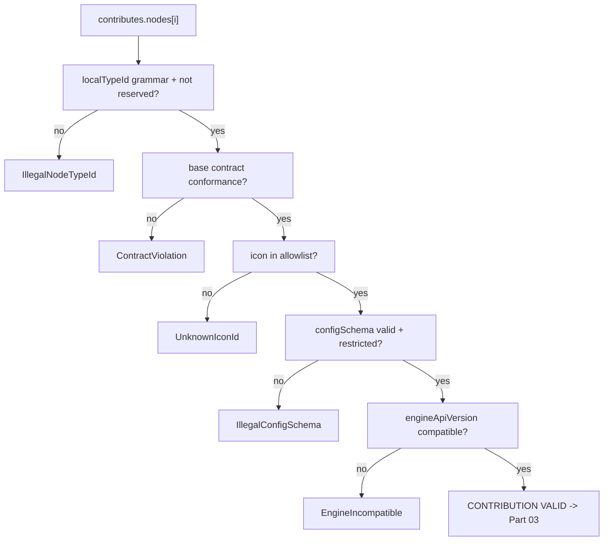

---
title: NodePlugins Specification - Part 02
status: draft
version: 1.0
tags:
  - plugin-system
  - node-plugins
  - manifest
  - ui-metadata
related:
  - "[[09-plugin-system/README]]"
  - [[NodePlugins-Part01]]
  - [[NodePlugins-Part03]]
  - [[PluginArchitecture-Part02]]
  - [[NodeArchitecture-Part01]]
---

# NodePlugins Specification (Part 02)

## Document Index

Part 01 - Purpose, Philosophy, Definition, Responsibilities, Object Model, States, Invariants
Part 02 - The Node Contribution Manifest, Base Node Contract Conformance, UI Metadata and the No-DOM Rule
Part 03 - Typed Ports, the Config JSON Schema, Type Compatibility, and Edge Validation
Part 04 - The Execute Function, the Sandboxed Context, Progress Reporting, Failure, Retry, and Timeout
Part 05 - Implementation Checklist, the Complete Worked Example Node, Common Mistakes, Future Expansion
Diagrams - NodePlugins-Diagrams.md

# Purpose

This part defines the `NodeContribution` manifest entry, the rules of conformance to the base node contract in [[NodeArchitecture-Part01]], and the UI metadata contract including the absolute prohibition on plugin-supplied DOM. A node contribution that fails here never registers, which is the first gate a plugin node meets.

# The NodeContribution Entry

A node contribution is one entry of the `contributes.nodes` array in the plugin manifest. It declares the node type statically; nothing about it is supplied at run time.

```text
NodeContribution:
  localTypeId    required   the plugin's own id for the type (unique in plugin)
  displayName    required   human label for the palette (metadata only)
  category       required   palette grouping (metadata)
  description    required   human description; never shown to a model
  icon           required   icon id from the host allowlist (metadata)
  color          required   a color token from the host palette (metadata)
  inputs         required   array of input port specs
  outputs        required   array of output port specs
  configSchema   required   JSON Schema 2020-12, type "object"
  engineApiVersion required semver of the WorkflowEngine node API targeted
  policy         required   timeout, retry, determinism, cancellation
  deterministic  required   boolean: does execute commute on same inputs?
```

# localTypeId Grammar And Namespacing

`localTypeId` is the plugin's own name for the type. It is namespaced at registration as `plugin:<pluginId>:<localTypeId>` (Part 01). It is subject to a closed grammar so the eventual registry key is always safe.

```text
localTypeId := segment ("." segment)*
segment     := [a-z][a-z0-9_]*   must start with a lowercase letter
max length  64 characters
max segments 5
reserved "Eulinx" / "internal"  FORBIDDEN (core namespaces)
```

A contribution attempting a bare or core-looking id (e.g. `Eulinx.merge`) is rejected with `IllegalNodeTypeId`. The namespace is host-applied; the plugin cannot choose it.

# Base Node Contract Conformance

A plugin node MUST conform to the base node contract defined in [[NodeArchitecture-Part01]]. The contract says: a node has typed input ports, typed output ports, a config object, and an `execute` that maps inputs plus config to outputs. The plugin node adds: it executes in a sandbox, under a host-owned deadline, returning only JSON data. Conformance is checked at registration: port count, port types, config schema shape, and the `execute` signature must all match the base contract. A node that does not conform is rejected, not "fixed".

# UI Metadata And The No-DOM Rule

The `displayName`, `category`, `description`, `icon`, and `color` are METADATA ONLY. They are rendered by the host from declared values; the plugin supplies no component, no HTML, and no CSS. This rule exists because plugin strings reach a trusted, Tauri-privileged window; interpolating guest strings into markup is a remote-code-execution primitive.

```text
UI metadata rules:
  displayName / description are TEXT ONLY; never interpreted as HTML
  icon MUST be an id from the host allowlist; unknown ids are rejected
  color MUST be a token from the host palette; arbitrary CSS is rejected
  the plugin renders NOTHING; the host renders the node chrome
  the plugin cannot supply, inject, or influence arbitrary DOM
```

The icon allowlist is enforced at registration: a `NodeContribution` whose `icon` is not in the allowlist is rejected with `UnknownIconId`. This prevents a plugin from referencing an icon that loads code or from smuggling markup through an icon id.

# Policy: Timeout, Retry, Determinism, Cancellation

The `policy` block is the execution contract (detailed in Part 04). It is declared statically and frozen at registration.

```text
policy:
  timeoutMs       required   wall-clock ceiling; host-clamped, host-enforced
  retry           required   max attempts; applied by host, not plugin
  determinism     required   "deterministic" | "non_deterministic"
  cancellable     required   whether the node honors an abort signal
```

The plugin cannot raise `timeoutMs` at run time. The timeout comes from the installed manifest record, which the user consented to. A run-time value from the guest is a suggestion the host ignores.

# Contribution Invariants

```text
A NodeContribution is static; nothing in it is supplied at run time.
localTypeId is grammar-checked and host-namespaced; no core prefix.
A node MUST conform to the base node contract or be rejected.
UI metadata is text/token only; no DOM, HTML, or CSS from the plugin.
The icon MUST be in the host allowlist; unknown icons are rejected.
policy is frozen at registration; the plugin cannot widen it at run time.
```

# Mermaid Diagram



# AI Notes

Do not let the plugin supply the icon as anything but an allowlisted id. An icon reference that loads code or carries markup is a classic XSS-in-a-node disguise. Allowlist or reject.

Do not render anything the plugin gave you as HTML. Not the display name, not the description, not the error, not progress. Text nodes only, always. A trusted window that interpolates guest strings into markup is an RCE primitive wearing a node icon.

Do not let the plugin widen `policy` at run time. The timeout is from the installed record. Untrusted code that names its own deadline has no deadline.

# Related Documents

- [[09-plugin-system/README]]
- [[NodePlugins-Part01]]
- [[NodePlugins-Part03]]
- [[NodePlugins-Part04]]
- [[NodePlugins-Part05]]
- [[NodePlugins-Diagrams]]
- [[PluginArchitecture-Part02]]
- [[NodeArchitecture-Part01]]
- [[WorkflowEngine-Part01]]
- [[NodeTypes-Part01]]
