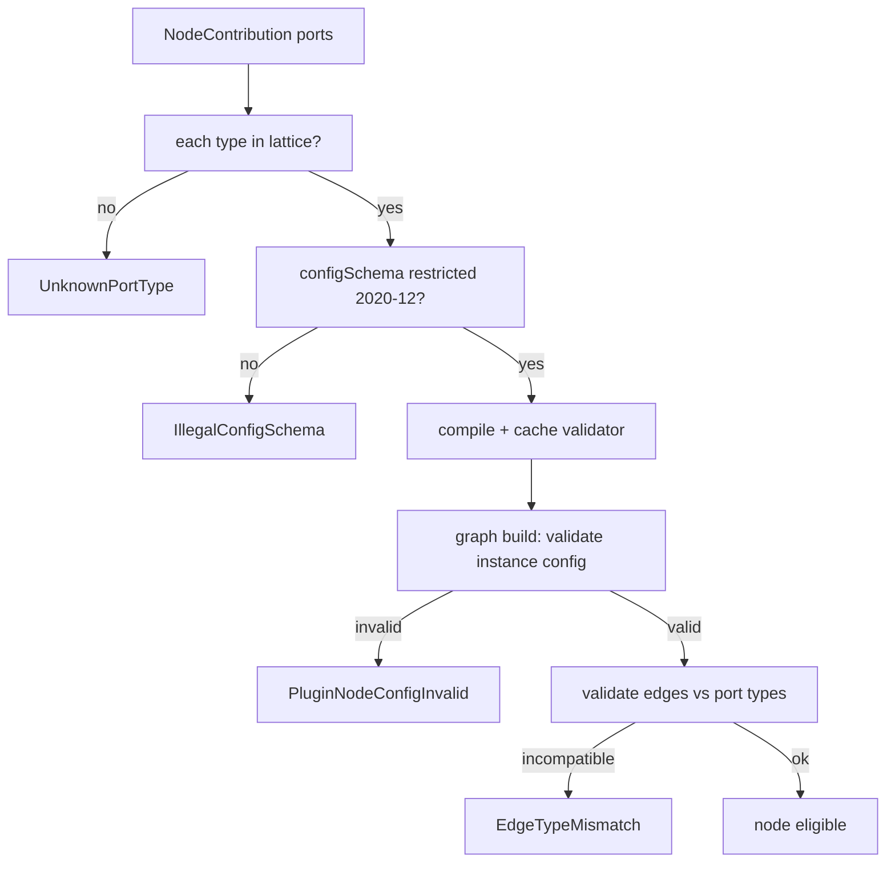

# NodePlugins Specification (Part 03)

## Document Index

Part 01 - Purpose, Philosophy, Definition, Responsibilities, Object Model, States, Invariants
Part 02 - The Node Contribution Manifest, Base Node Contract Conformance, UI Metadata and the No-DOM Rule
Part 03 - Typed Ports, the Config JSON Schema, Type Compatibility, and Edge Validation
Part 04 - The Execute Function, the Sandboxed Context, Progress Reporting, Failure, Retry, and Timeout
Part 05 - Implementation Checklist, the Complete Worked Example Node, Common Mistakes, Future Expansion
Diagrams - NodePlugins-Diagrams.md

# Purpose

This part defines typed ports, the restricted config JSON Schema, the port type lattice mapping, and edge validation for plugin ports. Ports are the contract by which a plugin node talks to the rest of the graph; a wrong port type silently corrupts a downstream node, so the lattice is closed and every port is checked.

# Port Specs

Each input and output port is declared with a name, a type drawn from the closed type lattice, a required flag, and a human label.

```text
PluginPortSpec:
  name      required   port name; grammar-checked (lowercase, no slashes)
  type      required   a member of the EdgeTypes type lattice (Part 04)
  required  required   boolean; an input with required=true must be wired
  label     required   human label (text only, never HTML)
  multiple  optional   whether the port accepts multiple edges
```

# The Closed Type Lattice

Port types MUST resolve to a member of the closed type lattice defined in [[EdgeTypes-Part01]] (Part 04 of that document). The lattice is a fixed set of data types (e.g. `string`, `number`, `boolean`, `object`, `array`, `json`, `artifact_ref`, `file_ref`, `worker_ref`). A plugin cannot invent a port type. A contribution declaring a type outside the lattice is rejected with `UnknownPortType`.

The lattice defines which types are compatible across an edge. Compatibility is structural: an output of type `T` may connect to an input of type `T`, or to a supertype (`json` accepts anything). A connection that violates compatibility is rejected at graph build time, before any node runs.

# The Restricted Config Schema

The node's `configSchema` is JSON Schema draft 2020-12 with a restricted dialect. The restrictions exist because the config object is user-authored in the UI and then validated before the node runs; a permissive schema would let a plugin coerce arbitrary shapes.

```text
restrictions on configSchema:
  top-level type MUST be "object"
  no `function` or `any` equivalent that escapes JSON
  no `$ref` to external resources (local fragment refs only)
  additionalProperties is constrained (plugin may set false or a
  closed sub-schema; open additionalProperties is flagged)
  maximum depth and property count caps (host-enforced)
  no schema keywords that execute (no custom "format" that runs code)
```

The host compiles the schema exactly once at registration (cached per `nodeTypeId` + `contributionHash`). A config object for a node instance is validated against this schema at graph build time; an invalid config fails the build with `PluginNodeConfigInvalid` and names the offending JSON Pointer.

# Edge Validation

When a graph is admitted, every edge touching a plugin node is validated against the declared port types and compatibility:

```text
1. the source node's output port type resolves in the lattice
2. the target node's input port type resolves in the lattice
3. the types are compatible per the lattice
4. required input ports are wired
5. multiple-edge rules are respected
```

Any violation fails the graph build. A plugin node is never scheduled if its instance config or its edges are invalid. This is the "validate before you run" principle applied to the graph.

# Determinism And Replay

The `deterministic` flag (Part 02 policy) tells the engine whether re-invocation would be meaningful. For plugin nodes it does not matter for Replay, because Replay never re-invokes the plugin (Part 01 invariant); it reads the recorded outcome. The flag matters for caching and for merge decisions: a non-deterministic node's output is never assumed reproducible.

# Port And Schema Invariants

```text
Every port type resolves to a member of the EdgeTypes lattice.
A plugin cannot invent a port type; UnknownPortType rejects.
Edge compatibility is checked at graph build time, before run.
A node instance config is validated against configSchema at build.
configSchema is a restricted 2020-12 dialect, compiled once.
additionalProperties is constrained; open schemas are flagged.
A plugin node is never scheduled with invalid config or invalid edges.
```

# Mermaid Diagram



# AI Notes

Do not let a plugin open `additionalProperties: true` on its config schema "for flexibility". An open schema is a coercion channel: the plugin can stuff arbitrary shapes into config that the UI and engine then trust. Constrain it; flag open schemas at registration.

Do not validate edges only at run time. Edge type mismatches must fail the graph build so a Worker never sees a value a node was statically proven never to receive. Run-time validation is too late; the corruption already happened.

Do not let the plugin invent a port type because "the graph is dynamic". The lattice is closed precisely so the engine can prove compatibility without executing the plugin. A dynamic type defeats the proof.

# Related Documents

- [[09-plugin-system/README]]
- [[NodePlugins-Part01]]
- [[NodePlugins-Part02]]
- [[NodePlugins-Part04]]
- [[NodePlugins-Part05]]
- [[NodePlugins-Diagrams]]
- [[PluginArchitecture-Part02]]
- [[EdgeTypes-Part01]]
- [[NodeArchitecture-Part01]]
- [[WorkflowEngine-Part01]]
- [[NodeTypes-Part01]]
