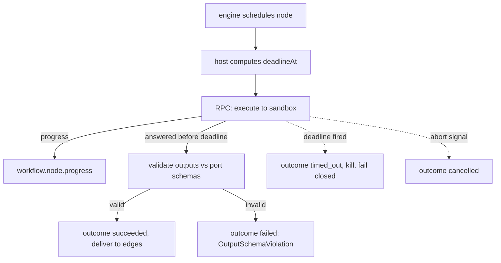

# NodePlugins Specification (Part 04)

## Document Index

Part 01 - Purpose, Philosophy, Definition, Responsibilities, Object Model, States, Invariants
Part 02 - The Node Contribution Manifest, Base Node Contract Conformance, UI Metadata and the No-DOM Rule
Part 03 - Typed Ports, the Config JSON Schema, Type Compatibility, and Edge Validation
Part 04 - The Execute Function, the Sandboxed Context, Progress Reporting, Failure, Retry, and Timeout
Part 05 - Implementation Checklist, the Complete Worked Example Node, Common Mistakes, Future Expansion
Diagrams - NodePlugins-Diagrams.md

# Purpose

This part defines the `execute` function, the sandboxed `PluginNodeContext`, progress reporting, the failure and retry model, and the timeout that guarantees the engine always has a definite outcome. This is where "the engine never waits on a guest" becomes operational.

# The execute Function

`execute` is the function the plugin's sandbox process runs when the WorkflowEngine schedules a plugin node instance. It receives validated inputs, the validated config, and a `PluginNodeContext`, and returns validated outputs or an error. It runs only in the sandbox; the host's node adapter is a stub that marshals JSON over the RPC boundary.

```text
execute(inputs, config, nodeContext) -> Promise<outputs>
  inputs        JSON values, each validated against its input port schema
  config        the instance config, validated against configSchema
  nodeContext   scoped, handle-free context (below)
  returns       JSON values, each validated against its output port schema
```

# The PluginNodeContext

`nodeContext` is the node's view of the host during execution. It is scoped and handle-free, mirroring the plugin `context` ([[PluginSDK-Part02]]) but narrowed to node execution.

```text
nodeContext.workflowId     the owning workflow (read-only, for logging)
nodeContext.nodeId         this node instance (read-only)
nodeContext.pluginId       the owning plugin (read-only)
nodeContext.abortSignal    host-requested cancellation
nodeContext.reportProgress(p)  emit a workflow.node.progress event
nodeContext.storage        the plugin's namespaced KV (read/write)
nodeContext.fs             scoped, capability-gated fs RPCs only
nodeContext.tools          invoke granted tools by id
nodeContext.logger         namespaced, redacted logger
```

What `nodeContext` MUST NOT expose: a file handle, a database handle, a socket, a child process, a reference to any host object, or the ability to write the working tree. If the node wants to change the project, it emits an Artifact via a `fs.write`-capability RPC; the MergeManager applies it. The node never writes the tree directly.

# Progress Reporting

A node MAY report progress via `nodeContext.reportProgress`. Each call emits a `workflow.node.progress` EventBus event attributed to the plugin id. Progress is observation; it does not change the outcome. A node that never reports progress is legal; the engine's timeout still bounds it.

# The Timeout And Definite Outcome

Before `execute` is dispatched, the host computes `deadlineAt` from `policy.timeoutMs` (frozen at registration). There is a finite wall-clock time T after which the engine has a definite outcome regardless of the plugin. When the deadline fires:

```text
1. the call is abandoned (the plugin is sent the abort signal)
2. if the plugin is uncooperative, the process watchdog escalates
3. the node outcome is timed_out; the node is killed if needed
4. the graph proceeds with the node failed (fail closed)
```

There is no configuration, manifest field, or user setting that makes T infinite. The "engine never waits on a guest" rule is enforced here.

# Failure, Retry, And Cancellation

```text
failed        execute rejected, threw, or returned an invalid output.
              The node outcome is failed; the error is attributed and
              breaker-counted (PluginLifecycle-Part06).
retry          the host retries up to policy.retry.maxAttempts, but ONLY
              if the node is deterministic AND the failure was transient
              (transport/crash), never after an invalid-output validation
              failure (which would recur).
cancelled      the workflow was cancelled, an upstream failed, a sibling
              won, the plugin deactivated, the breaker opened, or the
              host shut down. The node outcome is cancelled; no partial
              output is delivered to edges.
```

An output value that fails the declared output port schema is a `failed` outcome with `OutputSchemaViolation`, never a value placed on an edge. The second gate (result validation) applies here exactly as in [[ToolPlugins-Part01]].

# Execution Invariants

```text
execute runs only in the sandbox; never in the host process.
Every execute call has a finite deadlineAt computed before dispatch.
Every output is validated against its output port schema before edges.
A failed/timeout/cancel yields exactly one terminal outcome.
Retry applies only to deterministic, transient failures.
A non-deterministic or invalid-output failure is never retried.
A node cannot write the working tree; it emits an Artifact.
The engine's scheduling loop is never blocked on a plugin RPC.
```

# Mermaid Diagram



# AI Notes

Do not let the plugin return anything that is not JSON. If your RPC layer happily serializes a function, a Proxy, or a Promise, you have a hole. The boundary is JSON-equivalent by construction, and the receiving side validates against the declared output schema anyway.

Do not let a plugin node write to the project. Its sympathetic use case ("my node formats the code") is answered by emitting a patch Artifact, verifying it, and letting the MergeManager write it. Same answer Workers get, for the same reason.

Do not implement the timeout inside the plugin. The plugin in an infinite loop never checks a flag. The host computes `deadlineAt` and abandons the call; the watchdog escalates if the plugin will not die.

Do not retry a non-deterministic node after a transient failure expecting the same result. Retry only when deterministic and transient; otherwise you multiply uncertainty, not reliability.

# Related Documents

- [[09-plugin-system/README]]
- [[NodePlugins-Part01]]
- [[NodePlugins-Part02]]
- [[NodePlugins-Part03]]
- [[NodePlugins-Part05]]
- [[NodePlugins-Diagrams]]
- [[PluginArchitecture-Part05]]
- [[PluginSDK-Part02]]
- [[PluginLifecycle-Part06]]
- [[WorkflowEngine-Part01]]
- [[ExecutionFlow-Part01]]
- [[MergeManager-Part01]]
- [[ToolPlugins-Part01]]
