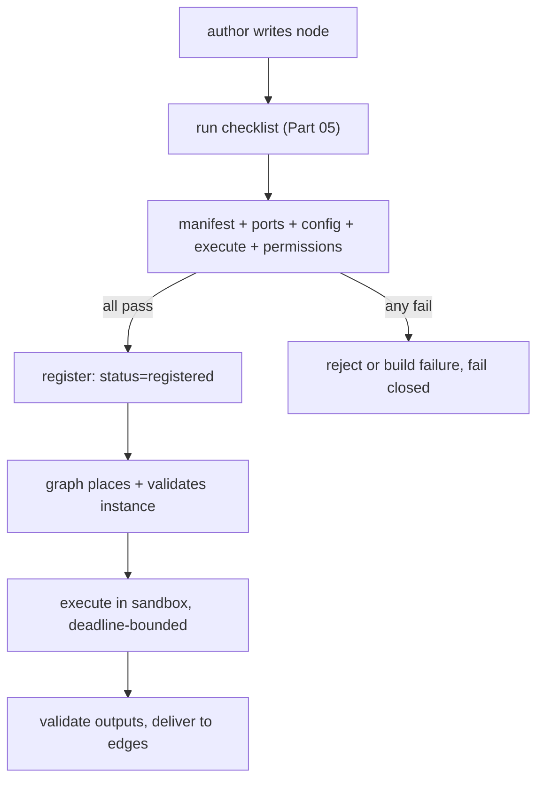

---
title: NodePlugins Specification - Part 05
status: draft
version: 1.0
tags:
  - plugin-system
  - node-plugins
  - checklist
  - example
related:
  - "[[09-plugin-system/README]]"
  - [[NodePlugins-Part01]]
  - [[NodePlugins-Part02]]
  - [[NodePlugins-Part03]]
  - [[NodePlugins-Part04]]
---

# NodePlugins Specification (Part 05)

## Document Index

Part 01 - Purpose, Philosophy, Definition, Responsibilities, Object Model, States, Invariants
Part 02 - The Node Contribution Manifest, Base Node Contract Conformance, UI Metadata and the No-DOM Rule
Part 03 - Typed Ports, the Config JSON Schema, Type Compatibility, and Edge Validation
Part 04 - The Execute Function, the Sandboxed Context, Progress Reporting, Failure, Retry, and Timeout
Part 05 - Implementation Checklist, the Complete Worked Example Node, Common Mistakes, Future Expansion
Diagrams - NodePlugins-Diagrams.md

# Purpose

This part closes NodePlugins with an implementation checklist for authors, a complete worked example node, the common mistakes to avoid, and notes on future expansion. The checklist is the contract an author verifies before publishing; the example shows a node that does everything right.

# The Author Checklist

```text
manifest:
  contributes.nodes entry present, localTypeId grammar-valid
  localTypeId not using reserved "Eulinx"/"internal" prefix
  icon is in the host allowlist; color is a host palette token
  engineApiVersion matches a supported WorkflowEngine API
  policy.timeoutMs within the host ceiling; deterministic flag set

ports:
  every input/output type is in the EdgeTypes lattice
  required input ports are marked required
  labels are plain text, never HTML

config:
  configSchema is restricted 2020-12, type "object"
  additionalProperties constrained (not open)
  no external $ref, no code-executing keywords
  no function/any escape

execute:
  runs only in the sandbox; returns JSON only
  reads inputs/config; never holds a host handle
  emits Artifact for any project change (never writes tree)
  reports progress via nodeContext.reportProgress (optional)
  respects the abort signal

permissions:
  every capability the node needs is declared in capabilities
  reasons are plain language, within length cap
```

# Worked Example: A "Schema Validator" Node

A plugin contributes a node `plugin:acme/schema_validate` that takes a `json` input and a `schema` config and outputs a `boolean` `valid` and an `array` `errors`.

```text
contribution:
  localTypeId: schema_validate
  displayName: "Schema Validator"
  category: "validation"
  icon: "check-circle" (allowlisted)
  color: "blue" (palette token)
  inputs:  [{ name: "data", type: "json", required: true }]
  outputs: [{ name: "valid", type: "boolean" },
            { name: "errors", type: "array" }]
  configSchema: { type: "object", properties: { schema: { type: "object" } },
                  required: ["schema"], additionalProperties: false }
  engineApiVersion: "1.0"
  policy: { timeoutMs: 5000, retry: 1, determinism: "deterministic",
            cancellable: true }

execute(data, config, nodeContext):
  validate data against config.schema (pure, in sandbox)
  return { valid: bool, errors: string[] }
  no fs, no net, no handle, no tree write
```

Registration: `contributionHash` computed, ports resolve in lattice, config schema restricted and valid, icon allowlisted, engine API compatible -> `status = registered`. The node appears in the palette. When a graph runs it, the host computes `deadlineAt`, dispatches `execute` over RPC, validates the output against the `boolean`/`array` port schemas, and delivers to edges. If it times out, the node fails closed and the graph proceeds with the node failed.

# Common Mistakes

```text
writing the working tree directly           -> must emit an Artifact
returning a non-JSON value (function, ref)  -> boundary rejects, fails
supplying the timeout at run time           -> host ignores it; uses policy
open additionalProperties in configSchema   -> flagged, constrains required
using a non-allowlisted icon                -> UnknownIconId rejection
declaring a port type outside the lattice   -> UnknownPortType rejection
rendering HTML in displayName/description   -> XSS; text only, always
```

# Future Expansion

```text
typed port generics         a later engine API may add parametric types;
                            gated by engineApiVersion bump
multi-output streaming      progress already covers partial reporting;
                            true streaming outputs are a future API
node-to-node direct calls   remain out of scope; a node calls granted tools,
                            never another node's internals
```

# Checklist Invariants

```text
The checklist is the author's pre-publish contract; all items are
enforced at registration or build time, not advisory.
A node that passes the checklist still runs sandboxed and grant-checked.
A node that fails any checklist item is rejected or fails the build.
The worked example obeys every rule; it is the reference implementation.
```

# Mermaid Diagram



# AI Notes

Do not treat the checklist as optional reading for authors. Every item is enforced somewhere in Parts 02-04; the checklist is the map. An author who skips it produces a node that fails registration with a cryptic code.

Do not copy the worked example's `policy.timeoutMs` blindly. Pick a value the node can actually meet; too small and it times out under load, too large and it stalls the graph. The host clamps to the ceiling regardless.

Do not "temporarily" write the tree in the example node during development. The Artifact path is the only path; there is no dev exception, because dev exceptions become production escapes.

# Related Documents

- [[09-plugin-system/README]]
- [[NodePlugins-Part01]]
- [[NodePlugins-Part02]]
- [[NodePlugins-Part03]]
- [[NodePlugins-Part04]]
- [[NodePlugins-Diagrams]]
- [[PluginArchitecture-Part02]]
- [[PluginArchitecture-Part05]]
- [[EdgeTypes-Part01]]
- [[NodeArchitecture-Part01]]
- [[WorkflowEngine-Part01]]
- [[MergeManager-Part01]]
- [[ToolPlugins-Part01]]
