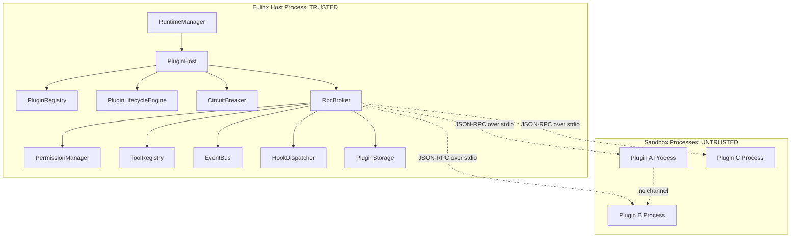
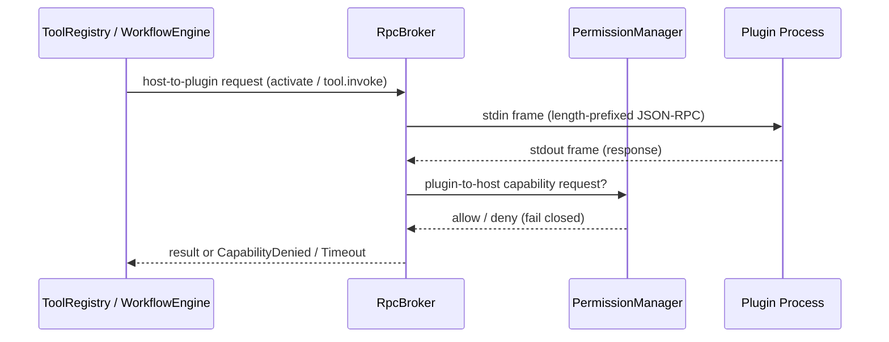
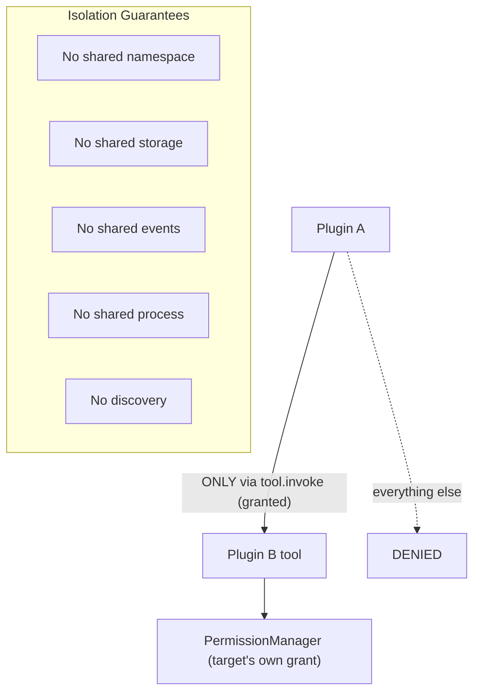
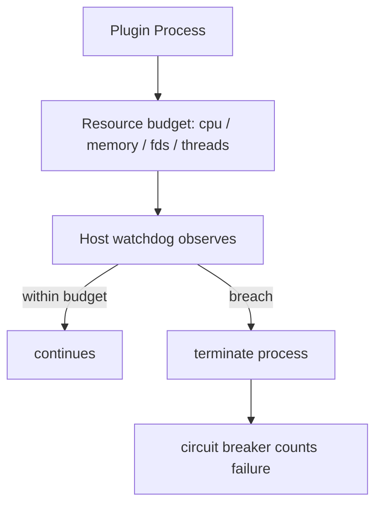

---
title: PluginArchitecture Diagrams
status: draft
version: 1.0
tags:
  - plugin-system
  - plugin-architecture
  - diagrams
related:
  - "[[09-plugin-system/README]]"
  - [[PluginArchitecture-Part01]]
  - [[PluginArchitecture-Part05]]
  - [[PluginArchitecture-Part06]]
---

# PluginArchitecture Diagrams

## Overview: Trusted Host And Untrusted Guest



Note the absent edges. There is no edge from a plugin process to the filesystem, to SQLite, to the network, or to another plugin process. Those absences are the specification.

## ASCII Overview

```text
                 TRUSTED HOST PROCESS
   +-------------------------------------------------+
   |  RuntimeManager                                  |
   |     |                                            |
   |     v                                            |
   |  PluginHost                                      |
   |     +-- PluginRegistry      what is installed    |
   |     +-- LifecycleEngine     state machine        |
   |     +-- CircuitBreaker      disables bad actors  |
   |     +-- HookDispatcher      timeouts, ordering   |
   |     +-- RpcBroker           the ONLY doorway     |
   |            |                                     |
   |            +-- PermissionManager  every request  |
   |            +-- ToolRegistry                      |
   |            +-- EventBus                          |
   |            +-- PluginStorage      namespaced kv  |
   +------------|------------------------------------+
                |
       JSON-RPC over stdio pipes
       length-prefixed, schema-validated,
       timeout-bounded, permission-gated
                |
   +------------v------------+  +-------------------+
   |  SANDBOX PROCESS A      |  |  SANDBOX PROCESS B|
   |  UNTRUSTED              |  |  UNTRUSTED        |
   |                         |  |                   |
   |  no fs      no db       |  |  no fs   no db    |
   |  no net     no spawn    |  |  no net  no spawn |
   |  no env     no handles  |  |  no env  no peers |
   +-------------------------+  +-------------------+
             |                            |
             +------- no channel ---------+
```

## The RPC Boundary



## Cross-Plugin Isolation



## Resource Limits And Watchdog



## Related Documents

- [[09-plugin-system/README]]
- [[PluginArchitecture-Part01]]
- [[PluginArchitecture-Part02]]
- [[PluginArchitecture-Part03]]
- [[PluginArchitecture-Part04]]
- [[PluginArchitecture-Part05]]
- [[PluginArchitecture-Part06]]
- [[PermissionManager-Part01]]
- [[ProcessLifecycle-Part01]]
