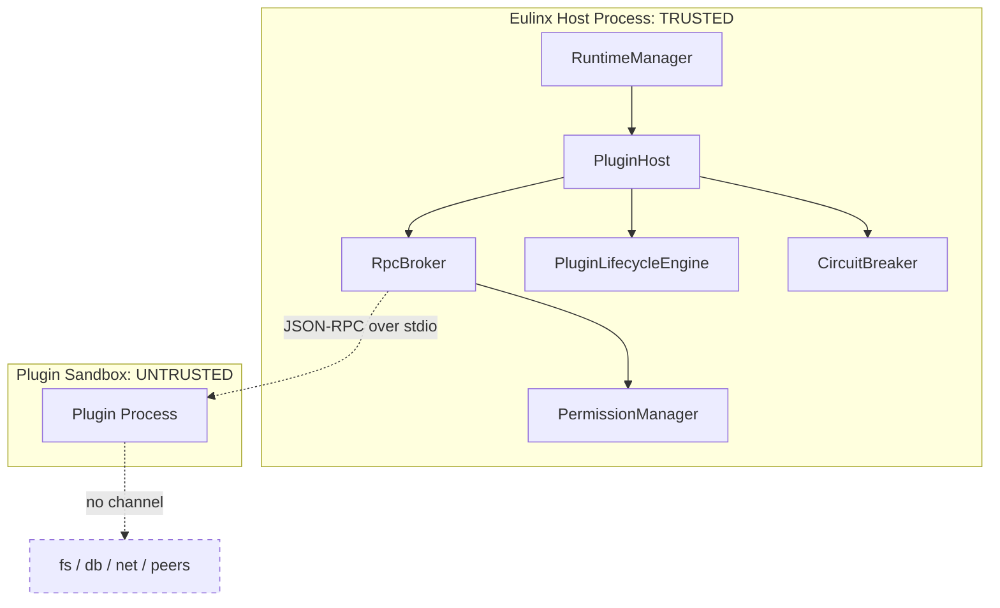

---
title: PluginArchitecture Specification - Part 01
status: draft
version: 1.0
tags:
  - plugin-system
  - plugin-architecture
  - sandbox
  - security
related:
  - "[[09-plugin-system/README]]"
  - "[[PluginLifecycle-Part01]]"
  - "[[PluginSDK-Part01]]"
  - "[[PermissionManager-Part01]]"
  - "[[ProcessLifecycle-Part01]]"
---

# PluginArchitecture Specification (Part 01)

## Document Index

Part 01 - What a plugin is, the threat model, the sandbox execution model, isolation principles
Part 02 - The plugin manifest format and every field
Part 03 - The extension point catalog (tools, nodes, hooks, settings, panels)
Part 04 - The capability and permission model, the closed capability registry
Part 05 - The plugin-to-core RPC boundary, JSON-RPC over stdio, framing, and the broker
Part 06 - Version compatibility, resource limits, and cross-plugin isolation

# Purpose

PluginArchitecture is the topic that decides the security posture of the entire plugin system. Every other topic in `09-plugin-system` is an elaboration of a decision made here. Read this topic before any other.

This document defines what a plugin is, what it may and may not extend, the manifest format, the extension point catalog, the sandboxed execution model, the capability permission model, resource limits, the plugin-to-core RPC boundary, version compatibility, and the isolation rules that keep a plugin away from the filesystem, the database, and other plugins.

# The Central Decision

```text
Eulinx does not run plugin code inside the Eulinx process.
Eulinx runs plugin code in a separate OS process.
The only doorway between that process and Eulinx is the RpcBroker.
The only authority the process has is what PermissionManager granted.
```

This is the single architectural decision from which every rule in this folder follows. It is not a performance optimization. It is the difference between "a malicious plugin can read your provider API keys" and "a malicious plugin can at worst waste a process and get killed".

# What A Plugin Is

A **plugin** is a bundle of third-party code plus a manifest, installed by the user from a marketplace or a local path, that contributes one or more extension points to Eulinx. Eulinx's authors did not write it, did not review it, and cannot vouch for it.

A plugin owns:

- its own bundle on disk, under a per-plugin install directory
- its own sandbox process, spawned and owned by [[ProcessLifecycle-Part01]]
- a capability grant record produced by the install-time consent gate (see [[PluginLifecycle-Part05]])
- a namespaced key-value storage prefix in the plugin store (see [[SQLiteSchema-Part01]])

A plugin does NOT own, and MUST NOT be able to reach:

- the Eulinx host process's memory, handles, or objects
- the user's filesystem outside its own install and storage directories
- SQLite, LanceDB, or Tantivy directly
- the network, except through capability-gated RPC
- any other plugin's process, storage, events, or identity
- any provider API key, WebSocket, or credential

# The Threat Model

```text
Threat: a plugin authored specifically to exfiltrate this user's
repository and API keys, published to the marketplace under a
plausible name, with a clean manifest and a polite description.

Not the threat: a well-meaning plugin with a bug.
```

The design assumes the worst credible case, not the average case. A bug-prone friendly plugin is handled by the same rules as a hostile one, because the runtime cannot tell them apart at load time.

# The Sandbox Execution Model

Every plugin runs as a child process spawned by [[ProcessLifecycle-Part01]]. The process is created with:

- a dedicated working directory inside the plugin's install directory, never the workspace root
- a scrubbed environment: no provider keys, no Eulinx internals, no inherited PATH entries the host did not intend
- no inherited file descriptors, sockets, or handles of any kind
- a resource budget (see Part 06) enforced by the OS where possible and by the host watchdog otherwise
- a single communication channel: a stdio pipe pair carrying length-prefixed JSON-RPC (see Part 05)

The process cannot open a second channel. It has no socket it can listen on, no shared memory it can attach to, and no parent handle it can message. The RpcBroker is the only thing that reads its stdout and the only thing that writes its stdin.

# Invariants

```text
Plugin code never executes in the Eulinx host process.
A plugin process starts with a scrubbed env and no inherited handles.
A plugin process has exactly one I/O channel: the RPC stdio pipes.
Every capability a plugin uses was declared and granted before install.
Every RPC from a plugin is checked by PermissionManager.
A plugin cannot read, write, or detect any other plugin.
A plugin cannot reach SQLite, LanceDB, or Tantivy directly.
A plugin cannot reach the network except through a capability-gated RPC.
A crashed plugin takes only itself down.
```

# Mermaid Diagram



# AI Notes

Do not invent an "in-process plugin mode for performance". There is no safe version of it. The moment plugin code shares your address space, it shares your SQLite handle and your provider keys. The performance cost of a second process is real and is accepted on purpose.

Do not give the plugin process a debug socket "just for development". A debug socket is a network listen, which is the sandbox escape. Development uses the same stdio RPC channel everything else uses.

Do not inherit the host environment into the plugin process because "it needs NODE_PATH". The plugin bundles its own dependencies. Inheriting host env is how a plugin reads `OPENAI_API_KEY` out of the process block.

# Related Documents

- [[09-plugin-system/README]]
- [[PluginArchitecture-Part02]]
- [[PluginArchitecture-Part03]]
- [[PluginArchitecture-Part04]]
- [[PluginArchitecture-Part05]]
- [[PluginArchitecture-Part06]]
- [[PluginArchitecture-Diagrams]]
- [[PluginLifecycle-Part01]]
- [[PluginSDK-Part01]]
- [[PermissionManager-Part01]]
- [[ProcessLifecycle-Part01]]
- [[SQLiteSchema-Part01]]
