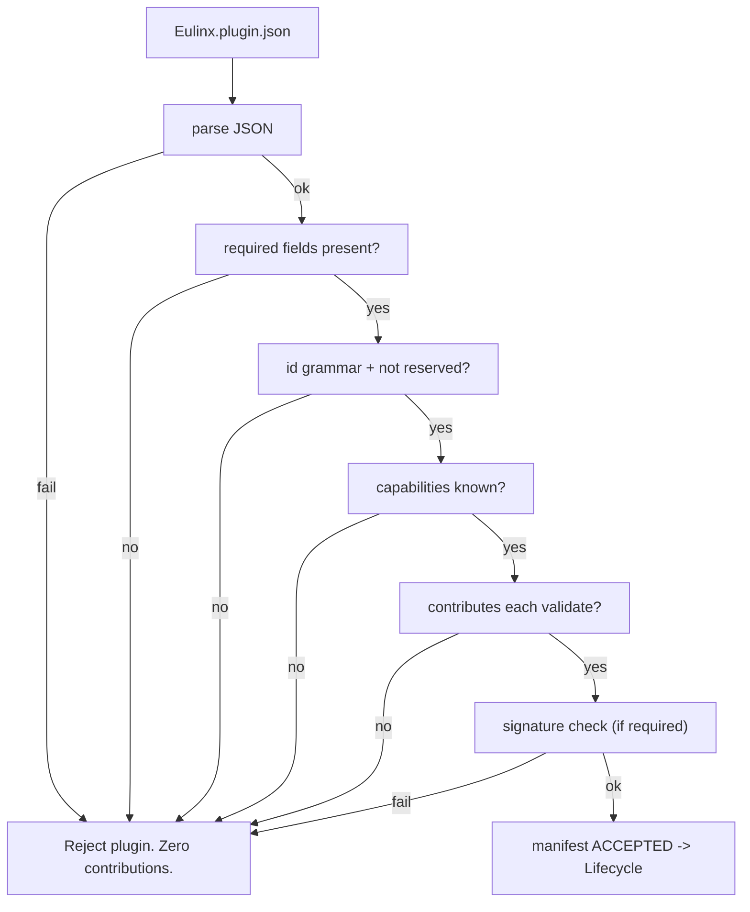

---
title: PluginArchitecture Specification - Part 02
status: draft
version: 1.0
tags:
  - plugin-system
  - plugin-architecture
  - manifest
  - schema
related:
  - "[[09-plugin-system/README]]"
  - "[[PluginArchitecture-Part01]]"
  - "[[PluginArchitecture-Part03]]"
  - "[[PluginLifecycle-Part02]]"
  - "[[PluginSDK-Part01]]"
---

# PluginArchitecture Specification (Part 02)

## Document Index

Part 01 - What a plugin is, the threat model, the sandbox execution model, isolation principles
Part 02 - The plugin manifest format and every field
Part 03 - The extension point catalog (tools, nodes, hooks, settings, panels)
Part 04 - The capability and permission model, the closed capability registry
Part 05 - The plugin-to-core RPC boundary, JSON-RPC over stdio, framing, and the broker
Part 06 - Version compatibility, resource limits, and cross-plugin isolation

# Purpose

This part defines the single source of truth for what a plugin declares: the root `Eulinx.plugin.json` manifest. The manifest is a declaration of intent shown to the user at install. It is not enforcement. Enforcement happens at the RpcBroker on every call (see Part 05 and [[PluginArchitecture-Part04]]).

# The Manifest Envelope

The manifest is a JSON document at the bundle root named `Eulinx.plugin.json`. It is the only file Eulinx reads before install. Nothing else in the bundle is trusted at discovery time.

The manifest carries identity, compatibility, contribution declarations, and capability requests. Every field is either required or explicitly optional. A missing required field fails the whole plugin (fail closed). There are no silent defaults that grant authority.

```text
Eulinx.plugin.json
  schema            required   manifest schema URI pinning the format version
  id                required   the verified plugin id (grammar in this part)
  name              required   human display name (metadata only, not an id)
  version           required   semver of the plugin
  engines           required   supported Eulinx semver range the plugin targets
  author            required   publisher identity reference (see MarketplaceIntegration)
  summary           required   one-line human summary (metadata)
  description       optional   longer human description (metadata)
  icon              optional   icon id from the host allowlist (metadata)
  homepage          optional   URL, display only, never fetched at load
  capabilities      required   array of DeclaredPermission requested pre-install
  contributes       required   object holding tools, nodes, hooks, settings, panels
  sdkVersion        required   semver of PluginSDK the plugin built against
  main              required   entry module path inside the bundle
  signature         optional   detached signature reference (see PluginLifecycle-Part03)
```

# Identity And The id Grammar

The `id` is the verified, marketplace-assigned or install-generated identifier. It is NOT the display `name`. The `id` is what namespacing is built from (see ToolPlugins-Part04 and NodePlugins-Part01), and it is what audit records carry. A plugin cannot choose an `id` that collides with another or with the reserved `Eulinx` namespace.

```text
id       := scope "/" segment
scope    := [a-z][a-z0-9-]*       (publisher or org scope)
segment  := [a-z][a-z0-9-]*       (plugin name within scope)
max length of id                  = 96 characters
reserved prefix "Eulinx/"            = FORBIDDEN (core namespace)
reserved prefix "internal/"      = FORBIDDEN
```

```text
VALID     acme/dep-linter
VALID     madblast/keymap-export
INVALID   Eulinx/fs          (reserved core prefix)
INVALID   Acme/DepLinter  (uppercase)
INVALID   a b             (space)
```

The `id` is assigned by the id authority (the marketplace or the local install), never by the manifest's self-assertion. A plugin that presents an `id` not matching its verified identity is rejected at install (see [[PluginLifecycle-Part03]]).

# Compatibility: engines And sdkVersion

`engines` is a semver range describing which Eulinx versions the plugin claims to support. The host checks it against its own version at install and again at activation. A plugin whose range does not include the running Eulinx version is placed in `unavailable` (see [[PluginLifecycle-Part01]]), never force-activated.

`sdkVersion` pins the PluginSDK the plugin was built against. The SDK's own semver policy (see [[PluginSDK-Part06]]) decides forward and backward compatibility between SDK and host. A host that cannot satisfy `sdkVersion` MUST NOT activate the plugin.

# The contributes Object

`contributes` is the catalog of what the plugin adds to Eulinx. Each member corresponds to an extension point defined in Part 03. An empty `contributes` is legal (a plugin may only register hooks, for example) but a plugin that declares zero contributions and zero hooks is rejected as having no purpose.

```text
contributes:
  tools:    ToolContribution[]     see [[ToolPlugins-Part02]]
  nodes:    NodeContribution[]     see [[NodePlugins-Part02]]
  hooks:    HookContribution[]     see [[HookSystem-Part02]]
  settings: SettingsContribution[] see Part 03
  panels:   PanelContribution[]    see Part 03
```

# capabilities: The Pre-Install Request

`capabilities` is the array of `DeclaredPermission` objects the plugin asks for. Each entry names a capability from the closed registry (Part 04), an optional narrowing scope, and a plain-language `reason` shown verbatim in the consent dialog. An unknown capability name here is a hard rejection. The user may grant a subset, which becomes the stored grant record (see [[PluginLifecycle-Part05]]).

# Validation Order

```text
1. manifest parses as JSON and matches the pinned schema version
2. schema / id / name / version / engines / author / summary present
3. id matches grammar and is not reserved
4. engines range parses and will be re-checked at activation
5. sdkVersion parses
6. capabilities[*] each name a known capability, reason within limits
7. contributes is an object; each declared contribution validates
   against its own part (ToolPlugins-Part02 / NodePlugins-Part02 /
   HookSystem-Part02 / Part 03)
8. signature present if the marketplace requires one
```

Any failure fails the whole plugin. Eulinx does not register a partial plugin.

# Mermaid Diagram



# AI Notes

Do not read anything other than `Eulinx.plugin.json` at discovery time. Reading a plugin's code before install is both a waste and a risk; the code is untrusted and should not be executed or even fully parsed until it is in a sandbox.

Do not let the display `name` become a routing key. Only `id` routes. Two publishers could both ship a plugin called "Linter"; only their `id`s differ, and only `id` keeps their tools from colliding.

Do not add a default `capabilities: []` and treat absence as "read everything it needs". Absence means "needs nothing". The user grants nothing, and the plugin gets nothing beyond what it asked for and was granted.

# Related Documents

- [[09-plugin-system/README]]
- [[PluginArchitecture-Part01]]
- [[PluginArchitecture-Part03]]
- [[PluginArchitecture-Part04]]
- [[PluginArchitecture-Part05]]
- [[PluginArchitecture-Part06]]
- [[PluginLifecycle-Part02]]
- [[PluginLifecycle-Part03]]
- [[PluginLifecycle-Part05]]
- [[PluginSDK-Part06]]
- [[ToolPlugins-Part02]]
- [[NodePlugins-Part02]]
- [[HookSystem-Part02]]
- [[MarketplaceIntegration-Part01]]
