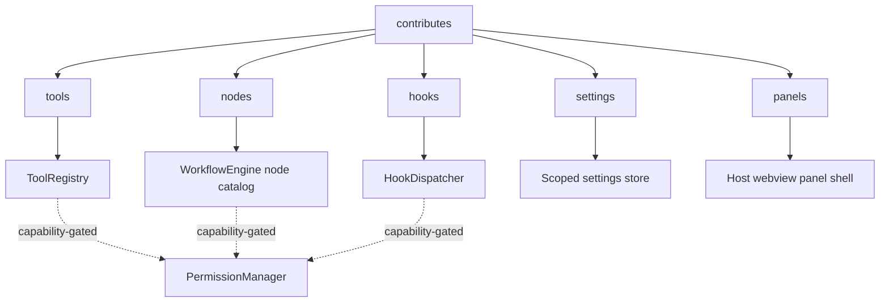

---
title: PluginArchitecture Specification - Part 03
status: draft
version: 1.0
tags:
  - plugin-system
  - plugin-architecture
  - extension-points
related:
  - "[[09-plugin-system/README]]"
  - "[[PluginArchitecture-Part01]]"
  - "[[PluginArchitecture-Part02]]"
  - "[[ToolPlugins-Part01]]"
  - "[[NodePlugins-Part01]]"
  - "[[HookSystem-Part01]]"
---

# PluginArchitecture Specification (Part 03)

## Document Index

Part 01 - What a plugin is, the threat model, the sandbox execution model, isolation principles
Part 02 - The plugin manifest format and every field
Part 03 - The extension point catalog (tools, nodes, hooks, settings, panels)
Part 04 - The capability and permission model, the closed capability registry
Part 05 - The plugin-to-core RPC boundary, JSON-RPC over stdio, framing, and the broker
Part 06 - Version compatibility, resource limits, and cross-plugin isolation

# Purpose

This part enumerates the closed set of extension points a plugin may declare in `contributes`. The set is closed on purpose. A plugin may only extend what Eulinx has explicitly declared extensible, and each extension point has its own conformance specification elsewhere in this folder. There is no "arbitrary code at startup" extension point, because that is the sandbox escape.

# The Closed Extension Point Catalog

```text
tools    A Tool a Worker can call.              Highest risk. [[ToolPlugins-Part01]]
nodes    A Workflow node type.                  Critical path. [[NodePlugins-Part01]]
hooks    A runtime hook (observe or veto).      Sharpest tool. [[HookSystem-Part01]]
settings A namespaced settings schema + UI.     UI only, no logic at load.
panels   A dockable UI panel.                   Render only, no host access.
```

No other extension point exists. A plugin cannot contribute a new command palette command that runs code at startup, cannot hook the process spawner, cannot intercept provider traffic, and cannot replace a core node. Each "cannot" is a missing entry in this catalog, which is the security design.

# tools

A `tools` entry binds a tool name, a definition, a permission set, and a handler. The full schema and validation are in [[ToolPlugins-Part02]]. Tools enter the [[ToolRegistry-Part01]] under the `pluginId/name` namespace. A tool runs when a language model decides to call it, which is why it is the highest-risk surface.

# nodes

A `nodes` entry declares a node type with typed ports and an `execute` function. The full schema is in [[NodePlugins-Part02]]. Nodes enter the WorkflowEngine's node type catalog under `plugin:pluginId:localTypeId`. A node becomes a vertex in the execution graph and sits on the workflow's critical path, which is why its rules are tighter than a tool's.

# hooks

A `hooks` entry declares participation in a runtime decision. The full catalog and signatures are in [[HookSystem-Part02]]. Hooks are split into observing hooks (notification only) and blocking hooks (may veto). A blocking hook places untrusted code on the runtime's critical path and is therefore the most sharply bounded surface: hard timeouts, fail-closed defaults, no privilege escalation.

# settings

A `settings` entry contributes a namespaced settings section. It declares a JSON Schema for the plugin's own configuration and a UI metadata hint (group, label). The settings UI is rendered by the host from the schema; the plugin supplies no component. Settings values are read by the plugin only through the scoped storage API in the SDK (see [[PluginSDK-Part03]]). A `settings` entry grants no capability and runs no code at load.

```text
settings contribution:
  namespace      required   must equal the plugin id (no cross-plugin settings)
  schema         required   JSON Schema 2020-12, type "object"
  group          required   human label for the settings group
  uiHints        optional   ordering, input control hints (host interprets)
```

# panels

A `panels` entry contributes a dockable UI panel. It declares a panel id, a title, a preferred dock position, and an icon id from the host allowlist. The panel's content is rendered by the plugin's sandbox through a strictly limited webview contract: the panel may emit observation events and call scoped SDK functions, but it receives no host object, no DOM outside its panel root, and no access to other panels. The panel contract is defined in [[PluginSDK-Part04]].

```text
panels contribution:
  panelId        required   namespaced as pluginId/panelName
  title          required   human title (text only, never HTML)
  dock           required   one of: left, right, bottom, floating
  icon           optional   icon id from the host allowlist
  minSize        optional   size hint, host-clamped
```

# What An Extension Point Is Not

```text
An extension point is NOT a way to run code at Eulinx startup.
An extension point is NOT a way to replace a core component.
An extension point is NOT a way to read another plugin's data.
An extension point is NOT a way to register a provider or a model.
An extension point is NOT a way to intercept the EventBus globally.
```

Each of those is deliberately excluded. A plugin's code runs only when its declared extension point is invoked through the RPC boundary, and only then under the capability grant and the timeout that apply to that point.

# Mermaid Diagram



# AI Notes

Do not add an extension point "because authors will want it". Each new extension point is a new doorway from untrusted code into the runtime. The catalog is small by design. If a legitimate use case appears, it is added through a spec change with a security review, not by a plugin declaring a new key.

Do not let `settings` or `panels` become a code-execution channel. A settings schema is data. A panel is a render target. Neither must ever receive a callback, a handler reference, or a script. The host renders both from declared metadata; the plugin influences them only through the RPC boundary after activation.

# Related Documents

- [[09-plugin-system/README]]
- [[PluginArchitecture-Part01]]
- [[PluginArchitecture-Part02]]
- [[PluginArchitecture-Part04]]
- [[ToolPlugins-Part01]]
- [[ToolPlugins-Part02]]
- [[NodePlugins-Part01]]
- [[NodePlugins-Part02]]
- [[HookSystem-Part01]]
- [[HookSystem-Part02]]
- [[PluginSDK-Part03]]
- [[PluginSDK-Part04]]
- [[ToolRegistry-Part01]]
