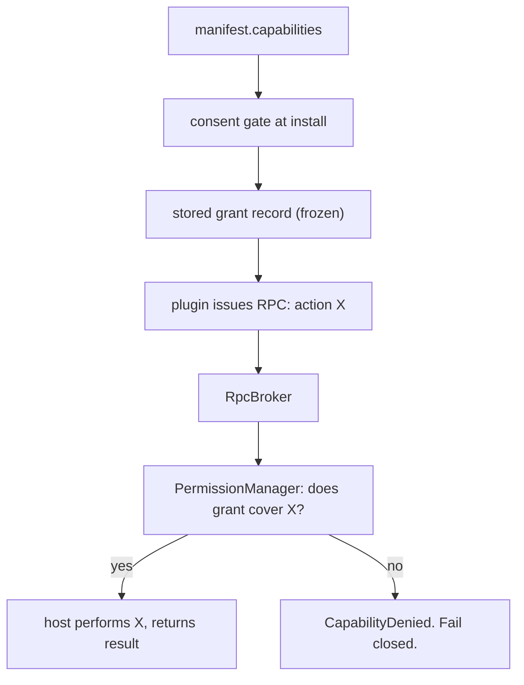

---
title: PluginArchitecture Specification - Part 04
status: draft
version: 1.0
tags:
  - plugin-system
  - plugin-architecture
  - permissions
  - capability-model
related:
  - "[[09-plugin-system/README]]"
  - "[[PluginArchitecture-Part01]]"
  - "[[PluginArchitecture-Part02]]"
  - "[[PluginArchitecture-Part05]]"
  - "[[PermissionManager-Part01]]"
  - "[[PluginLifecycle-Part05]]"
---

# PluginArchitecture Specification (Part 04)

## Document Index

Part 01 - What a plugin is, the threat model, the sandbox execution model, isolation principles
Part 02 - The plugin manifest format and every field
Part 03 - The extension point catalog (tools, nodes, hooks, settings, panels)
Part 04 - The capability and permission model, the closed capability registry
Part 05 - The plugin-to-core RPC boundary, JSON-RPC over stdio, framing, and the broker
Part 06 - Version compatibility, resource limits, and cross-plugin isolation

# Purpose

This part defines the capability permission model: the closed set of capabilities a plugin may request, what each capability authorizes, and the rule that enforcement happens at the broker on every call. The manifest declares; the PermissionManager decides; the RpcBroker enforces.

# The Capability Model In One Paragraph

A **capability** is a named, coarse authority category (for example, reading a scoped file, performing a network request to a named host, or emitting a notification). A plugin declares the capabilities it wants in its manifest. The user grants a subset at install time. The grant becomes a stored record. Every time the plugin attempts an authority-bearing action, it does so through an RPC, and the RpcBroker asks the [[PermissionManager-Part01]] whether the grant record covers that specific action. A capability that was not declared and granted does not exist for that plugin, and no runtime request can create one.

# The Closed Capability Registry

The registry is a fixed enumeration. A plugin cannot invent a capability. An unknown capability name in a manifest is a hard rejection (see [[PluginArchitecture-Part02]]).

```text
fs.read            read files under a declared scope (directory / glob)
fs.write           write files under a declared scope, via Artifact only
net.http           perform an outbound HTTP request to a declared host list
net.ws             open an outbound WebSocket to a declared host list
ui.notify          emit a host notification (no content injection)
ui.panel           render a dockable panel (see Part 03)
storage.kv         read/write the plugin's own namespaced key-value prefix
hook.register      participate in a declared hook (see HookSystem)
tool.invoke        call a declared core or other-plugin tool by id
process.spawn      spawn a child process (almost never granted)
process.self_terminate  request its own termination (rarely granted)
db.query           run a declared, scoped read query against SQLite
event.emit         emit an observation event on the EventBus
```

Each capability's scope narrows it. An empty scope means "the whole capability", which the consent UI almost always denies; authors are expected to name specific paths, hosts, tool ids, or query shapes.

# Capability Semantics

```text
fs.read     authorizes read RPCs whose path is under a declared scope.
            It does NOT authorize reading the workspace root broadly.
            It does NOT authorize reading provider keys or Eulinx config.

fs.write    authorizes emitting an Artifact that the MergeManager may
            apply. It does NOT authorize writing the working tree directly.
            A plugin with fs.write that opens a file handle is a violation.

net.http    authorizes outbound requests only to declared hosts. The host
            performs the request; the plugin never holds the socket. The
            plugin passes a method, url-in-scope, headers, body; the host
            executes and returns the response. The plugin cannot connect
            to an arbitrary address.

storage.kv  authorizes the plugin's own namespaced prefix only. The prefix
            is enforced by the store, not by the plugin. See Part 06.

hook.register  authorizes participating in the specific named hooks listed
               in the grant. A plugin cannot subscribe to a hook it did not
               declare and was not granted.

tool.invoke  authorizes calling a named tool by id. The called tool still
             enforces its own permission set. Privilege is not transitive.

db.query    authorizes a read-only, scoped query. The host holds the
            connection; the plugin sends a parameterized query shape and
            receives rows. It never holds the SQLite handle.

event.emit  authorizes emitting observation events. The event payload is
            validated and namespaced. See Part 06 isolation.
```

# The Enforcement Rule

```text
The manifest is a declaration of intent. It is NOT enforcement.
Enforcement happens at the RpcBroker, on EVERY single call,
against the stored grant record, for the plugin's id.
A plugin that was granted fs.read still gets checked on call 4,000,000.
```

The grant record is the law. The manifest is never re-read for a permission decision, because a plugin that swapped its manifest on disk between install and invocation would otherwise have widened its own authority. This is the canonical escalation exploit, and the frozen grant record closes it.

# DeclaredPermission Versus PermissionRequirement

A `DeclaredPermission` lives in the manifest: it is a request (`capability`, `scope`, `reason`). A `PermissionRequirement` is the frozen, post-consent object stored by the host: same `capability` and `scope`, plus a `granted` boolean decided by the consent gate (see [[PluginLifecycle-Part05]]).

A `granted: false` requirement is not an error. The plugin still registers and still runs; it receives `CapabilityDenied` on the RPC it was never granted. This lets a user install a plugin while withholding a capability, and the plugin degrades gracefully instead of failing to install.

# No Runtime Escalation

There is no runtime permission escalation prompt. Install-time informed consent is the only consent. A runtime prompt converts informed consent into fatigue-driven click-through at the exact moment a malicious plugin has manufactured urgency. If a plugin attempts an action whose capability was not granted, the answer is `CapabilityDenied`, always. The plugin cannot ask the user to upgrade mid-call.

# Mermaid Diagram



# AI Notes

Do not treat the manifest's declared permissions as enforcement. They are a screenshot of intent shown to the user. The RpcBroker and PermissionManager are the enforcement, and they consult the frozen grant, not the manifest.

Do not implement transitive privilege. If plugin A is granted `tool.invoke` for tool B, tool B still runs under its own permission set. A plugin must not be able to launder a denied capability through a granted one.

Do not add a runtime "grant now?" dialog. It is the single most abused pattern in plugin systems, and it defeats the entire consent model.

# Related Documents

- [[09-plugin-system/README]]
- [[PluginArchitecture-Part01]]
- [[PluginArchitecture-Part02]]
- [[PluginArchitecture-Part03]]
- [[PluginArchitecture-Part05]]
- [[PluginArchitecture-Part06]]
- [[PluginLifecycle-Part05]]
- [[PermissionManager-Part01]]
- [[SQLiteSchema-Part01]]
- [[ToolPlugins-Part02]]
- [[HookSystem-Part02]]
