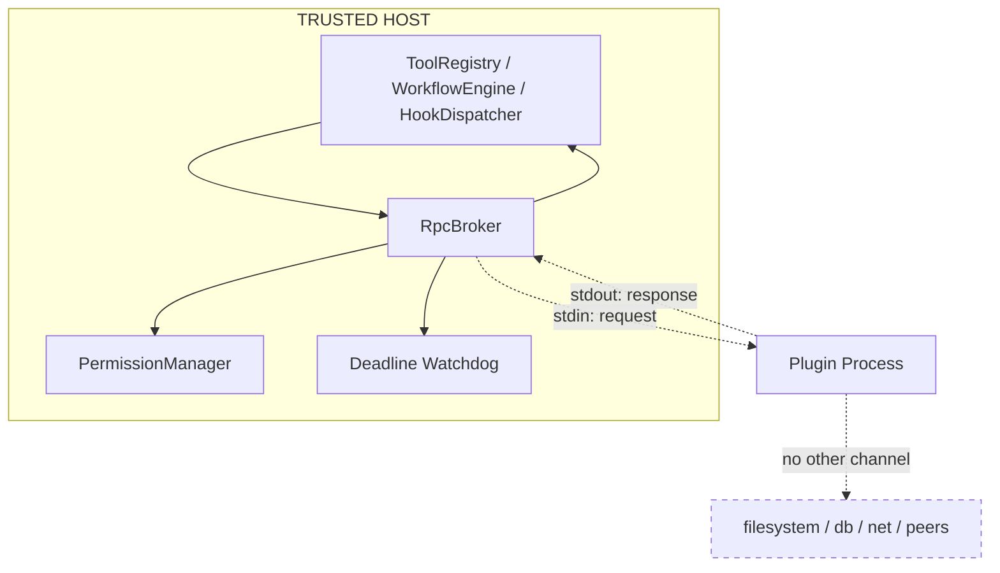

---
title: PluginArchitecture Specification - Part 05
status: draft
version: 1.0
tags:
  - plugin-system
  - plugin-architecture
  - rpc
  - sandbox
related:
  - "[[09-plugin-system/README]]"
  - "[[PluginArchitecture-Part01]]"
  - "[[PluginArchitecture-Part04]]"
  - "[[PluginArchitecture-Part06]]"
  - "[[PermissionManager-Part01]]"
  - "[[ProcessLifecycle-Part01]]"
---

# PluginArchitecture Specification (Part 05)

## Document Index

Part 01 - What a plugin is, the threat model, the sandbox execution model, isolation principles
Part 02 - The plugin manifest format and every field
Part 03 - The extension point catalog (tools, nodes, hooks, settings, panels)
Part 04 - The capability and permission model, the closed capability registry
Part 05 - The plugin-to-core RPC boundary, JSON-RPC over stdio, framing, and the broker
Part 06 - Version compatibility, resource limits, and cross-plugin isolation

# Purpose

This part defines the only doorway between a plugin's sandbox process and Eulinx: the RpcBroker speaking JSON-RPC 2.0 over length-prefixed stdio pipes. The boundary is the whole security mechanism. Inside it, the plugin is a guest. Outside it, the plugin does not exist.

# The Channel

Each plugin process is given exactly one communication channel: a pair of stdio pipes. The host writes requests to the plugin's stdin; the plugin writes responses to its stdout. There is no second channel, no socket, and no shared memory. If the plugin opens a socket itself, that is its own process doing so in violation of its grant, and the host's network capability gate means the host will never perform the request for it.

```text
Eulinx host                     Plugin sandbox process
RpcBroker  --stdin pipe-->   plugin reads request
RpcBroker  <--stdout pipe--  plugin writes response
            (no other channel exists)
```

# Framing

Because stdio is a byte stream, not a message stream, every RPC frame is length-prefixed. The host reads exactly the declared number of bytes per frame; it never reads an unbounded stream, because an infinite stream from a hostile plugin would exhaust host memory. The framing is a fixed header carrying the frame byte length, followed by exactly that many bytes of UTF-8 JSON.

```text
frame = LENGTH(4 bytes, big-endian unsigned) + JSON_BYTES(LENGTH bytes)
```

The host enforces a maximum frame size. A frame larger than the cap is discarded and the plugin is flagged. The plugin enforces the same cap on its side, so neither party can be flooded by the other.

# The Protocol: JSON-RPC 2.0

The wire format is JSON-RPC 2.0. Requests carry a method, params, and an id. Responses carry the same id, a result, or an error. Notifications (no id) flow in both directions for events.

Two classes of method exist:

- **Host-to-plugin** methods: `activate`, `deactivate`, `tool.invoke`, `node.execute`, `hook.run`, `settings.get`, `storage.get`, `storage.put`, `panel.render`. These are invocations the host makes into the guest. Each is bounded by a deadline.
- **Plugin-to-host** methods: these are capability requests (`fs.read`, `net.http`, `storage.kv`, `tool.invoke`, `event.emit`, and so on). Each plugin-to-host call is intercepted by the RpcBroker and routed through [[PermissionManager-Part01]] before any host action is taken.

# The RpcBroker Is The Doorway

The RpcBroker owns both sides of the pipe. It is the only host component that parses plugin output and the only one that writes to the plugin. Every plugin-to-host request is intercepted here and checked:

```text
plugin stdout frame
  -> RpcBroker parses JSON-RPC
  -> is it a host->plugin method?   NO (plugins do not call those)
  -> is it a plugin->host capability request?
       -> PermissionManager: does grant cover this exact action?
            yes -> host performs the action, result returned
            no  -> CapabilityDenied returned, fail closed
  -> is the response within the size cap and schema?
       yes -> forwarded to caller
       no  -> truncated / rejected, plugin flagged
```

The RpcBroker also enforces the per-call deadline. It starts a timer before dispatching into the plugin and abandons the call when the timer fires, returning the fail-closed default. The plugin cannot extend the timer; the timer is host-owned.

# Timeouts Are Host-Owned

Every host-to-plugin call carries a deadline computed by the host from the installed manifest policy (not from any value the plugin sends). When the deadline fires:

- the call returns the fail-closed default for that method
- the in-flight request is marked abandoned
- if the plugin cannot be cancelled cooperatively, the host's watchdog considers escalation (see Part 06)
- the failure is attributed to the plugin id and recorded against the circuit breaker (see [[PluginLifecycle-Part06]])

# Schema Validation At The Boundary

Both directions are schema-checked. A plugin's request params and the plugin's response result are validated against the method's schema before they reach or leave the broker. A malformed frame is rejected, not coerced. This is the second gate described in [[ToolPlugins-Part01]] and [[NodePlugins-Part01]]: the plugin is a suspect in the middle of a corridor with a checkpoint at each end.

# The Trust Boundary In One Line

```text
Everything to the left of the RpcBroker is TRUSTED and holds authority.
Everything to the right of the RpcBroker is UNTRUSTED and holds none.
The broker is the only thing that crosses, and it crosses only with a
permission check and a deadline.
```

# Mermaid Diagram



# AI Notes

Do not let the plugin open a second channel "for performance". The single stdio pipe is the security boundary. A second channel (socket, named pipe, shared memory) is an escape and must be prevented by the process spawn policy.

Do not implement the timeout in the plugin. The plugin in an infinite loop will never honor a timeout it is asked to check. The watchdog lives in the host and does not require the plugin's cooperation.

Do not coerce a malformed plugin response into something usable. Reject it. Coercion at the boundary is how a plugin that returns the wrong shape quietly injects bad data into a Worker's context.

Do not let the RpcBroker short-circuit the permission check "because the method is internal". Every plugin-to-host request, without exception, goes through PermissionManager. There is no friendship with a guest.

# Related Documents

- [[09-plugin-system/README]]
- [[PluginArchitecture-Part01]]
- [[PluginArchitecture-Part04]]
- [[PluginArchitecture-Part06]]
- [[PluginLifecycle-Part06]]
- [[PermissionManager-Part01]]
- [[ProcessLifecycle-Part01]]
- [[ToolPlugins-Part01]]
- [[NodePlugins-Part01]]
- [[HookSystem-Part01]]
