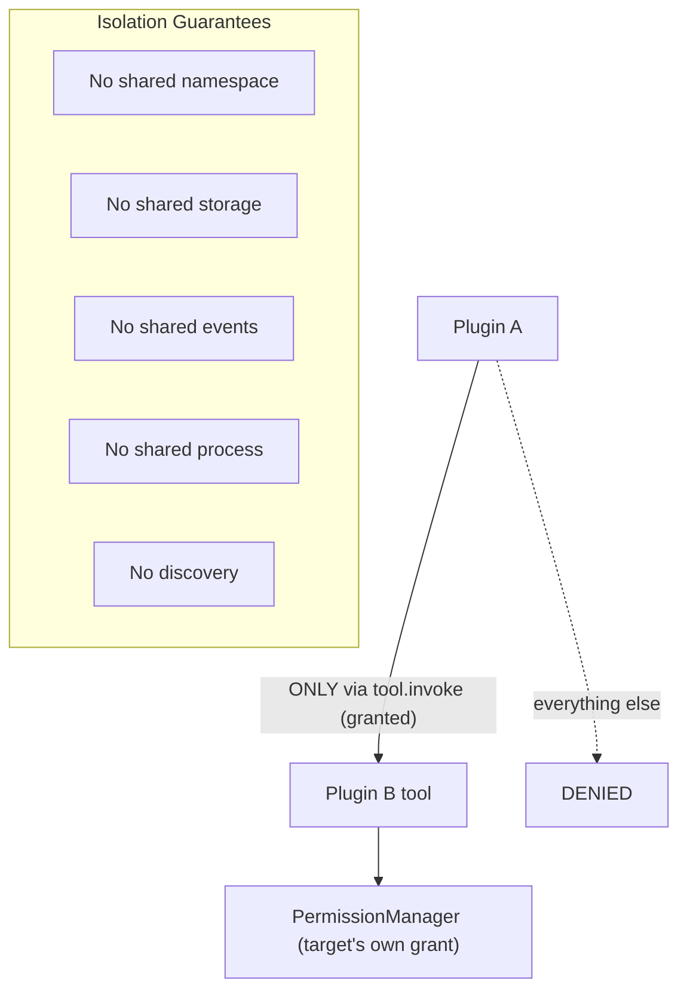

---
title: PluginArchitecture Specification - Part 06
status: draft
version: 1.0
tags:
  - plugin-system
  - plugin-architecture
  - isolation
  - resource-limits
related:
  - "[[09-plugin-system/README]]"
  - "[[PluginArchitecture-Part01]]"
  - "[[PluginArchitecture-Part04]]"
  - "[[PluginArchitecture-Part05]]"
  - "[[PluginLifecycle-Part06]]"
  - "[[SQLiteSchema-Part01]]"
---

# PluginArchitecture Specification (Part 06)

## Document Index

Part 01 - What a plugin is, the threat model, the sandbox execution model, isolation principles
Part 02 - The plugin manifest format and every field
Part 03 - The extension point catalog (tools, nodes, hooks, settings, panels)
Part 04 - The capability and permission model, the closed capability registry
Part 05 - The plugin-to-core RPC boundary, JSON-RPC over stdio, framing, and the broker
Part 06 - Version compatibility, resource limits, and cross-plugin isolation

# Purpose

This part closes the architecture with the rules that keep plugins apart from each other and bounded in resources: version compatibility at the SDK and engine level, the resource budget enforced on a sandbox process, and the cross-plugin isolation guarantees that make supply-chain attacks between plugins impossible.

# Version Compatibility

Three versions interact. All three are checked, and any mismatch that the compatibility policy cannot absorb puts the plugin in `unavailable` rather than risking a broken activation.

```text
Eulinx version        the host's own semver. Checked against manifest.engines.
sdkVersion         the PluginSDK the plugin built against. Checked against
                  the host's SDK compatibility policy (see PluginSDK-Part06).
engineApiVersion   per contribution (node types, hook signatures). Checked
                  against the running engine's API version (NodePlugins-Part01,
                  HookSystem-Part03).
```

Compatibility rules:

- `engines` MUST include the running Eulinx version, else `unavailable`.
- `sdkVersion` MUST be within the host's supported SDK range, else `unavailable`.
- a `node` whose `engineApiVersion` is incompatible renders `unavailable` but does not block the plugin's other contributions.
- a `hook` whose signature version is incompatible is silently not registered; the plugin still activates.

# Resource Limits

Every plugin process is created under a resource budget. Where the OS supports it, the limit is enforced by the OS; where it does not, the host watchdog enforces it by observation and, if exceeded, terminates the process.

```text
cpu              a wall-clock CPU fraction cap, host-clamped
memory           a hard resident-set cap; exceeding it triggers termination
open files       a low descriptor ceiling (the plugin's own bundle only)
threads          a cap; the plugin must be single- or few-threaded
stdout bytes     a per-frame and per-session byte cap (see Part 05 framing)
spawn            forbidden unless process.spawn granted (almost never)
network          forbidden at the socket level; only via net.* capability RPC
```

No plugin may raise its own limits. There is no manifest field that increases a cap, and no runtime call that does. The caps are host policy, not plugin request.

# Cross-Plugin Isolation

This is the rule that stops one plugin from attacking another. Plugins are mutually opaque.

```text
No shared namespace.     Each plugin has its own id; no plugin can read or
                         guess another's id from inside the sandbox.
No shared storage.       storage.kv is prefix-scoped to the plugin id by the
                         store. Plugin A cannot address Plugin B's prefix.
No shared events.        event.emit is namespaced to the emitting plugin.
                         Plugin A cannot subscribe to or observe Plugin B.
No shared process.       Each plugin is a separate OS process. A crash in one
                         does not affect another.
No discovery.            There is no API that lists installed plugins. A plugin
                         cannot enumerate, detect, message, or even learn of
                         another plugin's existence.
No shared memory.        No shared memory region, no named pipe, no IPC the
                         host does not mediate. The only mediated channel is
                         tool.invoke against a named, granted tool id.
```

Cross-plugin discovery is treated as a supply-chain attack primitive. If Plugin A could learn that Plugin B (a popular, trusted one) is installed, Plugin A could target it. Eulinx denies the knowledge.

# The One Mediated Cross-Plugin Path

The only way one plugin can affect another is through a `tool.invoke` capability that names the other plugin's tool by id, and only if that capability was declared, granted, and the target tool is currently `enabled`. Even then, the target tool runs under its own permission set and its own timeout. Privilege is not transitive (see Part 04). This single, auditable, capability-gated path is deliberately narrow.

# Isolation Invariants

```text
No plugin can read, write, or detect any other plugin.
No plugin can reach SQLite, LanceDB, or Tantivy except via a scoped,
capability-gated RPC that the host performs on its behalf.
No plugin can exceed its resource budget without the host terminating it.
No plugin can raise its own limits.
No plugin can learn the set of installed plugins.
A plugin's storage, events, and identity are namespaced to its id.
```

# Mermaid Diagram



# AI Notes

Do not add a "list installed plugins" API because a legitimate plugin might want to coordinate. Coordination between untrusted parties is exactly what isolation forbids. If two plugins must interact, the interaction is a declared, granted, capability-gated `tool.invoke`, never free discovery.

Do not let resource limits be advisory. A plugin that ignores its memory cap and the host that ignores the breach together produce an OOM that takes down Eulinx. The host watchdog MUST terminate on breach. That is the "never crash the core" rule in practice.

Do not scope storage by anything the plugin can choose. The prefix is the verified `id`, computed by the host. A plugin that sends a different "namespace" in a storage RPC is ignored; the host substitutes the verified id.

# Related Documents

- [[09-plugin-system/README]]
- [[PluginArchitecture-Part01]]
- [[PluginArchitecture-Part04]]
- [[PluginArchitecture-Part05]]
- [[PluginLifecycle-Part01]]
- [[PluginLifecycle-Part06]]
- [[PluginSDK-Part06]]
- [[NodePlugins-Part01]]
- [[HookSystem-Part03]]
- [[SQLiteSchema-Part01]]
- [[PermissionManager-Part01]]
