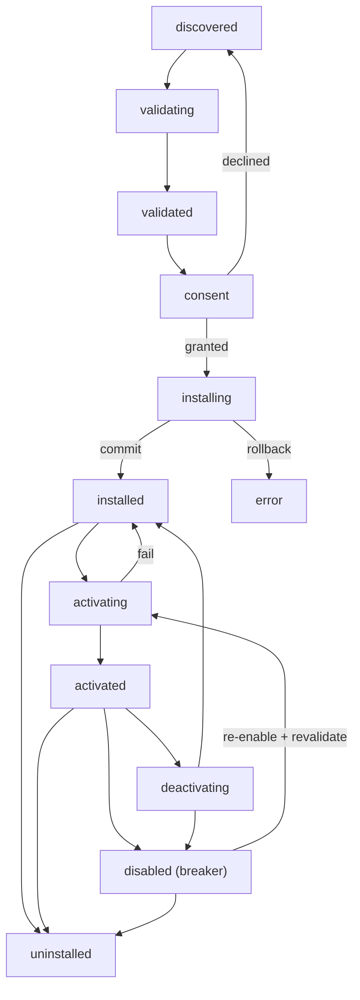
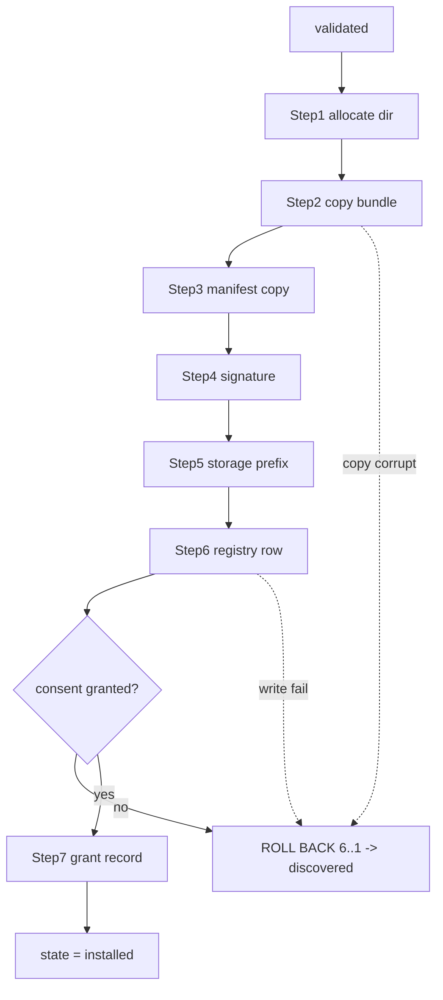
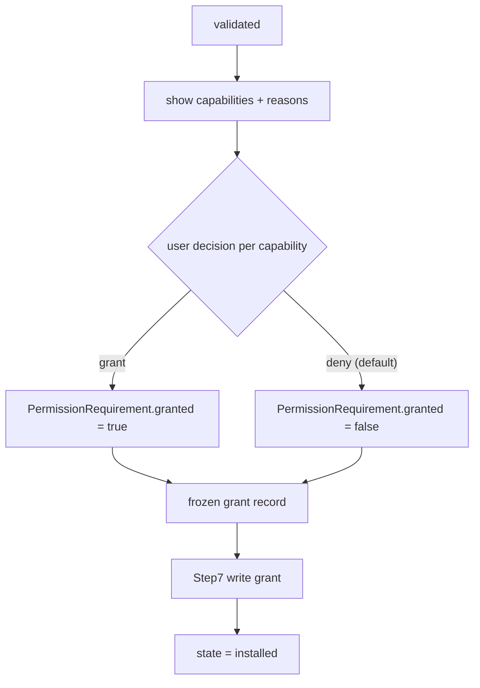
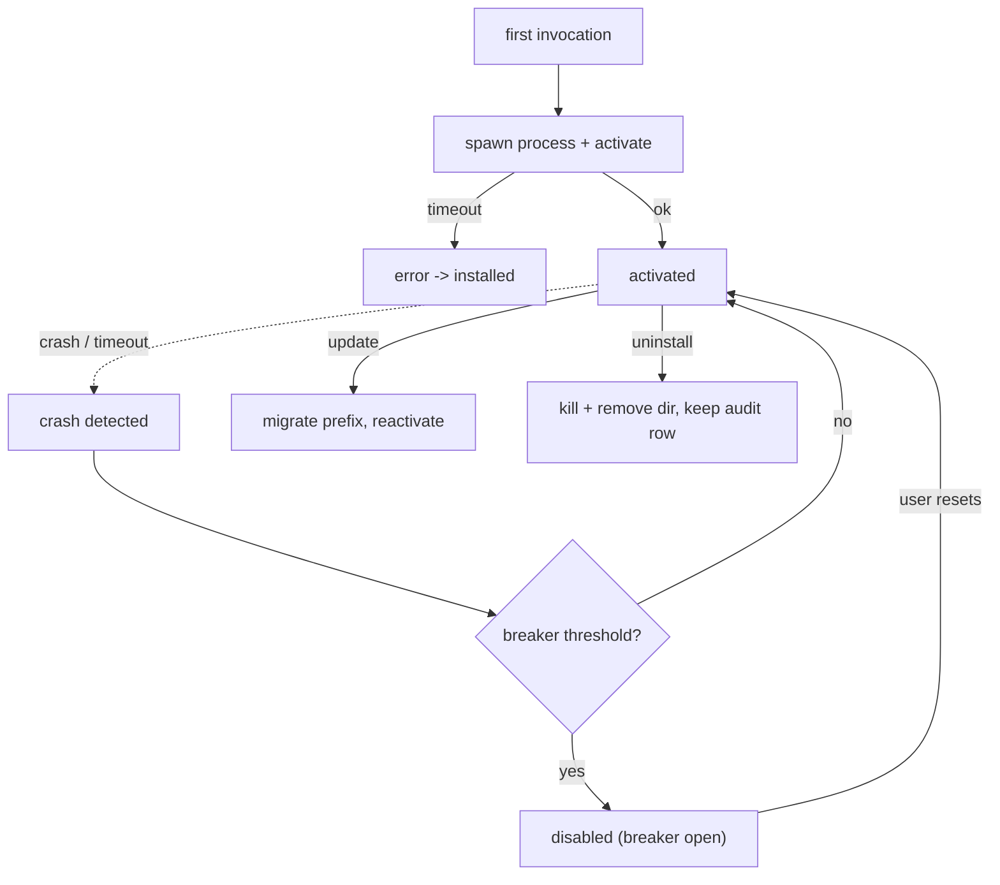
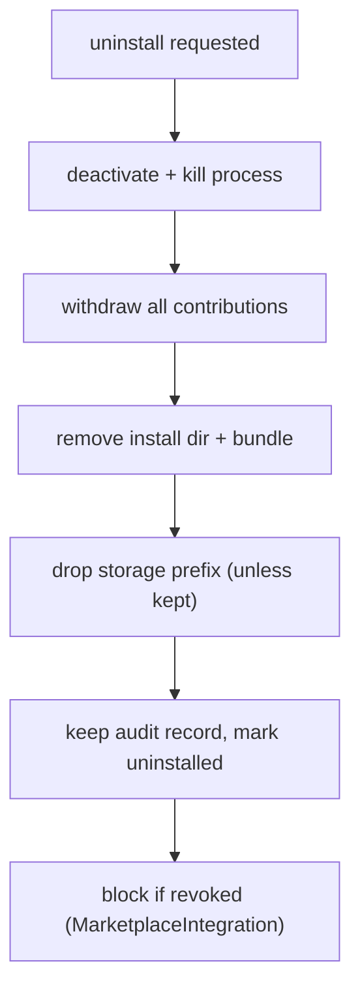

# PluginLifecycle Diagrams

## State Machine

## Transactional Install

## Consent Gate

## Activation, Crash, And Circuit Breaker

## Clean Uninstall

## Related Documents

- [[09-plugin-system/README]]
- [[PluginLifecycle-Part01]]
- [[PluginLifecycle-Part02]]
- [[PluginLifecycle-Part03]]
- [[PluginLifecycle-Part04]]
- [[PluginLifecycle-Part05]]
- [[PluginLifecycle-Part06]]
- [[PluginArchitecture-Part01]]
- [[MarketplaceIntegration-Part01]]
- [[SQLiteSchema-Part01]]
