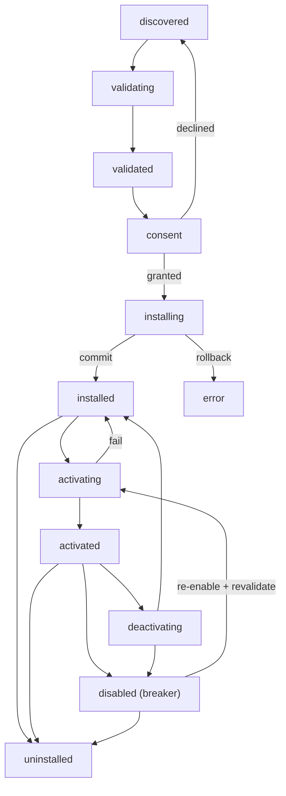

# PluginLifecycle Specification (Part 01)

## Document Index

Part 01 - Purpose, the lifecycle state machine, lifecycle invariants
Part 02 - Discovery and directory layout
Part 03 - Manifest validation and signature verification
Part 04 - The transactional install algorithm with rollback
Part 05 - The permission consent gate
Part 06 - Activation, crash detection, circuit breaker, update migration, uninstall

# Purpose

PluginLifecycle defines the plugin state machine from discovery to uninstall: discovery and directory layout, manifest validation, signature verification, the transactional install algorithm with rollback, the permission consent gate, lazy activation, the activate and deactivate contract, crash detection, the circuit breaker that disables a repeatedly-failing plugin, data migration on update, and clean uninstall.

The lifecycle is owned by the host. The plugin never decides its own state. Every transition either succeeds entirely or rolls back entirely; there is no half-installed plugin.

# The Lifecycle State Machine

A plugin moves through a fixed set of states. Transitions are host-driven and auditable.

```text
discovered     a plugin bundle was found at a known location and its
               manifest parsed. Nothing executed yet.

validating     manifest schema, id grammar, capability names, and signature
               are being checked. See Part 03.

validated      manifest passed all static checks. Not yet installed to the
               registry. Awaiting user consent.

consent        the user is shown the requested capabilities and asked to
               grant a subset. See Part 05.

installing     the transactional install runs (copy/move into the install
               dir, write the grant record, register contributions).
               See Part 04.

installed      install committed. Contributions registered but the plugin
               process is not yet spawned.

activating     lazy activation: the host spawns the sandbox process and
               calls activate. See Part 06.

activated      the process is up, activate resolved, contributions live.

deactivating   host calls deactivate and tears down the process. See Part 06.

disabled       user or circuit breaker turned the plugin off. Process gone.
               Contributions remain registered but not offered.

error          a lifecycle step failed and could not roll back cleanly;
               requires user attention. Terminal-ish; can move to uninstall.

uninstalled    clean removal complete. Registration record retained for
               audit only (see Part 06). Terminal.
```

# Legal Transitions

```text
(none)        -> discovered     bundle located
discovered    -> validating     host begins checks
validating    -> validated      all static checks pass
validating    -> error          static check fail (rare; usually rejected)
validated     -> consent        presented to user
consent       -> installing     user granted (possibly empty) subset
consent       -> discovered     user declined (return to pool, no install)
installing    -> installed      transaction committed
installing    -> error          transaction rolled back, see Part 04
installed     -> activating     lazy activation triggered
activating    -> activated      activate resolved
activating    -> error          activate failed; rollback to installed
activated     -> deactivating   user or host initiates
activated     -> disabled       circuit breaker opened
deactivating  -> installed      deactivated, process gone
deactivating  -> disabled       deactivation after breaker
installed     -> uninstalled    user removes
activated     -> uninstalled    user removes
disabled      -> uninstalled    user removes
disabled      -> activating     user re-enables (re-validate first)
error         -> uninstalled    user removes after resolving
```

Note the absences. There is no `activated -> installed` without deactivation. There is no `disabled -> activated` without re-validation (a plugin may have changed on disk while disabled). There is no transition out of `uninstalled` except a fresh install that produces a new record.

# Lifecycle Invariants

```text
A plugin is never partially installed. Install commits or rolls back.
A plugin never decides its own state; the host does.
A plugin in any state other than activated has no live process.
A plugin is never offered to a model or scheduled while not activated.
Activation is lazy: the process spawns on first need, not at boot.
A plugin that fails repeatedly is disabled automatically and cannot
re-enable itself.
Every lifecycle transition is recorded in the audit log with the plugin id.
Uninstall removes the process and the install dir but retains the audit
record.
A revoked plugin (see MarketplaceIntegration) cannot be reinstalled.
```

# Mermaid Diagram



# AI Notes

Do not let a plugin influence its own lifecycle state. A plugin that could mark itself `activated` would be a plugin that bootstraps itself past consent. State is host-owned; the plugin receives `activate` and `deactivate` calls, it does not assert state.

Do not make activation eager "so tools are ready". Eager activation at boot means every installed plugin spawns a process at startup, which is both a resource drain and an attack surface that is always on. Lazy activation means a malicious plugin only runs when something actually invokes it, and even then under a grant and a timeout.

Do not leave a half-installed plugin on disk after a failed install. The transaction in Part 04 either commits or rolls back; a partial install is a prime spot for a plugin to be "technically present" and later auto-activated by a code path that assumes install is atomic.

# Related Documents

- [[09-plugin-system/README]]
- [[PluginLifecycle-Part02]]
- [[PluginLifecycle-Part03]]
- [[PluginLifecycle-Part04]]
- [[PluginLifecycle-Part05]]
- [[PluginLifecycle-Part06]]
- [[PluginArchitecture-Part01]]
- [[ProcessLifecycle-Part01]]
- [[MarketplaceIntegration-Part01]]
- [[SQLiteSchema-Part01]]
