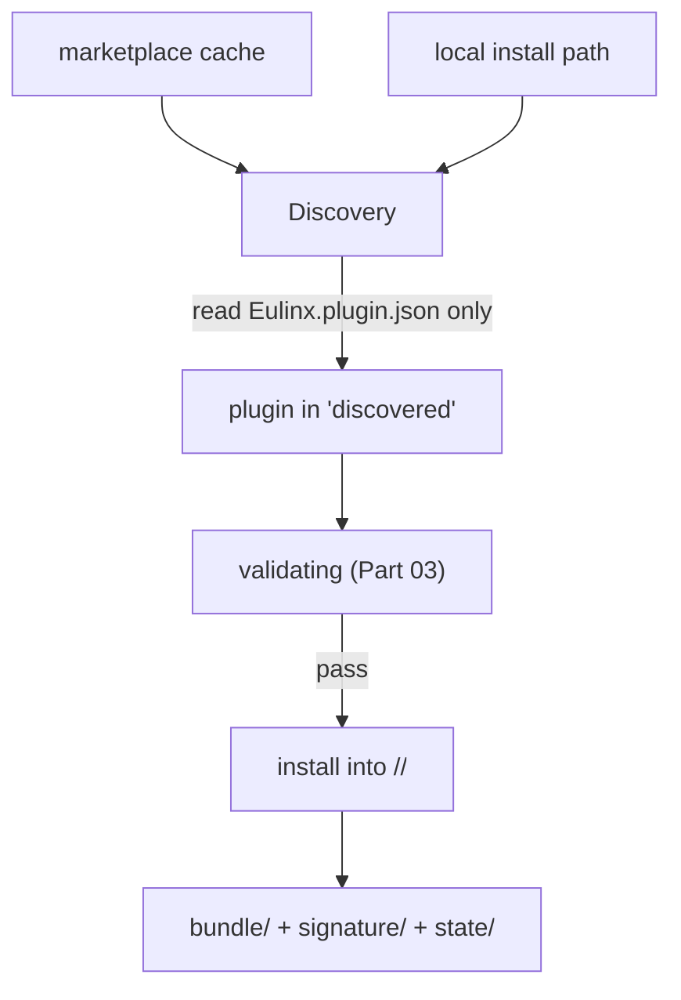

---
title: PluginLifecycle Specification - Part 02
status: draft
version: 1.0
tags:
  - plugin-system
  - plugin-lifecycle
  - discovery
  - directory-layout
related:
  - "[[09-plugin-system/README]]"
  - "[[PluginLifecycle-Part01]]"
  - "[[PluginLifecycle-Part03]]"
  - "[[MarketplaceIntegration-Part01]]"
---

# PluginLifecycle Specification (Part 02)

## Document Index

Part 01 - Purpose, the lifecycle state machine, lifecycle invariants
Part 02 - Discovery and directory layout
Part 03 - Manifest validation and signature verification
Part 04 - The transactional install algorithm with rollback
Part 05 - The permission consent gate
Part 06 - Activation, crash detection, circuit breaker, update migration, uninstall

# Purpose

This part defines where Eulinx looks for plugins, what it reads at discovery time, and the on-disk layout of an installed plugin. Discovery is read-only and never executes code. The bundle is untrusted until it passes validation (Part 03) and consent (Part 05).

# Discovery Sources

Eulinx discovers plugins from a fixed, small set of locations. A plugin cannot make itself discoverable from an arbitrary path.

```text
marketplace cache     plugins downloaded through MarketplaceIntegration,
                      staged in a managed cache directory.
local install path    an explicit user-provided directory or bundle file,
                      added through the UI or CLI. Never auto-scanned.
builtin (none)        Eulinx ships no bundled plugins; the plugin dir is empty
                      at first run.
```

Discovery does not crawl the filesystem. It reads the known directories and the explicit local path list. A plugin placed elsewhere is simply not found, which is the safe default.

# What Discovery Reads

At discovery, the host reads exactly one file per candidate: `Eulinx.plugin.json`. It does not read the plugin's code, does not execute anything, and does not trust any other file in the bundle. From the manifest it extracts enough to place the plugin in `discovered` and to begin validation: `schema`, `id`, `name`, `version`, `engines`, `capabilities`, and `contributes` (presence only; deep validation is Part 03).

# Installed Directory Layout

Once installed, a plugin occupies a dedicated directory under the plugin root. The directory is named by the verified `id`, not by the display name, so two plugins with the same display name do not collide.

```text
<plugin-root>/
  <plugin-id>/
    Eulinx.plugin.json        the verified manifest (a copy, frozen at install)
    bundle/                the plugin's code, unpacked
      main module
      dependencies
    signature/             detached signature artifacts (Part 03)
    state/                 host-managed runtime state, not the plugin's data
```

The plugin's own data (user settings, key-value store) lives NOT in this directory but in the namespaced plugin store (see [[SQLiteSchema-Part01]] and [[PluginArchitecture-Part06]]). The install directory is code plus frozen manifest; the store is data. Separating them means uninstall can delete the directory without losing the audit trail, and a data reset does not touch the code.

# The Working Directory At Runtime

When the sandbox process is spawned (Part 06), its working directory is set to the plugin's `bundle/` directory. It is never the workspace root, never the Eulinx config dir, and never another plugin's directory. This is the first layer of filesystem containment; the capability gate is the second.

# Discovery Invariants

```text
Discovery reads only Eulinx.plugin.json. No code executes at discovery.
Discovery does not auto-scan arbitrary filesystem paths.
The install directory name is the verified id, not the display name.
Two plugins with identical display names do not collide on disk.
The plugin's data lives in the namespaced store, not the install dir.
A plugin found at discovery is in state discovered and nothing more.
```

# Mermaid Diagram



# AI Notes

Do not execute or even fully parse plugin code at discovery. Discovery is a manifest read. Parsing the code is wasted effort on untrusted input and a needless attack surface.

Do not name the install directory after the display `name`. Display names collide and are attacker-chosen. The directory is the verified `id`, which is unique and assigned by the id authority.

Do not store plugin data inside the install directory. Mixing code and data means uninstall either leaves data behind or deletes user data; and a data reset would risk the code. Keep them separate.

# Related Documents

- [[09-plugin-system/README]]
- [[PluginLifecycle-Part01]]
- [[PluginLifecycle-Part03]]
- [[PluginLifecycle-Part04]]
- [[PluginArchitecture-Part02]]
- [[PluginArchitecture-Part06]]
- [[MarketplaceIntegration-Part01]]
- [[SQLiteSchema-Part01]]
