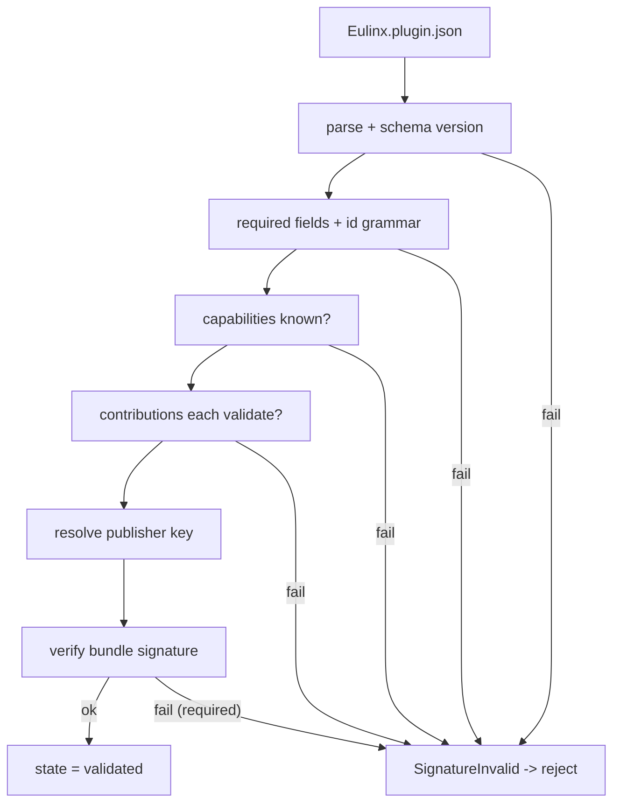

---
title: PluginLifecycle Specification - Part 03
status: draft
version: 1.0
tags:
  - plugin-system
  - plugin-lifecycle
  - validation
  - signature
related:
  - "[[09-plugin-system/README]]"
  - "[[PluginLifecycle-Part01]]"
  - "[[PluginLifecycle-Part02]]"
  - "[[PluginArchitecture-Part02]]"
  - "[[MarketplaceIntegration-Part01]]"
---

# PluginLifecycle Specification (Part 03)

## Document Index

Part 01 - Purpose, the lifecycle state machine, lifecycle invariants
Part 02 - Discovery and directory layout
Part 03 - Manifest validation and signature verification
Part 04 - The transactional install algorithm with rollback
Part 05 - The permission consent gate
Part 06 - Activation, crash detection, circuit breaker, update migration, uninstall

# Purpose

This part defines the static validation a plugin must pass before it can be offered to the user for consent, and the signature verification that proves the bundle came from the claimed publisher and was not tampered with. Validation is fail closed: any ambiguity resolves to rejection.

# The Validation Pipeline

Validation runs in a fixed order. The first failure moves the plugin to `error` (or `discovered` if it was merely rejected, never to `validated`). No partial validation is recorded as success.

```text
1. JSON parse of Eulinx.plugin.json. Fail -> RejectPlugin.
2. Manifest schema matches pinned schema version. Fail -> BadSchemaVersion.
3. Required fields present (schema, id, name, version, engines, author,
   summary, capabilities, contributes, sdkVersion, main). Fail -> MissingField.
4. id grammar and not reserved. Fail -> IllegalPluginId.
5. engines parses as a semver range. Fail -> BadEngines.
6. sdkVersion parses. Fail -> BadSdkVersion.
7. every capabilities[*] names a known capability (Part 04 registry).
   Fail -> UnknownCapability.
8. every capability reason non-empty, no markup, within length cap.
   Fail -> BadCapabilityReason.
9. contributes validates per target part: tool (ToolPlugins-Part02),
   node (NodePlugins-Part02), hook (HookSystem-Part02), settings/panels
   (PluginArchitecture-Part03). Fail -> ContributionInvalid.
10. signature verification (below). Fail -> SignatureInvalid.
```

# Identity Verification

The `id` presented in the manifest must match the identity the id authority assigned. For a marketplace plugin, the id authority is the marketplace; the downloaded bundle's id is checked against the registry index entry. For a local install, the id is generated or confirmed at add time and stored. A manifest that asserts an `id` differing from its verified identity is rejected as `IdMismatch`. This prevents a plugin from impersonating another publisher's id to inherit trust or collide namespaces.

# Signature Verification

A plugin MAY be signed; a marketplace-distributed plugin SHOULD be signed, and the marketplace MAY require it. Signature verification proves two things: authenticity (the bundle came from the holder of the publisher's signing key) and integrity (no file in the bundle was modified after signing).

```text
signature artifacts:
  signature/<file>.sig     one detached signature per signed bundle file,
                          or one manifest signature covering a hash list
  signature/pubkey.pem     the publisher's public key, or a reference to a
                          key fetched from the marketplace key directory
```

Verification steps:

```text
1. Resolve the publisher's public key from the trusted key directory
   (marketplace) or from the local trust store (local install).
2. Compute the hash list over the bundle exactly as the signer did.
3. Verify the signature over that hash list using the public key.
4. Confirm every signed file's hash matches the signed list.
```

A signature that fails verification is `SignatureInvalid`. A required-but-absent signature is also `SignatureInvalid` when the source mandates signing. A missing signature on a source that does not mandate it is allowed, but the plugin is marked `unsigned` in the registry and the UI surfaces this prominently.

# Trust Tiers

```text
signed + verified      highest; publisher key in trusted directory
signed + unverified    key unknown; user may add to local trust store
unsigned (allowed)     no signature; flagged in UI, full consent required
unsigned (required)    source mandates signing; rejected
```

The trust tier affects UI presentation and the revocation path (see [[MarketplaceIntegration-Part01]]), but it does NOT change the sandbox posture. A signed plugin is still an untrusted guest and still runs in a sandbox with a frozen grant. Signing proves origin; it does not prove safety.

# Validation Invariants

```text
Any validation ambiguity resolves to rejection (fail closed).
The id in the manifest must match the verified identity.
A required signature that fails blocks install.
Signing never relaxes the sandbox or the capability model.
Validation never executes plugin code.
A plugin rejected at validation contributes zero capabilities and zero
contributions.
```

# Mermaid Diagram



# AI Notes

Do not let a passing signature relax the sandbox. Signing answers "who", not "is this safe". A signed malicious plugin is still malicious and still sandboxed, granted only what the user granted.

Do not verify the signature and then forget the result. The trust tier must be recorded and surfaced, because the revocation path (Part 06, MarketplaceIntegration) depends on knowing which publisher key vouched for the bundle.

Do not trust a hash list supplied alongside the bundle without verifying it against the signature. The attacker controls the bundle and the list; only the signature over the list, with a trusted key, is trustworthy.

# Related Documents

- [[09-plugin-system/README]]
- [[PluginLifecycle-Part01]]
- [[PluginLifecycle-Part02]]
- [[PluginLifecycle-Part04]]
- [[PluginArchitecture-Part02]]
- [[PluginArchitecture-Part04]]
- [[ToolPlugins-Part02]]
- [[NodePlugins-Part02]]
- [[HookSystem-Part02]]
- [[MarketplaceIntegration-Part01]]
