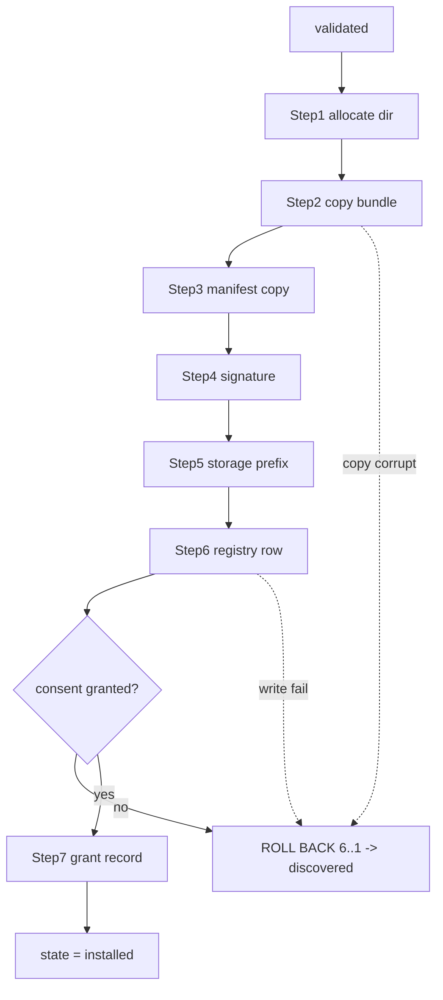

---
title: PluginLifecycle Specification - Part 04
status: draft
version: 1.0
tags:
  - plugin-system
  - plugin-lifecycle
  - install
  - transaction
related:
  - "[[09-plugin-system/README]]"
  - "[[PluginLifecycle-Part01]]"
  - "[[PluginLifecycle-Part03]]"
  - "[[PluginLifecycle-Part05]]"
  - "[[SQLiteSchema-Part01]]"
---

# PluginLifecycle Specification (Part 04)

## Document Index

Part 01 - Purpose, the lifecycle state machine, lifecycle invariants
Part 02 - Discovery and directory layout
Part 03 - Manifest validation and signature verification
Part 04 - The transactional install algorithm with rollback
Part 05 - The permission consent gate
Part 06 - Activation, crash detection, circuit breaker, update migration, uninstall

# Purpose

This part defines the transactional install: the sequence of steps that moves a validated plugin from `validated` to `installed`, and the rollback that undoes all of them if any step fails. Install is atomic. There is no half-installed plugin on disk.

# The Install Transaction

Install runs as a transaction over a set of durable steps. Each step has a defined inverse. If any step fails, every prior step's inverse is run in reverse order, returning the system to its pre-install state. The grant record and the registry entries are written last, so a failed install leaves neither a dangling registration nor a phantom grant.

```text
STEP 1   allocate install directory <plugin-root>/<verified-id>/
         inverse: remove the directory if created
STEP 2   copy/move the bundle into <dir>/bundle/
         inverse: delete the copied bundle
STEP 3   write the frozen manifest copy into <dir>/Eulinx.plugin.json
         inverse: delete the manifest copy
STEP 4   write signature artifacts into <dir>/signature/
         inverse: delete signature artifacts
STEP 5   create the namespaced storage prefix in the plugin store
         inverse: drop the prefix and its rows
STEP 6   write the plugin registry row (id, version, state=installed)
         inverse: delete the registry row
STEP 7   (after consent, Part 05) write the frozen grant record
         inverse: delete the grant record
```

Steps 1-6 run on a `validated` plugin. Step 7 runs only after the user grants consent (Part 05). If consent is declined, the plugin returns to `discovered` and steps 1-6 are rolled back; nothing is installed. This keeps "declined" clean: a declined plugin leaves no install directory and no storage prefix.

# Commit Order Matters

The grant record (Step 7) and the registry row (Step 6) are the authoritative records other subsystems read. They are written AFTER the on-disk bundle is in place and verified present, so a plugin that is `installed` is guaranteed to have its code on disk. If the bundle copy fails, steps 1-3 roll back and the registry is never written, so no `installed` plugin points at a missing bundle.

# Idempotency And Re-Install

Install is idempotent per `id` and `version`. Re-installing the same `id` and `version` is a no-op if the directory, manifest, and registry already match (verified by hash). Installing a different `version` of an already-installed `id` is an update, handled by Part 06 migration. Installing an `id` that already exists at a different `version` without going through update is rejected as `PluginIdExists`.

# Failure Classification

```text
transient     disk full, lock contended. Host may retry the transaction
              a bounded number of times, then move to error.
permanent     Step 7 would create a grant for a capability the user
              withheld entirely AND the plugin cannot function without it
              (rare; most plugins degrade). Treated as decline.
corrupt       bundle on disk does not match the verified hash after copy.
              Roll back; mark error; do not trust the partial copy.
```

A `corrupt` result after copy is a strong signal of tampering or transport corruption and MUST be treated conservatively: roll back and never auto-retry against the same bundle.

# Install Invariants

```text
Install commits fully or rolls back fully. No half state.
The grant record is written only after consent (Part 05).
A plugin marked installed has its bundle present and hash-matched.
No other subsystem sees the plugin until registry row is committed.
A declined plugin leaves no directory and no storage prefix.
An install failure never corrupts an already-installed sibling plugin.
```

# Mermaid Diagram



# AI Notes

Do not write the grant record before consent. The grant is the authority; writing it pre-consent means a plugin could be `installed` with capabilities the user never saw. Consent gates the grant, and the grant gates activation.

Do not leave a half-copied bundle on disk after a failed install. A partial bundle that is later auto-activated by a path assuming install is atomic is a classic persistence trick. Rollback must delete it.

Do not treat a hash mismatch after copy as retryable against the same source. Mismatch means the bytes on disk are not the bytes that were validated. Re-fetch from a trusted source, do not reuse the bad copy.

# Related Documents

- [[09-plugin-system/README]]
- [[PluginLifecycle-Part01]]
- [[PluginLifecycle-Part03]]
- [[PluginLifecycle-Part05]]
- [[PluginLifecycle-Part06]]
- [[PluginArchitecture-Part02]]
- [[SQLiteSchema-Part01]]
