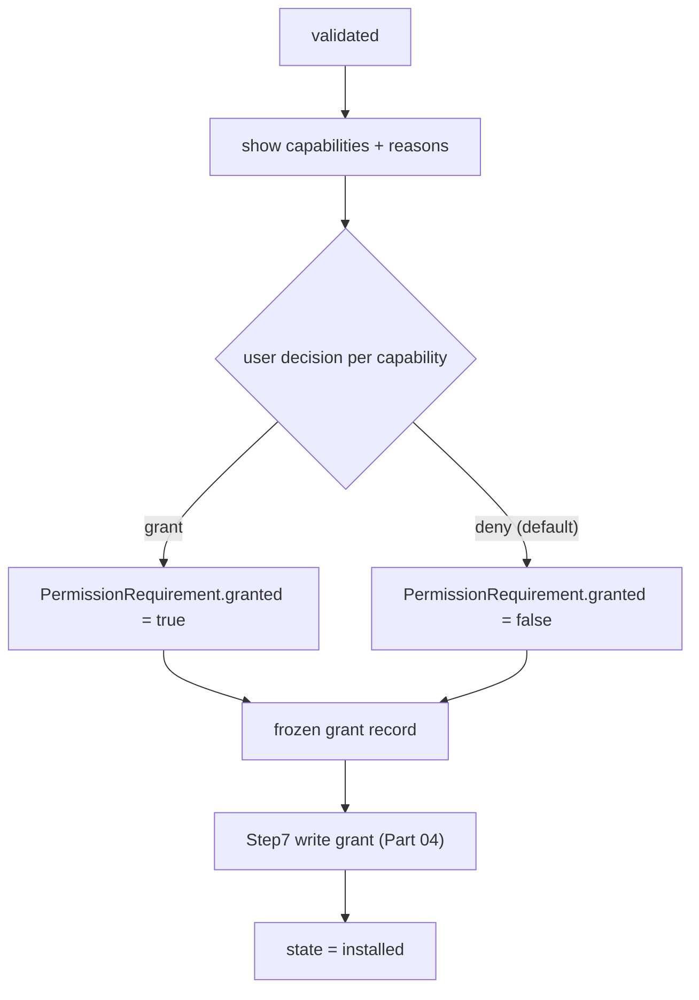

# PluginLifecycle Specification (Part 05)

## Document Index

Part 01 - Purpose, the lifecycle state machine, lifecycle invariants
Part 02 - Discovery and directory layout
Part 03 - Manifest validation and signature verification
Part 04 - The transactional install algorithm with rollback
Part 05 - The permission consent gate
Part 06 - Activation, crash detection, circuit breaker, update migration, uninstall

# Purpose

This part defines the permission consent gate: the single moment a human authorizes what an untrusted plugin may do. Consent is informed, explicit, and install-time only. There is no runtime escalation prompt. The outcome is the frozen grant record that enforcement consults on every later call.

# The Consent Moment

Consent happens exactly once, between `validated` and `installing` (Step 7 of Part 04). The user is shown the plugin's requested capabilities, each with its plain-language `reason`, and chooses which to grant. The choice is a subset of what was requested; granting more than requested is impossible, and granting a capability not requested is impossible.

```text
presented to user, per capability:
  capability   the registry name (e.g. fs.read)
  scope        the narrowing the plugin requested (paths, hosts, ids)
  reason       the plugin's own plain-language justification, verbatim
  decision     grant / deny  (default: deny)
```

The default for every capability is DENY. The UI must require an explicit grant; there is no "grant all" button that bypasses per-capability review, because a single click that approves everything is the fatigue exploit the whole model exists to prevent.

# Producing The Grant Record

For each requested capability, the host writes a `PermissionRequirement`: the `capability`, the `scope`, the `reason`, and a `granted` boolean from the user's decision. The set of these becomes the frozen grant record, stored under the plugin's registry row. This record is the enforcement basis for the lifetime of the install (see [[PluginArchitecture-Part04]]). It is never re-read from the manifest, never mutated at runtime, and never expanded.

# Degrading Gracefully

A plugin may be installed while the user withholds a capability it asked for. This is allowed and expected. The plugin still registers its contributions; it simply receives `CapabilityDenied` on the RPC it was never granted. Withholding `fs.read` from a tool that only reads does not prevent install; it makes that tool fail closed when called. The consent gate is per-capability, not all-or-nothing, because all-or-nothing pushes users to grant everything to make the plugin "work".

# No Runtime Escalation

There is no API, no hook, and no UI path by which a plugin can request additional capability at runtime. If a plugin attempts an action whose capability was not granted, the answer is `CapabilityDenied`. A runtime prompt "this plugin needs X to continue, allow?" is forbidden: it converts informed install-time consent into a fatigue-driven click-through at the moment a malicious plugin has manufactured urgency.

# Consent And The Audit Log

The consent decision is recorded in the audit log with the plugin id, the user identity (if multi-user), the timestamp, and the exact grant subset. This record is what lets a later reviewer answer "did the user knowingly grant this plugin network access?". The grant is attributable; the denial is attributable.

# Consent Invariants

```text
Consent happens once, at install, after validation.
The default decision for every capability is deny.
Granting a capability not requested is impossible.
The grant record is frozen at consent and never mutated at runtime.
A plugin denied a capability still installs and degrades gracefully.
No runtime escalation prompt exists in any form.
Every consent decision is recorded in the audit log.
```

# Mermaid Diagram



# AI Notes

Do not add a "grant all" button. It is the single most abused affordance in permission systems. Per-capability review is the point; a one-click approve defeats it.

Do not let the plugin re-request at runtime. If you are tempted by UX, remember the threat model: a malicious plugin manufactures urgency (a stuck progress bar, a fake error) precisely to get the runtime prompt clicked. There is no runtime prompt.

Do not make install all-or-nothing on consent. If withholding one capability blocked install, users would grant everything to avoid the friction. Per-capability grant with graceful degradation is safer in practice.

# Related Documents

- [[09-plugin-system/README]]
- [[PluginLifecycle-Part01]]
- [[PluginLifecycle-Part04]]
- [[PluginLifecycle-Part06]]
- [[PluginArchitecture-Part04]]
- [[PermissionManager-Part01]]
- [[ToolPlugins-Part02]]
