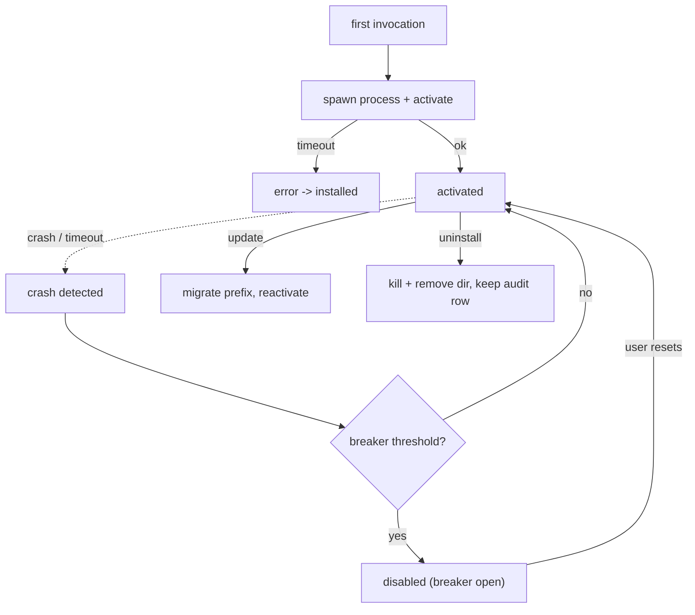

# PluginLifecycle Specification (Part 06)

## Document Index

Part 01 - Purpose, the lifecycle state machine, lifecycle invariants
Part 02 - Discovery and directory layout
Part 03 - Manifest validation and signature verification
Part 04 - The transactional install algorithm with rollback
Part 05 - The permission consent gate
Part 06 - Activation, crash detection, circuit breaker, update migration, uninstall

# Purpose

This part defines the runtime half of the lifecycle: lazy activation and the `activate`/`deactivate` contract, crash detection, the circuit breaker that disables a repeatedly-failing plugin, data migration on update, and clean uninstall. It is where "never stall the core" and "never crash the core" become operational.

# Lazy Activation

Activation is lazy. The host does not spawn a plugin's process at boot. The process is spawned on first need: the first time one of its contributions is actually invoked (a tool call, a node execution, a hook run, or a panel open). This keeps the attack surface and the resource cost off until something uses the plugin, and means a malicious plugin only runs when invoked, under a grant and a timeout.

When activation triggers, the host calls `activate(context)` on the plugin (see [[PluginSDK-Part02]]). The call has a deadline. If `activate` does not resolve in time, the plugin moves to `error` and rolls back to `installed`; no process is left running.

# The activate / deactivate Contract

`activate(context)` receives the scoped context object ([[PluginSDK-Part02]]) and is where the plugin performs one-time setup: registering handlers, reading its settings, subscribing to its granted hooks. It MUST be idempotent and MUST NOT perform authority-bearing actions beyond what the grant allows; any such action still goes through the RPC gate.

`deactivate()` is the host's signal to release resources. The host calls it before tearing down the process. The plugin MUST treat `deactivate` as a request it cannot refuse; the host will kill the process regardless if `deactivate` does not resolve within its deadline. `deactivate` is the plugin's last chance to flush its namespaced storage; after the process is killed, only the host-owned store retains data.

# Crash Detection

The host watches each plugin process. A process that exits non-zero, is killed by the OS, exceeds its resource budget (Part 06 of Architecture), or stops responding to the RPC keepalive is detected as crashed. On crash:

```text
1. the plugin's contributions are deregistered or marked unavailable
2. in-flight calls are resolved with their fail-closed default
3. the crash is attributed to the plugin id and counted against the
   circuit breaker
4. the process is not automatically restarted beyond the breaker's policy
5. the core continues; the crash is a plugin-scoped event only
```

A crash takes only the plugin down. It MUST NOT propagate as a runtime error, MUST NOT stall the WorkflowEngine or the EventBus, and MUST NOT take down sibling plugins.

# The Circuit Breaker

The circuit breaker protects the core from a plugin that fails repeatedly. Each plugin has a failure counter fed by crashes, timeouts, and `CapabilityDenied`-on-a-declared-grant anomalies. When the counter crosses a threshold within a window, the breaker opens: the plugin moves to `disabled`, its process is killed, and its contributions are withdrawn.

```text
breaker states:
  closed        healthy; failures counted, threshold not reached
  half_open     after a cooldown, one trial activation permitted
  open          disabled; no activation; requires user action to reset
```

A breaker-opened plugin CANNOT re-enable itself. Reset requires explicit user action in the UI. This is deliberate: an automatic reset would let a plugin that fails on a timer keep interrupting the core. The user decides when to retry.

# Data Migration On Update

When a new `version` of an installed `id` is installed (Part 04 idempotency rules), the host runs migration against the namespaced storage prefix. Migration is forward-only and must be safe to re-run. The old version's process is deactivated and killed before the new version activates. If migration fails, the new version is rolled back to `installed` (not activated) and the old data is preserved; the user is notified. Migration never touches other plugins' prefixes.

# Clean Uninstall

Uninstall removes the process and the install directory and withdraws all contributions, but it does NOT delete the audit record. The registration row is retained, marked `uninstalled`, for forensic attribution (which plugin held which grant, when). The namespaced storage prefix is dropped unless the user chooses to keep data. A revoked plugin (see [[MarketplaceIntegration-Part01]]) is uninstalled by the host and blocked from reinstall.

# Lifecycle Runtime Invariants

```text
Activation is lazy and deadline-bounded.
A crash is plugin-scoped; the core and siblings continue.
A repeatedly-failing plugin is disabled automatically.
A disabled plugin cannot re-enable itself.
deactivate is a request the host enforces by kill if ignored.
Update migrates only the plugin's own prefix; never another's.
Uninstall keeps the audit record; a revoked plugin cannot reinstall.
```

# Mermaid Diagram



# AI Notes

Do not auto-reset a breaker-opened plugin. The whole point of the breaker is to stop a failing plugin from interrupting the core on a loop. Reset is a human decision.

Do not let a crash surface as a core error. Catch it at the boundary, attribute it to the plugin id, record it against the breaker, apply the fail-closed default, and continue. The EventBus may carry a `plugin.crashed` observation event, but the runtime must not throw.

Do not delete the audit record on uninstall. "It's gone, so who cares what it did" is exactly wrong for a security subsystem. The record of what a malicious plugin was granted and did is the most valuable artifact after an incident.

Do not migrate other plugins' data during an update. Migration runs only against the updating plugin's own namespaced prefix; touching another prefix is a cross-plugin violation.

# Related Documents

- [[09-plugin-system/README]]
- [[PluginLifecycle-Part01]]
- [[PluginLifecycle-Part05]]
- [[PluginArchitecture-Part05]]
- [[PluginArchitecture-Part06]]
- [[PluginSDK-Part02]]
- [[ProcessLifecycle-Part01]]
- [[MarketplaceIntegration-Part01]]
- [[SQLiteSchema-Part01]]
