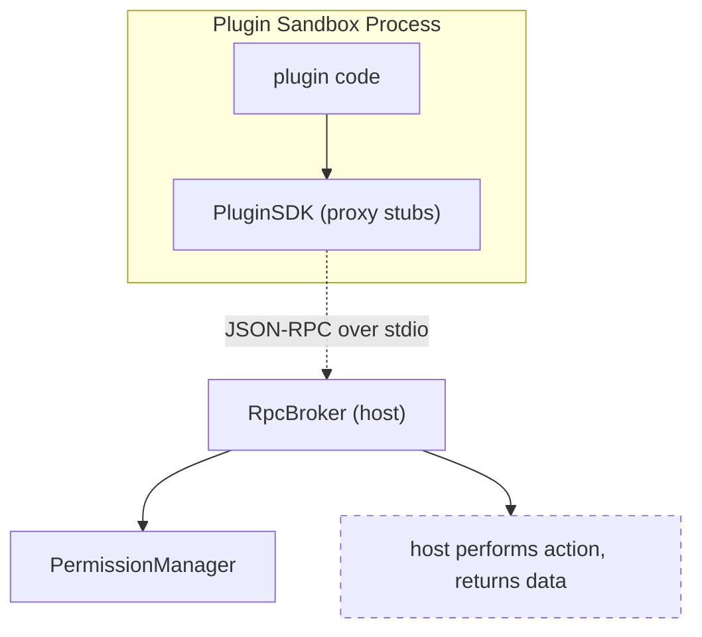
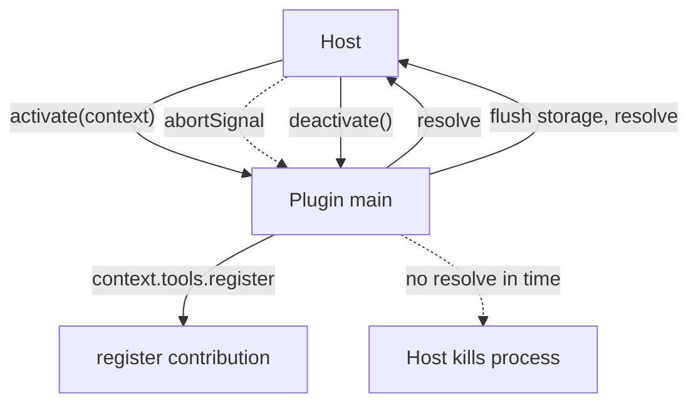
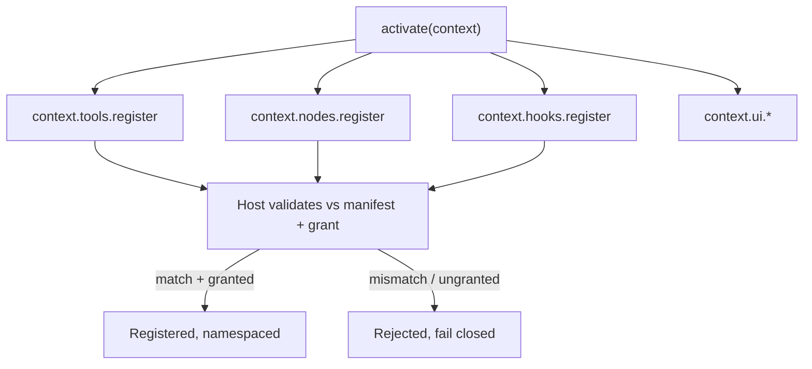
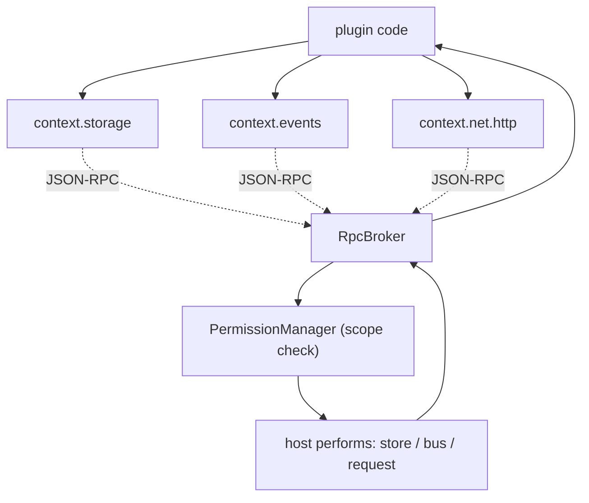
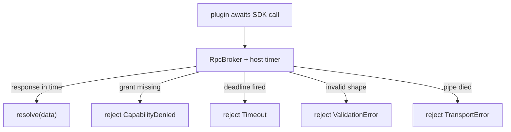
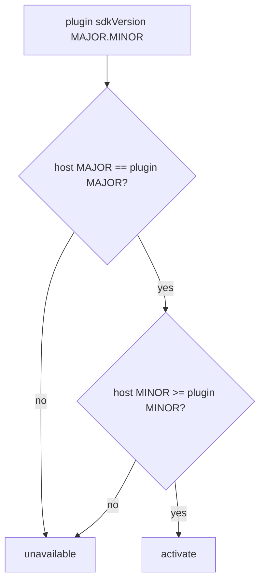

# PluginSDK Diagrams

## The SDK Is A Proxy Layer

## Entry Contract

## Scoped Registration

## Data APIs Are Scoped Stubs

## Promise And Timeout

## SDK Compatibility

## Related Documents

- [[09-plugin-system/README]]
- [[PluginSDK-Part01]]
- [[PluginSDK-Part02]]
- [[PluginSDK-Part03]]
- [[PluginSDK-Part04]]
- [[PluginSDK-Part05]]
- [[PluginSDK-Part06]]
- [[PluginArchitecture-Part05]]
- [[PermissionManager-Part01]]
