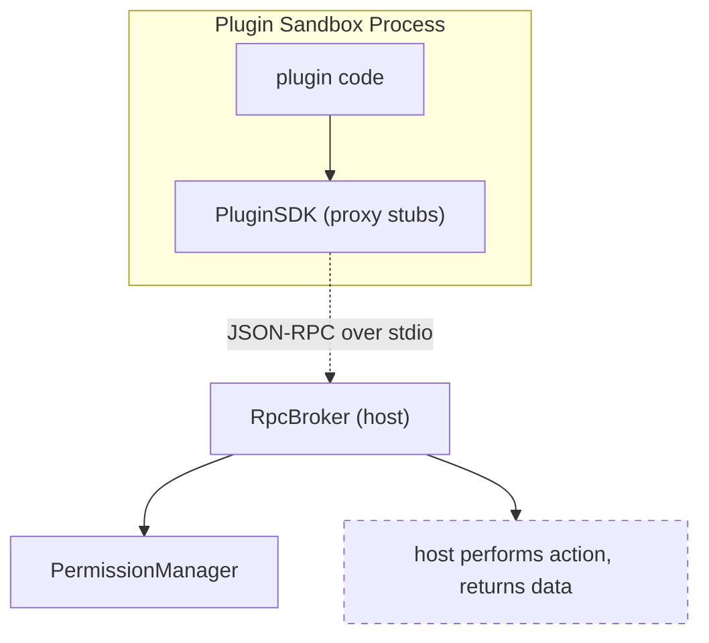

---
title: PluginSDK Specification - Part 01
status: draft
version: 1.0
tags:
  - plugin-system
  - plugin-sdk
  - api-surface
related:
  - "[[09-plugin-system/README]]"
  - "[[PluginSDK-Part02]]"
  - "[[PluginArchitecture-Part05]]"
  - "[[PermissionManager-Part01]]"
---

# PluginSDK Specification (Part 01)

## Document Index

Part 01 - What the SDK is, the proxy-layer principle, the public surface overview
Part 02 - The activate and deactivate entry contract and the context object
Part 03 - Scoped registration APIs (tools, nodes, hooks, settings, panels)
Part 04 - Typed events, storage, and the no-handle rule
Part 05 - Promise conventions, the error model, and timeout behavior
Part 06 - The SDK semver policy and compatibility

# Purpose

PluginSDK defines the TypeScript package a plugin author imports. It is the only thing a plugin author programs against. It is a proxy layer, not a library: every function in it is an RPC stub that crosses the boundary defined in [[PluginArchitecture-Part05]]. It never exposes a raw filesystem, database, network, or process handle, because handing an untrusted guest a real handle ends the sandbox.

# The SDK Is A Proxy Layer

The SDK runs inside the plugin's sandbox process. When a plugin calls `Eulinx.fs.read(scope, path)`, the SDK does not open a file. It marshals a JSON-RPC request, sends it over stdin to the RpcBroker, and awaits the response. The broker checks the grant ([[PermissionManager-Part01]]), performs the read in the host, and returns the bytes. The plugin never holds the file descriptor.

This is why the SDK can be thin. It has almost no logic of its own; it is a typed front door to the host. Its value is the typing, the ergonomics, and the guarantee that there is no back door to a real handle.

# What The SDK Exposes

```text
Eulinx.activate(ctx)          entry (host calls this; see Part 02)
Eulinx.deactivate()           exit (host calls this; see Part 02)
Eulinx.tools                  register / invoke tools (Part 03)
Eulinx.nodes                  register node types (Part 03)
Eulinx.hooks                  register hook handlers (Part 03)
Eulinx.settings              read this plugin's settings (Part 04)
Eulinx.storage               read/write this plugin's KV prefix (Part 04)
Eulinx.events                emit observation events, subscribe to own (Part 04)
Eulinx.ui                     request a notification, render a panel (Part 03/04)
Eulinx.net                    scoped outbound HTTP/WS via capability RPC (Part 04)
```

Every one of these is a stub. None of them touches the host's resources directly. None of them returns a handle.

# The No-Handle Rule

The SDK MUST NOT expose any of the following, in any form:

```text
a file descriptor, DirectoryHandle, or Buffer backed by a host file
a SQLite connection, statement, or transaction
a socket, WebSocket, or any object with a live network endpoint
a child process, Worker, or thread handle
a reference to any Eulinx host object (registry, bus, manager)
a function, Proxy, or closure that closes over host state
```

If a plugin needs any of these effects, it calls a scoped, capability-gated RPC and receives data, not a handle. The boundary is JSON, and that is a security property: a value that cannot express a reference cannot express an escape.

# The SDK Surface Is Stable By Contract

The SDK's public surface is governed by semver (Part 06). A breaking change to an entry point, a context field, or a registration signature is a major version bump, and the host's `sdkVersion` check ([[PluginArchitecture-Part06]]) refuses mismatches. Plugin authors program against a contract, not against internals.

# SDK Invariants

```text
Every SDK function is an RPC stub; none holds host authority.
The SDK never exposes a raw fs, db, net, or process handle.
The SDK marshals JSON only; no host object crosses the boundary.
The SDK surface is versioned and stability-gated by semver.
A plugin programs only against the SDK, never against host internals.
```

# Mermaid Diagram



# AI Notes

Do not add a "convenience" SDK function that wraps a real handle "just for speed". The handle is the escape. If the plugin needs the effect, it goes through the RPC like everything else. There is no fast path that is also safe except the RPC.

Do not let the SDK return a Promise that resolves to a host object. The Promise resolves to JSON data. Anything else leaks the boundary.

Do not expose host singletons through the SDK "so plugins can integrate". The registry, the bus, and the managers are trusted-host authority. A plugin integrates by calling scoped RPCs, not by holding a reference to the thing that enforces the rules.

# Related Documents

- [[09-plugin-system/README]]
- [[PluginSDK-Part02]]
- [[PluginSDK-Part03]]
- [[PluginSDK-Part04]]
- [[PluginSDK-Part05]]
- [[PluginSDK-Part06]]
- [[PluginArchitecture-Part05]]
- [[PermissionManager-Part01]]
- [[ToolPlugins-Part01]]
- [[NodePlugins-Part01]]
- [[HookSystem-Part01]]
