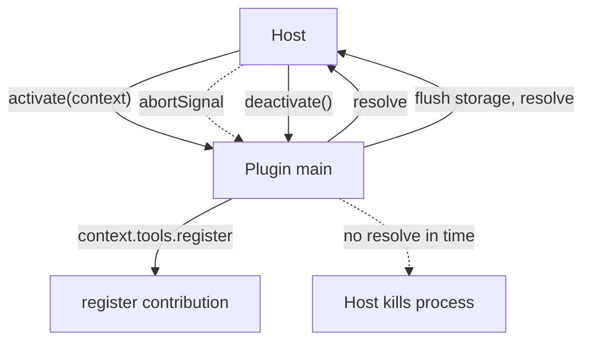

---
title: PluginSDK Specification - Part 02
status: draft
version: 1.0
tags:
  - plugin-system
  - plugin-sdk
  - entry-contract
  - context
related:
  - "[[09-plugin-system/README]]"
  - "[[PluginSDK-Part01]]"
  - "[[PluginSDK-Part03]]"
  - "[[PluginLifecycle-Part06]]"
---

# PluginSDK Specification (Part 02)

## Document Index

Part 01 - What the SDK is, the proxy-layer principle, the public surface overview
Part 02 - The activate and deactivate entry contract and the context object
Part 03 - Scoped registration APIs (tools, nodes, hooks, settings, panels)
Part 04 - Typed events, storage, and the no-handle rule
Part 05 - Promise conventions, the error model, and timeout behavior
Part 06 - The SDK semver policy and compatibility

# Purpose

This part defines the entry contract every plugin implements: the `activate` and `deactivate` functions, and the `context` object the host passes to `activate`. The context is scoped, typed, and handle-free. It is the only thing a plugin receives from the host at startup.

# The Entry Points

A plugin's main module exports two functions. The host calls them; the plugin does not call them itself.

```text
activate(context)    called once when the plugin is lazily activated
                     (see PluginLifecycle-Part06). Performs one-time setup:
                     registers handlers, reads settings, subscribes to
                     granted hooks. Returns a Promise that resolves when
                     setup is complete. Bounded by a deadline.

deactivate()         called when the host tears down the plugin. Releases
                     resources, flushes namespaced storage. Returns a
                     Promise bounded by a shorter deadline. The host will
                     kill the process regardless if it does not resolve.
```

Neither function receives or returns a host object. `activate` receives the `context`; `deactivate` receives nothing. `activate` may return a small, JSON-serializable summary used only for host logging (never for capability gain).

# The context Object

The `context` is the plugin's entire view of the host. It is constructed by the host from the verified manifest and the frozen grant, and it is the only handle-free bridge the plugin gets. Its fields are scoped to the plugin's own id and grant.

```text
context.pluginId        the verified id. Read-only. Used for namespacing.
context.version         the plugin's own version.
context.grant           the frozen PermissionRequirement list. Read-only.
                        The plugin can inspect what it was granted (to
                        degrade gracefully) but cannot change it.
context.tools           registration API for this plugin's tools (Part 03).
context.nodes           registration API for this plugin's node types.
context.hooks           registration API for this plugin's hooks.
context.settings        read API for this plugin's settings (Part 04).
context.storage         read/write API for this plugin's KV prefix (Part 04).
context.events          emit/subscribe API, namespaced to the plugin (Part 04).
context.ui              notification and panel request API (Part 03/04).
context.logger          a namespaced, redacted logger. Every line carries
                        pluginId. No raw stdout handle.
context.abortSignal     signals host-requested shutdown; deactivate follows.
```

# What context MUST NOT Expose

```text
no reference to ToolRegistry, EventBus, or any manager
no file system root, no directory handle, no path outside the bundle
no database connection or query handle
no network socket or fetch bound to an unrestricted endpoint
no other plugin's context, id list, or storage
no process spawn, no Worker constructor, no eval
no provider key, no Eulinx config object
```

The context is a curated, minimal surface. Anything the plugin needs beyond it is requested through a scoped RPC and arrives as data.

# activate Contract Rules

```text
activate MUST be idempotent; the host may call it once per activation.
activate MUST NOT perform authority-bearing actions outside the grant;
  any such action still routes through the RPC gate and is checked.
activate MUST resolve within its deadline or the plugin fails to activate.
activate's returned summary MUST be JSON-serializable and tiny.
activate MUST use context.* APIs, never host internals.
```

# deactivate Contract Rules

```text
deactivate MUST treat shutdown as non-negotiable.
deactivate SHOULD flush namespaced storage before resolving.
deactivate MUST NOT start new long-lived operations.
deactivate that does not resolve in time is superseded by process kill.
```

# Mermaid Diagram



# AI Notes

Do not put a host object on the context "so the plugin can call back efficiently". The context is the boundary. A host object on it is the boundary gone.

Do not let `activate` do authority-bearing work directly. Reading a file in `activate` by any means other than `context.storage` or a `fs.read` RPC is either impossible (no handle) or a grant violation. Setup registers handlers; it does not act.

Do not rely on `deactivate` running to completion. The host will kill the process. Any state that must survive must be flushed to `context.storage` before `deactivate`, because after the kill only the host-owned store has it.

# Related Documents

- [[09-plugin-system/README]]
- [[PluginSDK-Part01]]
- [[PluginSDK-Part03]]
- [[PluginSDK-Part04]]
- [[PluginArchitecture-Part05]]
- [[PluginLifecycle-Part06]]
- [[PermissionManager-Part01]]
- [[ToolPlugins-Part01]]
- [[NodePlugins-Part01]]
- [[HookSystem-Part01]]
