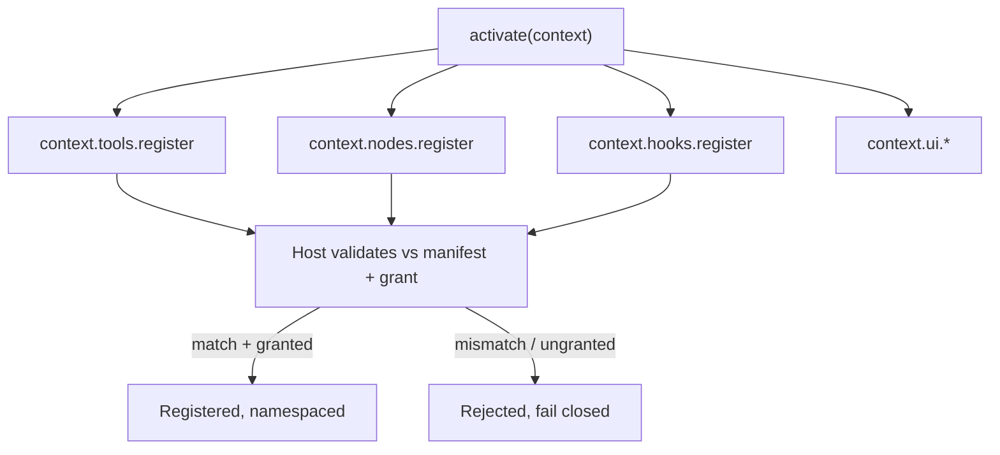

# PluginSDK Specification (Part 03)

## Document Index

Part 01 - What the SDK is, the proxy-layer principle, the public surface overview
Part 02 - The activate and deactivate entry contract and the context object
Part 03 - Scoped registration APIs (tools, nodes, hooks, settings, panels)
Part 04 - Typed events, storage, and the no-handle rule
Part 05 - Promise conventions, the error model, and timeout behavior
Part 06 - The SDK semver policy and compatibility

# Purpose

This part defines the scoped registration APIs a plugin calls inside `activate` to contribute its extension points. Each API is scoped to the plugin's own id and only registers what the manifest declared and the user granted. Registration is declarative: the plugin describes the contribution; the host validates and wires it.

# context.tools.register

Registers a tool handler declared in `contributes.tools`. The SDK forwards the registration to the host, which validates it against the frozen manifest contribution (see [[ToolPlugins-Part02]]) and namespaces it under `pluginId/name`. The handler the plugin provides is a function the host invokes over RPC; it receives validated arguments and returns a JSON result. The plugin does not register a core tool and cannot shadow one.

```text
context.tools.register(contributionName, handler)
  contributionName   must match a name in the manifest's contributes.tools
  handler            async (args, toolContext) => result
  returns            a registration handle (opaque, JSON-serializable only)
```

The `handler` runs in the sandbox. Any authority it needs (read a file, call a network host) it requests via `context.*` RPCs, which are grant-checked. The handler never receives a raw capability handle.

# context.nodes.register

Registers a node type declared in `contributes.nodes` (see [[NodePlugins-Part02]]). The node's `execute` function runs in the sandbox under a host-owned deadline; it receives typed inputs plus a `nodeContext` and returns typed outputs or an error. The registration carries the port specs and config schema exactly as declared; the host re-validates them.

```text
context.nodes.register(contributionName, { execute })
  contributionName   must match contributes.nodes local type id
  execute            async (inputs, config, nodeContext) => outputs
  returns            a registration handle (opaque)
```

The node cannot render DOM, cannot write the working tree, and cannot widen its grant. Its output is data validated against the declared output port schema before it reaches an edge.

# context.hooks.register

Registers a hook handler declared in `contributes.hooks` (see [[HookSystem-Part02]]). The handler is invoked by the HookDispatcher when the named hook fires. Blocking hooks may return a veto; observing hooks return nothing meaningful to control flow. Each registered hook is checked against the frozen grant for `hook.register` on that specific hook name.

```text
context.hooks.register(hookName, handler)
  hookName   must match a declared, granted hook
  handler    async (payload, hookContext) => HookResult
  returns    a registration handle (opaque)
```

A hook handler runs under the hook's hard timeout with a fail-closed default. A veto never grants authority the plugin did not already hold.

# context.ui.notify And Panels

`context.ui.notify(options)` requests a host notification. The options are data (title, body, level); the host renders it. No markup from the plugin is interpreted as HTML. `context.ui.registerPanel(panelId, render)` registers a panel declared in `contributes.panels`; `render` receives a scoped panel context and returns data or calls scoped SDK functions. The panel cannot access the DOM outside its root or other panels.

# Registration Scoping Rules

```text
A registration name MUST match a name declared in the manifest.
A registration for an ungranted capability is rejected by the host.
A registration cannot name a core contribution or another plugin's.
A registration returns an opaque handle; the handle is data, not a ref.
All registrations are scoped to the activating plugin's id.
```

# Mermaid Diagram



# AI Notes

Do not let a plugin register a contribution name not in its manifest. The manifest is the contract shown to the user; a registration that invents a new name is an attempt to contribute something the user never consented to see. Reject it.

Do not return a live handle from registration. The handle is an opaque token the plugin may use to unregister; it is not a reference to a host object. If it were a reference, the boundary would leak.

Do not let a node or hook registration widen the plugin's grant. Registration validates against the frozen grant; a node that needs `fs.write` but was granted only `fs.read` registers but fails closed when it tries the write.

# Related Documents

- [[09-plugin-system/README]]
- [[PluginSDK-Part01]]
- [[PluginSDK-Part02]]
- [[PluginSDK-Part04]]
- [[ToolPlugins-Part02]]
- [[ToolPlugins-Part05]]
- [[NodePlugins-Part02]]
- [[NodePlugins-Part04]]
- [[HookSystem-Part02]]
- [[HookSystem-Part04]]
- [[PluginArchitecture-Part03]]
