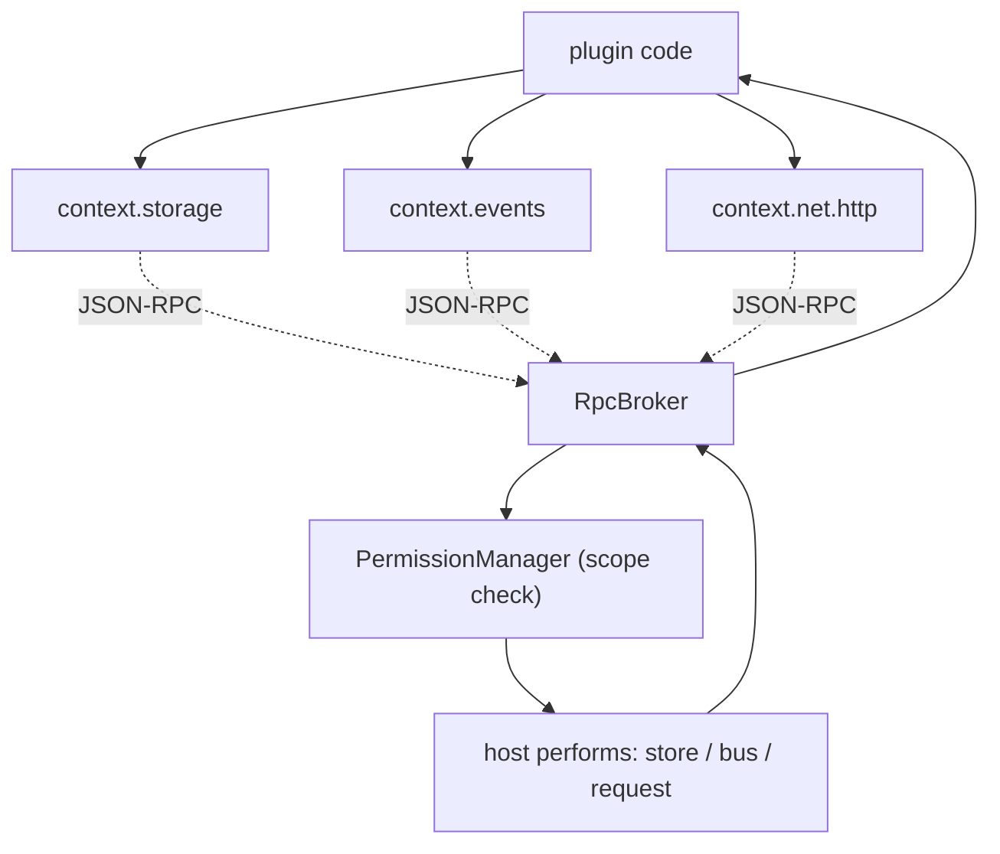

# PluginSDK Specification (Part 04)

## Document Index

Part 01 - What the SDK is, the proxy-layer principle, the public surface overview
Part 02 - The activate and deactivate entry contract and the context object
Part 03 - Scoped registration APIs (tools, nodes, hooks, settings, panels)
Part 04 - Typed events, storage, and the no-handle rule
Part 05 - Promise conventions, the error model, and timeout behavior
Part 06 - The SDK semver policy and compatibility

# Purpose

This part defines the SDK's interaction with data the plugin may own: typed events, namespaced key-value storage, settings, and scoped network. All of these are proxy stubs that cross the boundary and are scoped to the plugin's id. None of them exposes a handle.

# context.storage: Namespaced Key-Value

`context.storage` is the plugin's only persistent data store, and it is strictly prefixed to the plugin's id by the host (see [[PluginArchitecture-Part06]]). The plugin cannot address another prefix; the host substitutes the verified id on every call.

```text
context.storage.get(key)        returns the JSON value or undefined
context.storage.put(key, value) writes a JSON-serializable value
context.storage.delete(key)     removes a key
context.storage.list(prefix)    lists keys under a sub-prefix
```

Values are JSON only. A plugin cannot store a function, a handle, or a host object. The store is the namespaced `plugin_kv` table in SQLite (see [[SQLiteSchema-Part01]]), accessed by the host on the plugin's behalf; the plugin never holds the connection.

# context.settings: Read-Only Config

`context.settings.get()` returns the plugin's own settings object, validated against the `settings` contribution schema ([[PluginArchitecture-Part03]]). Settings are user-controlled through the host UI; the plugin reads them, it does not write them. Writing settings is a host action, not an SDK function, because settings are user data and a plugin must not be able to silently rewrite its own consent-relevant configuration.

# context.events: Namespaced Observation

`context.events.emit(event)` emits an observation event. The event is namespaced to the plugin and schema-validated before it touches the [[EventBus-Part01]]. `context.events.on(eventName, handler)` subscribes only to events the plugin itself emitted or to observing hooks it was granted; it cannot subscribe to core or other-plugin events. This enforces the no-discovery rule from [[PluginArchitecture-Part06]].

```text
context.events.emit({ type, payload })   payload must be JSON, schema-checked
context.events.on(type, handler)         type scoped to plugin or granted hook
```

# context.net: Scoped Outbound Only

`context.net.http(request)` performs an outbound HTTP request, but only if the plugin was granted `net.http` for the request's host. The host performs the request; the plugin never holds the socket. The request's URL must be in scope, the method is constrained, and the response is returned as data. There is no `net.listen`; a plugin cannot accept connections.

# The No-Handle Rule, Restated For Data

Even the data APIs return data, not handles:

```text
storage.get returns a value, not a cursor or a stream handle
events.on returns a subscription token (opaque JSON), not an EventBus ref
net.http returns a response object (data), not a socket
settings.get returns an object (data), not a settings file handle
```

# Data API Invariants

```text
storage is prefix-scoped to the plugin id by the host, not by the plugin.
settings are read-only from the plugin; the host owns writes.
events are namespaced; a plugin cannot observe core or peer events.
net is outbound-only and host-executed; no listen, no socket handle.
All values crossing these APIs are JSON; no handle, no host object.
```

# Mermaid Diagram



# AI Notes

Do not let the plugin choose its storage prefix. The host computes it from the verified id. A plugin that sends `prefix: "other-plugin"` in a storage call is ignored; the host uses the verified id. Cross-prefix access is the cross-plugin escape.

Do not expose a settings write function to the plugin. Settings are user consent-adjacent; a plugin that rewrites its own settings could silently change its behavior after install. The host owns settings writes.

Do not add `net.listen`. A plugin that accepts connections is a network listener on the user's machine with no host mediation. Outbound-only, host-executed requests are the entire network surface.

# Related Documents

- [[09-plugin-system/README]]
- [[PluginSDK-Part01]]
- [[PluginSDK-Part02]]
- [[PluginSDK-Part03]]
- [[PluginSDK-Part05]]
- [[PluginArchitecture-Part06]]
- [[EventBus-Part01]]
- [[SQLiteSchema-Part01]]
- [[PermissionManager-Part01]]
