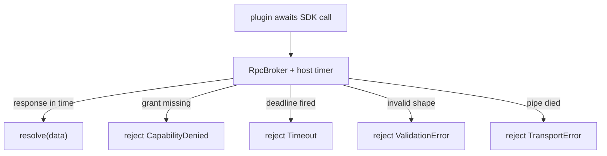

# PluginSDK Specification (Part 05)

## Document Index

Part 01 - What the SDK is, the proxy-layer principle, the public surface overview
Part 02 - The activate and deactivate entry contract and the context object
Part 03 - Scoped registration APIs (tools, nodes, hooks, settings, panels)
Part 04 - Typed events, storage, and the no-handle rule
Part 05 - Promise conventions, the error model, and timeout behavior
Part 06 - The SDK semver policy and compatibility

# Purpose

This part defines how the SDK's Promise-returning functions behave: cancellation, the error model, and the timeout semantics that implement "never stall the core". Every async SDK call is bounded, and every rejection is a typed, attributable error.

# Promise Conventions

Every SDK async function returns a Promise that resolves to JSON data or rejects with a typed `PluginError`. The Promise is the only async contract; there are no callbacks, no event-emitter returns with host refs, and no streams that carry handles. A Promise that rejects is the fail-closed signal for that call.

```text
resolve(value)    value is JSON-serializable data
reject(error)     error is a PluginError with a stable code
```

# The Error Model

All rejections are `PluginError` instances with a stable `code`, a human `message`, and an optional `detail` that is JSON only (never a handle or stack from the host). The codes are a closed set so the host and the plugin can branch on them deterministically.

```text
CapabilityDenied     the grant does not cover this action (fail closed)
Timeout              the host deadline fired before the call resolved
ValidationError      params/result failed schema at the boundary
NotFound             the named tool/node/hook/key does not exist or is
                    not enabled for this plugin
ResourceLimit        the plugin exceeded its resource budget
TransportError       the RPC pipe failed (process dying, frame corrupt)
Cancelled            the host cancelled via the abort signal
InternalError        anything else; the plugin must not learn host internals
```

A `CapabilityDenied` is not a bug in the plugin's logic; it is the enforcement answer and the plugin is expected to degrade. A `Timeout` is the host protecting the core, not the plugin's fault necessarily, but the plugin must handle it. An `InternalError` deliberately hides host detail so the plugin cannot probe internals.

# Timeouts Are Host-Owned

Every SDK call that crosses the boundary inherits a deadline from the host policy (the installed manifest, or the hook/node execution policy). The SDK does not compute the deadline; it forwards the call and races it against the host's timer. When the timer fires, the Promise rejects with `Timeout` and the plugin's in-flight work is abandoned by the host. The plugin cannot extend the deadline by returning a slower Promise; the host abandons it regardless.

# Cancellation

The host may cancel an in-flight call via the `abortSignal` (Part 02) or per-call cancellation token. When cancelled, the SDK rejects the Promise with `Cancelled` and signals the broker to stop waiting. A cooperative plugin observes the signal and returns; a non-cooperative plugin is abandoned by the host's watchdog and eventually killed (see [[PluginLifecycle-Part06]]).

# idempotent And Retry

The host retries a call once on a transient `TransportError` only if the underlying operation is declared `idempotent` in its contribution (see [[ToolPlugins-Part02]]). A non-idempotent mutating call is never retried, because a retry could double-apply a side effect. A `Timeout` is never retried, because the original may have succeeded after the timer; retry would double-apply.

# Promise Invariants

```text
Every boundary call is Promise-based and deadline-bounded.
Every rejection is a typed PluginError, never a raw host error.
A CapabilityDenied is expected and must be handled gracefully.
A Timeout is host-enforced; the plugin cannot extend the deadline.
A non-idempotent call is never retried after a transient error.
An error detail is JSON only; it never leaks a host handle or stack.
```

# Mermaid Diagram



# AI Notes

Do not let the plugin catch `Timeout` and retry the same call on its own loop. The host already abandoned the original; a plugin retry re-issues a capability-gated call that may double-apply a mutating effect. Timeouts are terminal for that call.

Do not put host stack traces or handle references in `detail`. An `InternalError` that leaks `sqlite connection 0x...` is both an info leak and a handle leak. The detail is JSON data the plugin may log, nothing more.

Do not make SDK calls unbounded "because the network is usually fast". The whole point is that untrusted code has no obligation to be fast. The host timer is the only thing standing between a hung plugin and a frozen core.

# Related Documents

- [[09-plugin-system/README]]
- [[PluginSDK-Part01]]
- [[PluginSDK-Part02]]
- [[PluginSDK-Part04]]
- [[PluginSDK-Part06]]
- [[PluginArchitecture-Part05]]
- [[PluginLifecycle-Part06]]
- [[ToolPlugins-Part02]]
- [[ToolPlugins-Part05]]
- [[NodePlugins-Part04]]
- [[HookSystem-Part04]]
