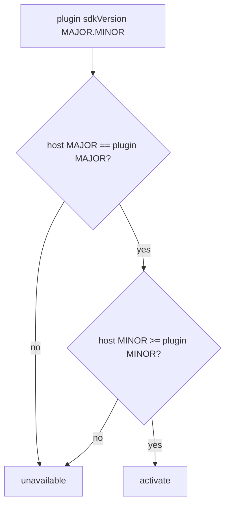

# PluginSDK Specification (Part 06)

## Document Index

Part 01 - What the SDK is, the proxy-layer principle, the public surface overview
Part 02 - The activate and deactivate entry contract and the context object
Part 03 - Scoped registration APIs (tools, nodes, hooks, settings, panels)
Part 04 - Typed events, storage, and the no-handle rule
Part 05 - Promise conventions, the error model, and timeout behavior
Part 06 - The SDK semver policy and compatibility

# Purpose

This part defines the PluginSDK's own semver policy and how the host decides whether a plugin built against a given SDK version may run against the host's current SDK. The SDK version is the contract that lets a plugin author write against a stable surface and lets the host refuse unsafe mismatches.

# The Versioning Model

The PluginSDK is published with semantic versioning: `MAJOR.MINOR.PATCH`.

```text
MAJOR   incremented on any breaking change to the public surface:
        an entry point renamed/removed, a context field removed,
        a registration signature changed, an error code removed,
        a behavior change that breaks existing correct plugins.
MINOR   incremented on a backward-compatible addition:
        a new API, a new optional context field, a new error code,
        a new hook name. Old plugins keep working.
PATCH   incremented on a bug fix or clarification with no surface change.
```

A plugin records the SDK `MAJOR.MINOR` it built against in `sdkVersion` (see [[PluginArchitecture-Part02]]). The host records the SDK `MAJOR.MINOR` it currently implements.

# Compatibility Rules

```text
same MAJOR, host MINOR >= plugin MINOR
        compatible. The plugin uses only APIs the host has. Activate.

same MAJOR, host MINOR < plugin MINOR
        incompatible. The plugin may call an API the host lacks.
        Place in unavailable; do not activate.

different MAJOR
        incompatible. A breaking change occurred. Place in unavailable.
        The plugin must be rebuilt against the new MAJOR.

PATCH differences never affect compatibility.
```

These rules are conservative. A plugin is only activated when the host is guaranteed to implement every API the plugin could call. The cost is that a plugin built against a newer MINOR will not run on an older host; that is accepted because the alternative is a runtime `method not found` deep in a Worker's turn.

# Deprecation Policy

When an API is to be removed, it is first deprecated in a MINOR (kept working, marked deprecated in types and docs) and only removed in the next MAJOR. A deprecated API continues to function for the remainder of the MAJOR. This gives plugin authors a full MAJOR cycle to migrate. The host logs a `sdk.deprecated_api` observation event when a plugin uses a deprecated API, but does not break it within the MAJOR.

# The SDK And The Engine API

The SDK version is separate from the engine API version carried per contribution (`engineApiVersion` for nodes, signature version for hooks). The SDK version governs the proxy surface; the engine API version governs the contribution contract. Both are checked, and a plugin can be `available` for its tools while its node type is `unavailable` due to an engine API mismatch (see [[NodePlugins-Part01]]).

# SDK Compatibility Invariants

```text
A plugin activates only if host SDK MAJOR == plugin MAJOR and
host MINOR >= plugin MINOR.
A different MAJOR never activates; it requires a rebuild.
Deprecation lives within a MAJOR; removal waits for the next MAJOR.
PATCH differences never block activation.
The SDK surface is the only thing a plugin programs against.
```

# Mermaid Diagram



# AI Notes

Do not bump MAJOR for a change a plugin can ignore. A needless MAJOR breaks every existing plugin at once. Reserve MAJOR for true breaking changes; use MINOR for additions.

Do not let a plugin built against a newer MINOR activate on an older host "to be friendly". The missing API will fail at the worst moment (mid-tool-call). Incompatible means unavailable, always.

Do not remove a deprecated API in the same MAJOR it was deprecated. Authors need the cycle to migrate. Removal is a MAJOR event, announced and documented.

# Related Documents

- [[09-plugin-system/README]]
- [[PluginSDK-Part01]]
- [[PluginSDK-Part05]]
- [[PluginArchitecture-Part02]]
- [[PluginArchitecture-Part06]]
- [[PluginLifecycle-Part03]]
- [[NodePlugins-Part01]]
- [[HookSystem-Part03]]
