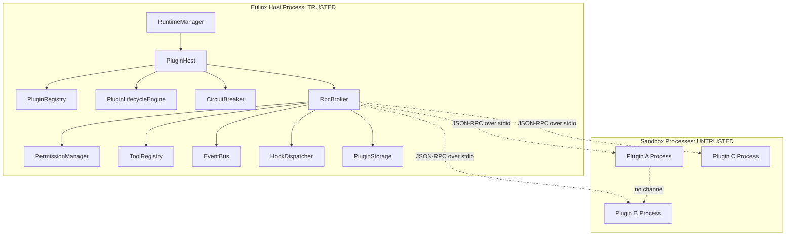

---
title: 09 Plugin System
status: draft
version: 1.0
tags:
  - plugin-system
  - security
  - architecture
  - Eulinx
  - flow:P01-CORE-FILEUTIL
  - flow:P13-TOOL-MANAGER
  - flow:P13-TOOL-FS
  - flow:P13-TOOL-GIT
  - flow:P13-TOOL-TERM
  - flow:P13-TOOL-BROWSER
  - flow:P13-TOOL-HTTP
  - flow:P13-TOOL-DB
  - flow:P13-TOOL-DOCKER
  - flow:P13-TOOL-MCP
  - flow:P13-TOOL-LOADER
  - flow:P14-SEC-SANDBOX
  - flow:P14-SEC-WSISO
  - flow:P17-CLI-TOOL
  - flow:P17-CLI-PLUGIN
related:
  - "[[PluginArchitecture-Part01]]"
  - "[[PluginLifecycle-Part01]]"
  - "[[PluginSDK-Part01]]"
  - "[[HookSystem-Part01]]"
  - "[[PermissionManager-Part01]]"
  - "[[ToolRegistry-Part01]]"
  - "[[EventBus-Part01]]"
  - "[[15-api/README]]"
  - "[[02-runtime/README]]"
  - "[[06-workflow-engine/README]]"
---

# 09 Plugin System

## Purpose

The `09-plugin-system` folder defines how third-party code extends Eulinx without being trusted by Eulinx.

Every other section of this vault describes code that Eulinx's authors wrote. This section is the only one that describes code Eulinx's authors did not write, did not review, and cannot vouch for, running on a user's machine, next to that user's source code, credentials, and AI provider keys.

That single fact determines every design in this folder.

```text
A plugin is not an extension of Eulinx.
A plugin is a guest of Eulinx.
Guests are hosted. Guests are not trusted.
```

## The Governing Principle

```text
PLUGINS ARE UNTRUSTED THIRD-PARTY CODE.
```

Read that as an engineering constraint, not a slogan. It expands into five rules that every document in this folder restates and enforces:

**Fail closed.** Any ambiguity in a plugin's manifest, permissions, signature, or RPC response resolves to denial. A plugin that cannot be understood is a plugin that does not run.

**Sandbox by default.** Plugin code never executes in the Eulinx process. It executes in a separate OS process with no ambient authority: no filesystem handle, no database handle, no network socket, no environment inheritance, no process spawning.

**Gate on explicit permission.** A plugin declares every capability it wants in its manifest, before installation. The user grants those capabilities explicitly, at install time, having seen them. A capability that was not declared and granted does not exist for that plugin, and no runtime request can create one.

**Never stall the core.** Every call into plugin code has a hard timeout and a defined fail-closed default. The runtime's forward progress MUST NOT depend on a plugin answering.

**Never crash the core.** A plugin that throws, hangs, leaks, or dies takes only itself down. The Eulinx runtime observes the death, records it, and continues.

If a design in this folder appears paranoid, that is the intent. The threat model is not "a buggy plugin". The threat model is "a plugin authored specifically to exfiltrate this user's repository and API keys, published to the marketplace under a plausible name".

## Plugin System Folder Structure

```text
09-plugin-system/
  README.md

  PluginArchitecture/
    PluginArchitecture-Part01.md ... PluginArchitecture-Part06.md
    PluginArchitecture-Diagrams.md

  PluginLifecycle/
    PluginLifecycle-Part01.md ... PluginLifecycle-Part06.md
    PluginLifecycle-Diagrams.md

  PluginSDK/
    PluginSDK-Part01.md ... PluginSDK-Part06.md
    PluginSDK-Diagrams.md

  HookSystem/
    HookSystem-Part01.md ... HookSystem-Part05.md
    HookSystem-Diagrams.md

  ToolPlugins/
    ToolPlugins-Part01.md ... ToolPlugins-Part05.md
    ToolPlugins-Diagrams.md

  NodePlugins/
    NodePlugins-Part01.md ... NodePlugins-Part05.md
    NodePlugins-Diagrams.md

  MCPIntegration/
    MCPIntegration-Part01.md ... MCPIntegration-Part06.md
    MCPIntegration-Diagrams.md

  MarketplaceIntegration/
    MarketplaceIntegration-Part01.md ... MarketplaceIntegration-Part05.md
    MarketplaceIntegration-Diagrams.md
```

## Total Plugin System Specification Size

```text
8 plugin system topic folders
1 root README
44 Markdown specification parts
8 Markdown diagram files
53 Markdown files in total
```

## Plugin System Topic Responsibilities

## PluginArchitecture

PluginArchitecture defines what a plugin is, what it may and may not extend, the manifest format, the extension point catalog, the sandboxed execution model, the capability permission model, resource limits, the plugin-to-core RPC boundary, version compatibility, and the isolation rules that keep a plugin away from the filesystem, the database, and other plugins.

This is the topic that decides the security posture. Read it before any other topic in this folder.

Parts: 6

## PluginLifecycle

PluginLifecycle defines the plugin state machine from discovery to uninstall: discovery and directory layout, manifest validation, signature verification, the transactional install algorithm with rollback, the permission consent gate, lazy activation, the activate and deactivate contract, crash detection, the circuit breaker that disables a repeatedly-failing plugin, data migration on update, and clean uninstall.

Parts: 6

## PluginSDK

PluginSDK defines the TypeScript package a plugin author imports: the complete public API surface with full type definitions, the `activate(context)` and `deactivate()` entry contract, the context object, the scoped registration APIs, Promise conventions, the error model, typed events, a literal hello-world plugin, and the SDK's own semver policy.

The SDK is a proxy layer, not a library. Every function in it is an RPC stub. It never exposes a raw filesystem, database, network, or process handle, because handing an untrusted guest a real handle ends the sandbox.

Parts: 6

## HookSystem

HookSystem defines how a plugin participates in runtime decisions rather than merely observing them: the hook catalog with a full signature for each hook, the split between blocking and observing hooks, mandatory hard timeouts with fail-closed defaults, ordering and priority determinism, the veto model and the rule that a veto MUST NOT escalate privilege, error isolation, and re-entrancy guards.

Hooks are the sharpest tool in this folder, because a blocking hook puts untrusted code on the runtime's critical path. Every rule in HookSystem exists to bound that.

Parts: 5

## ToolPlugins

ToolPlugins defines how a plugin contributes a Tool to the ToolRegistry: tool contribution schema, parameter validation, invocation routing through the sandbox, permission mapping, and the rule that a plugin tool is never more privileged than the Worker invoking it.

Parts: 5

## NodePlugins

NodePlugins defines how a plugin contributes a Workflow node type: node contribution schema, port typing, execution routing, determinism requirements, and failure semantics inside a running graph.

Parts: 5

## MCPIntegration

MCPIntegration defines how Eulinx consumes Model Context Protocol servers, how MCP servers are registered, authorized, sandboxed, and surfaced as Tools, and how MCP trust boundaries relate to plugin trust boundaries.

Parts: 6

## MarketplaceIntegration

MarketplaceIntegration defines plugin distribution: the registry index, publisher identity, signing keys, version resolution, update notification, and the review and revocation path for a plugin found to be malicious.

Parts: 5

## Global Plugin System Principles

Plugin code MUST NOT execute in the Eulinx host process.

Plugin code MUST run in a separate OS process with no inherited handles, no inherited environment, and no ambient filesystem, network, or database authority.

A plugin MUST declare every capability it requires in its manifest before installation.

A user MUST explicitly grant declared capabilities, having been shown them, before the plugin becomes installed.

An undeclared capability MUST NOT be grantable at runtime. There is no escalation path.

Every call into plugin code MUST have a hard timeout.

Every blocking call into plugin code MUST have a fail-closed default that applies on timeout, on error, and on crash.

A plugin MUST NOT be able to stall the runtime.

A plugin MUST NOT be able to crash the runtime.

A plugin MUST NOT be able to observe or affect another plugin.

A plugin MUST NOT receive a raw file handle, database handle, socket, or child process handle.

A plugin veto MUST NOT grant the plugin any authority it did not already hold.

Everything a plugin does MUST be attributable to that plugin's id in the audit log.

A plugin that fails repeatedly MUST be disabled automatically and MUST NOT re-enable itself.

The PermissionManager, not the plugin host, is the authority on every permission decision.

## Plugin System Architecture Overview



Note the absent edges. There is no edge from a plugin process to the filesystem, to SQLite, to the network, or to another plugin process. Those absences are the specification.

## ASCII Overview

```text
                 TRUSTED HOST PROCESS
  +-------------------------------------------------+
  |  RuntimeManager                                  |
  |     |                                            |
  |     v                                            |
  |  PluginHost                                      |
  |     +-- PluginRegistry      what is installed    |
  |     +-- LifecycleEngine     state machine        |
  |     +-- CircuitBreaker      disables bad actors  |
  |     +-- HookDispatcher      timeouts, ordering   |
  |     +-- RpcBroker           the ONLY doorway     |
  |            |                                     |
  |            +-- PermissionManager  every request  |
  |            +-- ToolRegistry                      |
  |            +-- EventBus                          |
  |            +-- PluginStorage      namespaced kv  |
  +------------|------------------------------------+
               |
      JSON-RPC over stdio pipes
      length-prefixed, schema-validated,
      timeout-bounded, permission-gated
               |
  +------------v------------+  +-------------------+
  |  SANDBOX PROCESS A      |  |  SANDBOX PROCESS B|
  |  UNTRUSTED              |  |  UNTRUSTED        |
  |                         |  |                   |
  |  no fs      no db       |  |  no fs   no db    |
  |  no net     no spawn    |  |  no net  no spawn |
  |  no env     no handles  |  |  no env  no peers |
  +-------------------------+  +-------------------+
            |                            |
            +------- no channel ---------+
```

## Where The Plugin System Touches The Rest Of Eulinx

```text
PermissionManager   authorizes every capability-gated RPC. Fail closed. [[PermissionManager-Part01]]
ToolRegistry        receives plugin-contributed Tools.                  [[ToolRegistry-Part01]]
EventBus            carries observation. Hooks carry participation.     [[EventBus-Part01]]
ProcessLifecycle    owns the sandbox child processes.                   [[ProcessLifecycle-Part01]]
WorkflowEngine      executes plugin-contributed nodes.                  [[WorkflowEngine-Part01]]
MergeManager        exposes onBeforeMerge and onAfterMerge hooks.       [[MergeManager-Part01]]
SQLiteSchema        owns the plugin, plugin_grant, plugin_kv tables.    [[SQLiteSchema-Part01]]
Marketplace         distributes and revokes plugins.                    [[MarketplaceIntegration-Part01]]
```

## AI Notes

Do not implement the plugin system by `require`-ing or dynamically importing plugin code into the Eulinx process because it is easier. It is enormously easier, and it is the one thing this entire section exists to forbid. An in-process plugin has your filesystem, your SQLite handle, your provider API keys, and your process. There is no partial version of this rule.

Do not treat the manifest's declared permissions as enforcement. The manifest is a declaration of intent shown to the user at install. Enforcement happens at the RPC broker, on every single call, against the stored grant record. A plugin that declares `fs:read` and was granted it still gets checked on call number 4,000,000.

Do not add a runtime permission escalation prompt. It seems user-friendly. It converts install-time informed consent into a fatigue-driven click-through at the exact moment a malicious plugin has manufactured urgency.

Do not call a plugin without a timeout because "it should be fast". Untrusted code has no obligation to be fast. An infinite loop in an `onBeforeMerge` hook without a timeout is a permanently frozen merge pipeline, which is a permanently frozen Eulinx.

Do not let one plugin's failure surface as a runtime error. Catch it at the boundary, attribute it to the plugin id, record it against the circuit breaker, apply the fail-closed default, and continue.

Do not give plugins a shared namespace, a shared event stream, or a shared storage prefix. Plugin A must not be able to enumerate, read, message, or even detect Plugin B. Cross-plugin discovery is a supply-chain attack primitive.

## Related Documents

- [[PluginArchitecture-Part01]]
- [[PluginLifecycle-Part01]]
- [[PluginSDK-Part01]]
- [[HookSystem-Part01]]
- [[ToolPlugins-Part01]]
- [[NodePlugins-Part01]]
- [[MCPIntegration-Part01]]
- [[MarketplaceIntegration-Part01]]
- [[PermissionManager-Part01]]
- [[ToolRegistry-Part01]]
- [[EventBus-Part01]]
- [[ProcessLifecycle-Part01]]
- [[02-runtime/README]]
- [[06-workflow-engine/README]]
- [[15-api/README]]
</content>
</invoke>
